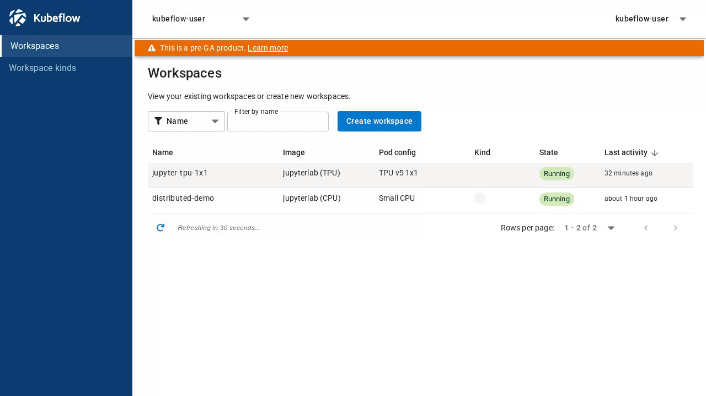
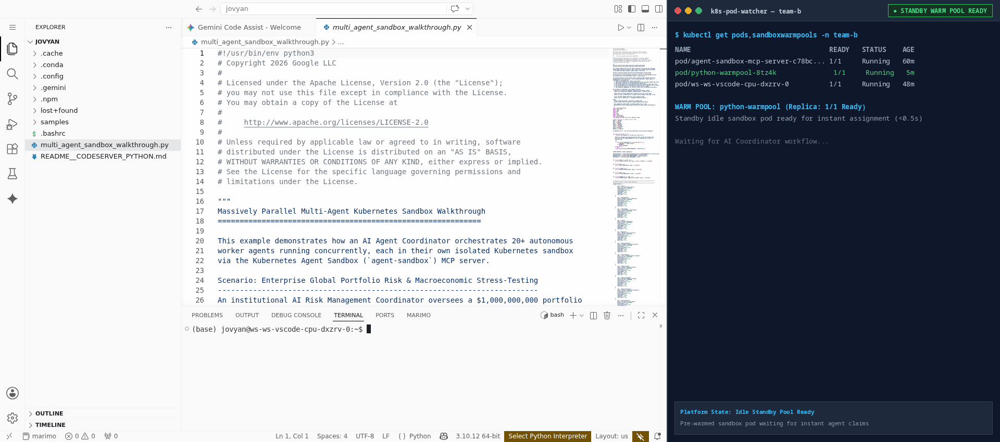

# GKE Workspaces: Your Notebook, on Google's AI Infrastructure — No Kubernetes Required

If you're an ML engineer or researcher, the GPUs and TPUs you need increasingly live on Kubernetes. But your job is to train and ship models — not to learn Kubernetes.

Today we're introducing **GKE Workspaces**, a self-hosted AI/ML development platform for Google Kubernetes Engine, built on the open-source [Kubeflow Workspaces](https://www.kubeflow.org/docs/components/workspaces/) project. Open a browser, pick an IDE and a machine, and you're coding on cloud accelerators in minutes.

---

## Why Kubeflow Workspaces

Kubeflow Workspaces gives every researcher a personal, persistent development environment on shared cluster hardware.

* **Self-service, in a few clicks.** Choose JupyterLab or VS Code in the browser, pick an environment, and pick a hardware size such as "Small CPU", "GPU", or "TPU". No YAML, no command-line setup.
* **Your work persists.** Each workspace has its own home directory, so your files, notebooks, and installed packages are still there when you come back.
* **Guardrails set by your platform team.** Admins curate the approved images and hardware options, and decide which machines and capacity types (such as Spot) back them. Researchers only see choices that work.
* **Open source and portable.** Workspaces is part of the Kubeflow community, so you aren't locked into a proprietary notebook service.

---

## What's Unique About GKE Workspaces

GKE Workspaces brings Kubeflow Workspaces together with capabilities that are only available on Google Cloud.

### 1. Pause and resume — without losing your state

You've spent an hour loading a large model into GPU memory and building up results across notebook cells. Now it's time to go home. Normally you have two bad options: shut down and lose everything, or leave it running and pay for an idle GPU overnight.

With GKE Workspaces, you just **pause**. Built on [Pod Snapshots](https://docs.cloud.google.com/kubernetes-engine/docs/concepts/pod-snapshots), GKE takes a snapshot of your running notebook — including variables in memory and models loaded on the GPU — saves it to Cloud Storage, and releases the hardware so you stop paying. When you **resume**, you pick up exactly where you left off. Workspaces can also be paused automatically after a period of inactivity.

### 2. An easy on-ramp to Cloud TPUs

Moving from a quick experiment to large-scale training on TPUs used to mean switching tools at every step. GKE Workspaces keeps you in the same notebook the whole way, with both JAX and PyTorch:

1. **Prototype on a single TPU chip**, just like you would on a GPU.
2. **Scale to multiple chips on one machine** by choosing a bigger hardware option.
3. **Scale out to multi-host TPU slices** by sending the same training function from your notebook to a larger slice. Logs stream back to your notebook, and the TPUs are released as soon as the job finishes.

### 3. Use your local VS Code with cloud accelerators

Prefer the editor on your laptop? Generate a secure, short-lived link in the Workspaces UI and connect your local VS Code directly to a notebook running on a remote TPU or GPU. No SSH keys, no tunnels.

### 4. A launchpad for distributed work

Your workspace doesn't have to be big to drive big jobs. From a small, inexpensive CPU notebook you can process data with Spark, launch multi-host training, serve your model, and scale Ray clusters — all from Python. Built-in Cloud Storage access, with no keys to manage, makes it easy to pass data between each step.

Building AI agents? You can also give your coding agent a fleet of secure, disposable sandboxes to run the code it generates, isolated from your workspace.

### 5. Lightweight and secure by default

GKE Workspaces runs on its own on GKE Standard or Autopilot — you don't need to install the full Kubeflow platform. Users sign in with their Google accounts, traffic is encrypted with Google-managed certificates, and each team's work is isolated from the others.

---

## Get Started

GKE Workspaces lets ML teams focus on models, not infrastructure: one-click development environments, stateful pause and resume, a smooth path to Cloud TPUs, and the power of GKE behind every notebook.

Ask your platform team to deploy it using the **[GKE deployment guide](../providers/gke/USER_GUIDE.md)**, and learn more about the upstream project at **[Kubeflow Workspaces](https://www.kubeflow.org/docs/components/workspaces/)**.
