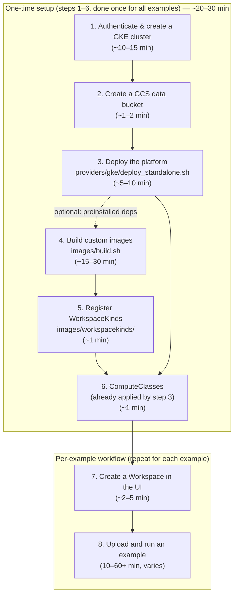

# Examples

End-to-end examples that run on top of the standalone Kubeflow Workspaces
deployment for GKE.

These are written for people who have **never used Kubernetes**. Each example has
its own README with a glossary, a prerequisite checklist you can copy-paste, the
exact commands to run, what the output should look like, a troubleshooting table,
and cleanup instructions.

> [!TIP]
> **One-time platform setup (~20–30 min without custom images, ~35–60 min with them):** All examples share the same underlying cluster and platform. You only complete the setup steps (**steps 1–6**) **once**. After that, the cluster, storage, images, and templates are in place, and you can run any (or all) of the examples without repeating the setup.
>
> **Steps 4–5 (custom images, ~15–30 min) are optional.** Step 3 already registers the `jupyterlab` and `codeserver` WorkspaceKinds on the public upstream Kubeflow base images and applies the GPU/TPU ComputeClasses. You only need steps 4–5 if you want the example dependencies (JAX, PyTorch, `transformers`, Kubeflow SDKs, VS Code extensions, …) **preinstalled** instead of `pip install`-ing them inside your Workspace. The exception is `spark-py312` for [distributed](distributed/), a non-Workspace image with no public substitute. ([agent-sandbox](agent-sandbox/) also needs a non-Workspace image, `agent-sandbox-mcp-server`, but its deploy script builds it for you.)

---

## The examples

| Example | What you get | Hardware | Roughly how long |
| :--- | :--- | :--- | :--- |
| [**resumable-notebooks**](resumable-notebooks/) | Pause a JupyterLab notebook and resume it later with every variable, thread, and GPU VRAM bit-identical (JupyterLab only; `codeserver` is stateless) | CPU, or 1 × NVIDIA T4 | 20–40 min |
| [**distributed**](distributed/) | A 0.1-CPU notebook drives a Spark ETL job, multi-host TPU training, and a serving Deployment — without you writing any YAML | CPU notebook + 5 Spark pods + 2 × TPU v5e host | 1–2 hours |
| [**tpu**](tpu/) | Interactive JAX training on Cloud TPU v5e (4 chips) directly from Desktop VS Code or JupyterLab | 1 × TPU v5e (4 chips) | 10–20 min |
| [**torch_tpu**](torch_tpu/) | Interactive PyTorch training on Cloud TPU v5e with TorchTPU, scaling to multi-core DDP with torchrun on a single-host TPU slice | 1 × TPU v5e (1 or 4 chips) | 10–20 min |
| [**agent-sandbox**](agent-sandbox/) | Give a Gemini coding agent a fleet of isolated, throwaway Linux sandboxes; fan out 20 parallel agents | CPU only | 30–60 min |
| [**ray**](ray/) | Elastic distributed computing with Ray (KubeRay): launch on-demand clusters from Python, run interactive tasks, submit batch jobs, and view the Ray Dashboard in-workspace | CPU (`e2-standard-4`) | 15–30 min |

Plus shared utilities and building blocks:

| Path | Purpose |
| :--- | :--- |
| [**compute-classes**](compute-classes/) | GKE ComputeClasses that let the cluster auto-create GPU and TPU machines on demand. Needed by the GPU and TPU examples. |
| [**upload_to_jupyter.py**](upload_to_jupyter.py) | CLI utility to upload local files into a remote Jupyter workspace over HTTP, preserving directory structure (no `kubectl` needed). |

---

## Start here: One-time setup (the order things have to happen in)

Every example assumes the platform underneath it already exists. **Steps 1–6 are a one-time setup**: work top to bottom through them **once** for your cluster. Once completed, your environment is ready for all examples — you do not repeat steps 1–6 when trying different examples.



### Steps at a glance

| Step | Action | Frequency | Estimated Time |
| :--- | :--- | :--- | :--- |
| **Step 1** | [Authenticate, set env vars & create GKE cluster](#1-authenticate-set-environment-variables--create-a-gke-cluster) | Once | **~10–15 min** |
| **Step 2** | [Create Cloud Storage (GCS) data bucket](#2-create-the-cloud-storage-gcs-data-bucket) | Once | **~1–2 min** |
| **Step 3** | [Deploy the standalone platform](#3-deploy-the-standalone-platform) (`deploy_standalone.sh`) | Once | **~5–10 min** |
| **Step 4** | *(Optional)* [Build custom images](#4-optional-build-custom-images) (`build.sh`) | Once | **~15–30 min** |
| **Step 5** | *(Optional)* [Register WorkspaceKinds](#5-optional-register-the-workspacekinds-that-expose-those-images) for custom images | Once | **~1 min** |
| **Step 6** | [Apply ComputeClasses](#6-apply-the-computeclasses-gpu--tpu-examples-only) *(GPU/TPU; applied in step 3)* | Once | **~1 min** |
| **Step 7** | [Create a Workspace](#7-create-a-workspace) in the Kubeflow UI | Per example | **~2–5 min** |
| **Step 8** | [Upload and run the example](#8-run-the-example) | Per example | **10–60+ min** *(see [table above](#the-examples))* |

---

<a id="1-authenticate-set-environment-variables--create-a-gke-cluster"></a>
### 1. Authenticate, set environment variables & create a GKE cluster (~10–15 min)

First, authenticate your account with Google Cloud. Run `gcloud auth login` to authenticate the CLI and `gcloud auth application-default login` to configure Application Default Credentials (ADC) for Google Cloud client libraries and tools:

```bash
# Authenticate the gcloud CLI with your Google user account
gcloud auth login

# Set up Application Default Credentials (ADC) for client libraries and SDKs
gcloud auth application-default login
```

Next, export your deployment variables in your shell. Setting them here configures all subsequent cluster, storage, deployment, and image steps consistently:

```bash
# Core coordinates
export PROJECT_ID="my-project"                # Your Google Cloud Project ID (Required)
export PILOT_USERS="you@example.com"          # Google accounts to grant IAP & UI access (Required)
export CLUSTER_NAME="kubeflow-notebooks"      # GKE cluster name
export LOCATION="us-west1"                    # GKE cluster location (zone or region; must be a region for Autopilot)
export REGION="us-west1"                      # GCP region for Artifact Registry and GCS
export TENANT_NAMESPACE="kubeflow-user"        # Namespace where your workspaces run
export REPO_NAME="kubeflow-repo"              # Artifact Registry repository name

# Workload data bucket (used by WorkspaceKinds and distributed ML examples)
export GCS_BUCKET="${PROJECT_ID}-${TENANT_NAMESPACE}-bucket"

# Optional: Custom domain name (leave unset to auto-generate a zero-DNS sslip.io domain)
# export WORKSPACES_HOST="workspaces.example.com"
# export DESKTOP_HOST="connect.example.com"
```

Create the VPC-native cluster with Gateway API, and Workload Identity Federation enabled. You can create either a **Standard** or an **Autopilot** cluster:

#### Option A: GKE Standard (recommended)

Standard gives you full control over node pools and runs the upstream Kubeflow manifests unmodified. It is the most widely tested path for these examples:

```bash
gcloud container clusters create "${CLUSTER_NAME}" \
  --project="${PROJECT_ID}" \
  --location="${LOCATION}" \
  --enable-pod-snapshots `# Required for stateful Pause & Resume` \
  --enable-dataplane-v2 `# Required: Enforces Kubernetes NetworkPolicies` \
  --gateway-api=standard `# Required: Enables GKE Gateway API controller` \
  --workload-pool="${PROJECT_ID}.svc.id.goog" `# Required: Workload Identity for GCS` \
  --workload-metadata=GKE_METADATA \
  --num-nodes=1 \
  --machine-type=e2-standard-4 \
  --addons=HttpLoadBalancing,RayOperator `# Required: HttpLoadBalancing for Gateway API | Optional: RayOperator for Ray cluster` \
  --enable-image-streaming
```

> [!NOTE]
> **gVisor node pool (Standard clusters only):**
> If you plan to try the [resumable-notebooks](resumable-notebooks/) example on a **GKE Standard** cluster, GKE Pod Snapshots requires a gVisor-enabled node pool. Create one with:
> ```bash
> gcloud container node-pools create gvisor-pool \
>   --cluster="${CLUSTER_NAME}" \
>   --project="${PROJECT_ID}" \
>   --location="${LOCATION}" \
>   --image-type=cos_containerd \
>   --sandbox type=gvisor \
>   --machine-type=e2-standard-4 \
>   --enable-autoscaling --min-nodes=0 --max-nodes=3
> ```
> *(On GKE Autopilot, you do not need to create this node pool—Autopilot automatically provisions and scales gVisor sandboxed nodes on demand when Pods specify `runtimeClassName: gvisor`.)*

#### Option B: GKE Autopilot

Autopilot automatically manages node provisioning, scaling, Dataplane V2, Gateway API, Workload Identity, and CSI storage drivers. `LOCATION` must be a region:

```bash
gcloud container clusters create-auto "${CLUSTER_NAME}" \
  --project="${PROJECT_ID}" \
  --region="${REGION}" \
  --enable-pod-snapshots `# Required for stateful Pause & Resume`
```

> [!NOTE]
> Autopilot's security policies reject a few things the upstream manifests do (cert-manager leader election in `kube-system`, and Kubeflow Trainer RBAC bindings to `system:authenticated`). `deploy_standalone.sh` detects Autopilot and adapts those manifests automatically; no extra steps are needed.

<details>
<summary><b>Updating an existing GKE cluster instead of creating a new one</b> (click to expand)</summary>

If you already have a GKE cluster, you can update it to enable the required features rather than creating a new one from scratch.

#### Step 0: Verify non-updatable prerequisites
Dataplane V2 and VPC-native networking **cannot** be enabled after cluster creation. Verify your cluster already has them:

```bash
# Must return "ADVANCED_DATAPATH"
gcloud container clusters describe "${CLUSTER_NAME}" \
  --location="${LOCATION}" --project="${PROJECT_ID}" \
  --format='value(networkConfig.datapathProvider)'

# Must return "True"
gcloud container clusters describe "${CLUSTER_NAME}" \
  --location="${LOCATION}" --project="${PROJECT_ID}" \
  --format='value(ipAllocationPolicy.useIpAliases)'
```

> [!WARNING]
> If either check fails, the cluster cannot be converted in-place and you must create a new cluster.

#### Step 1: Update cluster features
Because `gcloud container clusters update` requires each feature flag to be executed individually:

```bash
# 1. Enable standard Gateway API (GKE Gateway controller)
gcloud container clusters update "${CLUSTER_NAME}" \
  --project="${PROJECT_ID}" --location="${LOCATION}" \
  --gateway-api=standard

# 2. Enable Workload Identity Federation (required for GCS bucket access)
gcloud container clusters update "${CLUSTER_NAME}" \
  --project="${PROJECT_ID}" --location="${LOCATION}" \
  --workload-pool="${PROJECT_ID}.svc.id.goog"

# 3. Enable GKE Pod Snapshots (required for stateful Pause & Resume)
gcloud container clusters update "${CLUSTER_NAME}" \
  --project="${PROJECT_ID}" --location="${LOCATION}" \
  --enable-pod-snapshots

# 4. Enable Image Streaming (recommended: faster container startup times)
gcloud container clusters update "${CLUSTER_NAME}" \
  --project="${PROJECT_ID}" --location="${LOCATION}" \
  --enable-image-streaming
```

#### Step 2: Update or create node pools (Standard clusters)
Cluster-level updates do not automatically reconfigure existing node pools:

```bash
# Enable Workload Identity & Image Streaming on an existing node pool:
NODE_POOL_NAME="default-pool" # Replace with your node pool name
gcloud container node-pools update "${NODE_POOL_NAME}" \
  --cluster="${CLUSTER_NAME}" --project="${PROJECT_ID}" --location="${LOCATION}" \
  --workload-metadata=GKE_METADATA --enable-image-streaming

# (Optional) If running the resumable-notebooks example on GKE Standard, create a gVisor pool:
gcloud container node-pools create gvisor-pool \
  --cluster="${CLUSTER_NAME}" --project="${PROJECT_ID}" --location="${LOCATION}" \
  --image-type=cos_containerd --sandbox type=gvisor --machine-type=e2-standard-4 \
  --workload-metadata=GKE_METADATA --enable-autoscaling --min-nodes=0 --max-nodes=3
```
*(On GKE Autopilot clusters, node pools are managed automatically; you only need to run the `clusters update` commands in Step 1.)*

</details>

<a id="2-create-the-cloud-storage-gcs-data-bucket"></a>
### 2. Create the Cloud Storage (GCS) data bucket (~1–2 min)

Cloud Storage (`gs://...`) is Google Cloud's scalable object storage. While each Workspace pod mounts a persistent disk for its home directory (`/home/jovyan`), sharing datasets across users, saving model checkpoints, and running distributed workloads (such as Spark ETL and multi-host TPU training) require shared object storage.

Every Workspace automatically has **`$GCS_BUCKET`** injected into its environment. Python code in your notebooks or distributed jobs uses standard Cloud Storage client libraries to read and write data directly without needing complex filesystem mounts or NFS:

```python
from google.cloud import storage
import os

client = storage.Client()
bucket = client.bucket(os.environ["GCS_BUCKET"])
# Read/write datasets, model checkpoints, and metrics directly
```

> [!NOTE]
> **Data bucket vs. Snapshot bucket:**
> `deploy_standalone.sh` automatically creates a dedicated snapshot bucket (`SNAPSHOT_GCS_BUCKET`, default `${PROJECT_ID}-${TENANT_NAMESPACE}-snapshots-bucket`) solely for container memory checkpoints during stateful Pause & Resume (with an automated 14-day deletion lifecycle rule).
> The script does **not** create a general data storage bucket. You create the data bucket here.

Create the regional bucket and grant Workload Identity access to all pods in your tenant namespace:

```bash
# 1. Create the regional storage bucket
gcloud storage buckets create "gs://${GCS_BUCKET}" \
  --location="${REGION}" \
  --project="${PROJECT_ID}"

# 2. Authorize all pods in your tenant namespace via Workload Identity Federation
gcloud storage buckets add-iam-policy-binding "gs://${GCS_BUCKET}" \
  --member="principalSet://iam.googleapis.com/projects/$(gcloud projects describe ${PROJECT_ID} --format='value(projectNumber)')/locations/global/workloadIdentityPools/${PROJECT_ID}.svc.id.goog/namespace/${TENANT_NAMESPACE}" \
  --role="roles/storage.objectUser"
```

With `roles/storage.objectUser` granted via the `principalSet` binding, every pod in `${TENANT_NAMESPACE}` (notebooks, Spark executors, Trainer TPU pods, inference deployments) can seamlessly read and write objects in `gs://${GCS_BUCKET}` with zero secret keys to manage.

<a id="3-deploy-the-standalone-platform"></a>
### 3. Deploy the standalone platform (~5–10 min)

Run the standalone deployment:

```bash
./providers/gke/deploy_standalone.sh
```

This installs the Workspaces controller, backend, frontend, the IAP-authenticated
access proxy, the Pod snapshot add-on, Kubeflow Trainer v2, the Spark Operator,
and the GPU/TPU [ComputeClasses](compute-classes/). It also registers the
`jupyterlab` and `codeserver` WorkspaceKinds from
[`../images/workspacekinds/`](../images/workspacekinds/) so you have something to
launch straight away. Their image options point at the **public upstream Kubeflow
base images** (`jupyter-scipy`, `jupyter-pytorch-cuda-full`, `codeserver-python`;
the TPU option uses the CPU image), so no image build is needed. Install anything
an example needs that the base image lacks with `pip install --user` from a
notebook cell or terminal inside the Workspace. `--user` puts it in `~/.local` on
the home volume, so it persists across restarts. The first `--user` install in a
new Workspace is not importable until you restart the kernel (or run
`import site; site.addsitedir(site.getusersitepackages())`), because `~/.local`
did not exist when the kernel started.

#### Deployment Options

* **Are these the only required env vars to begin with?**
  In `deploy_standalone.sh`, only `PROJECT_ID` and `PILOT_USERS` are strictly required with no defaults. `CLUSTER_NAME`, `LOCATION`, `REGION`, `TENANT_NAMESPACE`, and `REPO_NAME` have built-in defaults (`kubeflow-notebooks`, `us-central1-c`, `us-central1`, `kubeflow-user`, `kubeflow-repo`), but defining them explicitly avoids unexpected locations or collisions.
* **What if you have a custom domain name?**
  * **No custom domain:** Leave `WORKSPACES_HOST` unset. `deploy_standalone.sh` automatically generates a domain using `sslip.io` (`notebooks.<GLOBAL_EXTERNAL_IP>.sslip.io`) and provisions a Google-managed SSL certificate via Certificate Manager with zero DNS configuration needed.
  * **With a custom domain:** Set `export WORKSPACES_HOST="workspaces.example.com"` (and optionally `export DESKTOP_HOST="connect.example.com"`). The script configures the GKE Gateway and Certificate Manager for your host. After deployment finishes, add a DNS `A` record pointing `workspaces.example.com` to the static external IP printed by the script.

<a id="4-optional-build-custom-images"></a>
### 4. (Optional) Build custom images (~15–30 min)

> [!NOTE]
> Skip steps 4–5 if you are fine installing dependencies yourself inside the
> Workspace; step 3 already gave you working `jupyterlab` and `codeserver`
> WorkspaceKinds on the upstream base images. Do steps 4–5 when you want the
> example stacks **preinstalled** (JAX, PyTorch, `transformers`, `libtpu`/`jax[tpu]`,
> Kubeflow SDKs, Gemini Code Assist, …) so every new Workspace is ready without a
> `pip install`. One image is required regardless, because it does not run as
> the Workspace and has no public substitute: `spark-py312`
> ([distributed](distributed/), `./build.sh --spark`). The
> [agent-sandbox](agent-sandbox/) example also needs `agent-sandbox-mcp-server`,
> but its deploy script builds and pushes that for you.

```bash
cd images
./build.sh --all --registry-path "${REGION}-docker.pkg.dev/${PROJECT_ID}/${REPO_NAME}"
```

See [`../images/README.md`](../images/README.md). `--all` means the three
workspace images — `codeserver-python`, `jupyterlab` and `spark-py312`. The
`agent-sandbox-mcp-server` image is deliberately **not** in `--all`; the
`agent-sandbox` example's `deploy_agent_sandbox.sh` builds it (`./build.sh --mcp-server`).

<a id="5-optional-register-the-workspacekinds-that-expose-those-images"></a>
### 5. (Optional) Register the WorkspaceKinds that expose those images (~1 min)

Register the ready-made templates for **JupyterLab** and **VS Code (code-server)**.
They use the same names and option ids as the kinds registered in step 3, so this
simply repoints them at your custom images:

```bash
cd images

# 1. Register JupyterLab WorkspaceKind
IMAGE_NAME="jupyterlab" CPU_IMAGE_TAG="latest-cpu" GPU_IMAGE_TAG="latest-gpu" TPU_IMAGE_TAG="latest-tpu" \
  envsubst < workspacekinds/jupyterlab.yaml | kubectl apply -f -

# 2. Register VS Code (code-server) WorkspaceKind
IMAGE_NAME="codeserver-python" CPU_IMAGE_TAG="latest-cpu" GPU_IMAGE_TAG="latest-gpu" TPU_IMAGE_TAG="latest-tpu" \
  envsubst < workspacekinds/codeserver-python.yaml | kubectl apply -f -
```

Verify that both WorkspaceKinds are registered:

```bash
kubectl get workspacekinds
# NAME          DISPLAY NAME             DEPRECATED   HIDDEN   AGE
# codeserver    VS Code (code-server)                         10s
# jupyterlab    JupyterLab Notebook                           30s
```

> [!IMPORTANT]
> The templates substitute `REGION`, `PROJECT_ID`, `REPO_NAME`, and `GCS_BUCKET` directly from your shell. Because you exported them in the initial setup, all image URIs and environment variables will resolve cleanly.
>
> If any variable is missing, `envsubst` turns it into an empty string instead of failing, which causes image pull failures later when a Workspace pod starts.

See [Ready-made WorkspaceKind templates](../images/README.md#ready-made-workspacekind-templates).

<a id="6-apply-the-computeclasses-gpu--tpu-examples-only"></a>
### 6. Apply the ComputeClasses (GPU / TPU examples only) (~1 min)

`deploy_standalone.sh` already applies these in step 3 (unless you set
`APPLY_COMPUTE_CLASSES=false`), so you normally have nothing to do here. To apply
them by hand — steps 4 and 5 left you in `images/`, and this path is relative to
the repository root, so go back up first:

```bash
cd ..
kubectl apply -f examples/compute-classes/
```

See [`compute-classes/README.md`](compute-classes/README.md).

---

## Running an example (per-example workflow)

The one-time platform setup is complete. For each example you want to try, you only follow steps 7–8:

<a id="7-create-a-workspace"></a>
### 7. Create a Workspace (~2–5 min)

Open `https://<your-workspaces-host>/workspaces/`, click **Create Workspace**, pick
the WorkspaceKind, image, and pod size that the example's README asks for.

<a id="8-run-the-example"></a>
### 8. Run the example (10–60+ min, varies by example)

Upload the notebook (and any `jobs/` package next to it) into the workspace using
the file-browser upload button, then follow that example's README. The
`agent-sandbox` example is driven by a script and a set of manifests rather than
a single notebook, and its commands use paths relative to the repository root —
for that one, clone or upload the whole repository.

#### Tip: Uploading & syncing files from local VS Code ([upload_to_jupyter.py](upload_to_jupyter.py))

If you develop locally in VS Code and connect the Jupyter extension to a remote workspace kernel, you do not need `kubectl` access or manual file uploads to keep library files in sync. Use [upload_to_jupyter.py](upload_to_jupyter.py) to push all files (or specific extensions with `--ext`) into your remote workspace over HTTP while preserving the folder hierarchy:

```bash
# One-time sync (token and base URL are automatically parsed from your connection link):
python3 examples/upload_to_jupyter.py "https://<connect-host>/workspace/connect/.../?token=..." --dir examples/distributed

# Auto-sync on save (continuously watches local directory and pushes changes on save):
python3 examples/upload_to_jupyter.py "https://<connect-host>/workspace/connect/.../?token=..." --dir examples/distributed --watch
```

By default, files are placed in the remote user's home directory (`~`, matching the Jupyter root), so `jobs/` and manifests land right where the notebooks search for them. Notebook (`.ipynb`) files are seeded once (skipped if they already exist on the remote server and ignored during `--watch`) so running notebooks never have their outputs overwritten; pass `--overwrite-notebooks` to force-replace them.

---

## What each example needs

The platform and components configured in the **one-time setup** (steps 1–6) provide everything these examples require. Custom images are optional except where marked **required**:

| | resumable-notebooks | distributed | tpu | agent-sandbox | ray |
| :--- | :---: | :---: | :---: | :---: | :---: |
| Standalone platform deployed | ✅ | ✅ | ✅ | ✅ | ✅ |
| Custom images from `images/build.sh` (optional unless marked **required**; otherwise `pip install` into the base image) | Not needed: CPU notebook runs on the base image as-is; GPU notebook installs `transformers` in its Step 0 cell | JupyterLab CPU + **`spark-py312` (required)** | JupyterLab TPU | VS Code (`codeserver-python`) CPU + `agent-sandbox-mcp-server` (required; built and pushed by `deploy_agent_sandbox.sh`) | JupyterLab CPU (with `jupyter-server-proxy`) |
| WorkspaceKind | `jupyterlab-resumable` (in this example) | `jupyterlab` (from `images/workspacekinds/`) | `jupyterlab` (from `images/workspacekinds/`) | `codeserver` (from `images/workspacekinds/`) | `jupyterlab` / `jupyterlab-resumable` |
| ComputeClasses | `gpu-t4-spot` (GPU notebook) | `tpu-v5-8-multi-host` | `tpu-v5-4-single-host` | none | none (standard CPU node pool) |
| GKE Pod Snapshots + gVisor | ✅ | — | — | — | — (requires standard non-gVisor node pool) |
| Kubeflow Trainer v2 | — | ✅ | — | — | — |
| Kubeflow Spark Operator | — | ✅ | — | — | — |
| Agent Sandbox operator | — | — | — | ✅ (installed by that example's deploy script) | — |
| KubeRay operator | — | — | — | — | ✅ (GKE Ray add-on or Helm, in that example's Step 1) |
| Cloud Storage bucket | snapshot bucket (created by the deploy script) | data bucket (you create it) | — | — | — |
| Accelerator quota | T4 Spot | TPU v5e Spot | TPU v5e Spot | — | — |

---

## Cost

> [!CAUTION]
> These examples create real, billable Google Cloud resources: GPU and TPU nodes,
> Cloud Storage objects, and a global load balancer. Accelerators dominate the
> bill — a 2-host TPU v5e slice and a T4 GPU are not free, even on Spot. Every
> example README ends with a **Cleanup** section. Run it.

To tear the whole platform down:

```bash
./providers/gke/cleanup_standalone.sh
```

---

## Glossary

Shared vocabulary used across the examples. Each README repeats the terms it
needs, so you can also just dive into one.

| Term | Plain-language meaning |
| :--- | :--- |
| **Pod** | The smallest thing Kubernetes runs: one or more containers on one machine. Your notebook is a Pod. |
| **Node** | A virtual machine in the cluster that Pods run on. |
| **Namespace** | A folder that groups and isolates resources. Your workspaces live in a *tenant namespace* such as `kubeflow-user`. |
| **Deployment** | A controller that keeps N copies of a Pod running and replaces them when they die. |
| **Service** | A stable in-cluster DNS name and IP that load-balances to a set of Pods. |
| **CRD / Custom Resource** | A user-defined object type added to the Kubernetes API (for example `Workspace`, `TrainJob`, `Sandbox`). |
| **Operator / controller** | A program running in the cluster that watches Custom Resources and makes reality match them. |
| **ServiceAccount** | The identity a Pod runs as, used for both Kubernetes permissions and (via Workload Identity) Google Cloud permissions. |
| **ClusterRole / RoleBinding** | The permission system: a role lists allowed verbs on resources, a binding attaches it to an identity. |
| **Workload Identity** | Lets a Pod call Google Cloud APIs as a Google identity with no key files. |
| **WorkspaceKind** | A cluster-wide template of the images and machine sizes a user may pick when creating a Workspace. |
| **ComputeClass** | A named recipe telling GKE what kind of machine to auto-create when a Pod asks for it. |
| **Spot VM** | A deeply discounted machine that Google may reclaim at 30 seconds' notice. All ComputeClasses here use Spot; `gpu-best-available` falls back to on-demand when Spot is stocked out. |
| **Artifact Registry** | Google Cloud's container image registry, where `images/build.sh` pushes. |
| **GCS bucket** | Cloud Storage: where datasets, model checkpoints, and pod snapshots are kept. |
| **Agent Sandbox** (`Sandbox`) | The operator and Custom Resource used by the `agent-sandbox` example: each `Sandbox` is one disposable Pod an AI agent can run code in. |
| **gVisor** | A different, unrelated isolation mechanism — a user-space kernel GKE can run a container inside. Used only by the `resumable-notebooks` example, which needs it for checkpointing. Agent Sandbox pods do **not** use it. |

---

## Reference

- [`../providers/gke/USER_GUIDE.md`](../providers/gke/USER_GUIDE.md) — deploying and operating the standalone platform
- [`../images/README.md`](../images/README.md) — building custom workspace images and registering WorkspaceKinds
- [`compute-classes/README.md`](compute-classes/README.md) — GPU and TPU ComputeClasses
