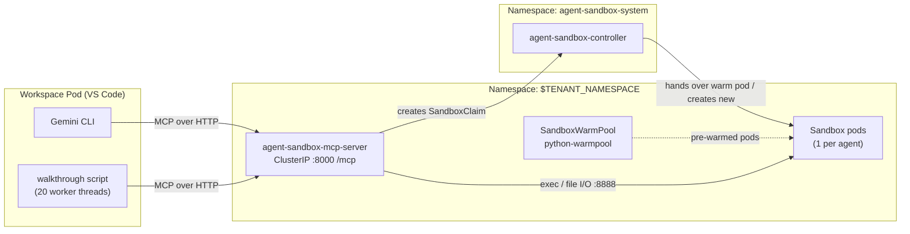

# Agent Sandbox: Giving Your AI Coding Agent a Fleet of Disposable Computers

Run untrusted, agent-generated code in throwaway Linux boxes inside your GKE
cluster — and fan a single agent out into 20 of them at once.

**Quick start** (after the [one-time platform setup](../README.md#start-here-one-time-setup-the-order-things-have-to-happen-in)):

1. From the repository root: `./examples/agent-sandbox/deploy_agent_sandbox.sh`
2. Create a `codeserver` Workspace, clone this repository into it, and run
   `python3 examples/agent-sandbox/multi_agent_sandbox_walkthrough.py`.
3. Optional: get Gemini CLI (install it, or build the custom `codeserver-python`
   image), run `bash examples/agent-sandbox/setup_gemini.sh`, and prompt Gemini to
   use the sandboxes.

The rest of this page explains each step.

---

## Table of Contents

- [What this example does](#what-this-example-does)
- [Prerequisites](#prerequisites)
- [Step 1: Deploy Agent Sandbox and the MCP server](#step-1-deploy-agent-sandbox-and-the-mcp-server)
- [Step 2: Start a VS Code Workspace](#step-2-start-a-vs-code-workspace)
- [Step 3: Run the 20-agent walkthrough](#step-3-run-the-20-agent-walkthrough)
- [Step 4 (optional): Let Gemini use the sandboxes](#step-4-optional-let-gemini-use-the-sandboxes)
- [Configuration](#configuration)
- [Cost](#cost)
- [Troubleshooting](#troubleshooting)
- [Cleanup](#cleanup)
- [Reference](#reference)

---

## What this example does

When an AI assistant writes code for you, running that code in your own
Workspace means a bad `pip install`, an infinite loop or an `rm -rf` runs with
your credentials, on your disk. This example gives the assistant **disposable,
isolated Linux boxes ("sandboxes")** instead: it creates one in about a second,
uploads its script, runs it, reads the result back, and deletes the box.

The sandboxes are exposed through an **MCP (Model Context Protocol) server**
running in your cluster. It offers five core tools to any AI agent:
`create_sandbox`, `upload_file`, `execute_command`, `download_file`,
`delete_sandbox`.

**The walkthrough** shows the fan-out: a coordinator manages a fictional
\$1B portfolio across 20 market sectors and launches **20 worker agents in
parallel**. Each one gets its own sandbox, runs a Monte-Carlo risk simulation
(15,000 price paths × 252 trading days), downloads a JSON report and deletes its
sandbox. The coordinator then aggregates the 20 reports into one risk matrix.
Twenty pods appear, compute, and vanish. It is CPU-only; no GPU or TPU is used.



1. Gemini or the walkthrough calls the MCP server over plain HTTP.
2. The MCP server turns `create_sandbox` into a `SandboxClaim` in Kubernetes.
3. The Agent Sandbox controller hands over an idle pod from the warm pool, or
   creates a new one from the `SandboxTemplate`.
4. The MCP server talks to that pod directly to upload files, run commands and
   download results. `delete_sandbox` removes the claim and the pod.

> [!NOTE]
> A "sandbox" here is an ordinary pod (own filesystem, process tree and IP,
> non-root, CPU/memory limits) managed by the Agent Sandbox operator — not
> gVisor. See the [glossary](#glossary) if the Kubernetes terms are new to you.

---

## Prerequisites

1. **The platform is deployed** — steps 1–3 of the
   [Examples README](../README.md#start-here-one-time-setup-the-order-things-have-to-happen-in)
   (`providers/gke/deploy_standalone.sh`). That creates the tenant namespace, the
   Artifact Registry repository, and the `codeserver` WorkspaceKind this example
   uses.
2. **Tools on the machine that runs the deploy script:** `gcloud`, `kubectl`,
   `envsubst` (`apt-get install gettext-base`), `jq`, and **Docker** — the
   script builds the MCP server image. No Docker? Use Cloud Build instead
   (`MCP_BUILD_FLAGS="--cloud-build"`, see [Step 1](#step-1-deploy-agent-sandbox-and-the-mcp-server)).
3. **Enough CPU.** Each sandbox requests 250m CPU / 512Mi (limit 1 CPU / 1Gi), so
   the 20-agent run requests about **5 vCPU / 10Gi**. On **GKE Autopilot** nodes
   are added automatically. On **GKE Standard**, enable node pool autoscaling or
   node auto-provisioning, or run with fewer agents (`NUM_AGENTS=5`).

---

## Step 1: Deploy Agent Sandbox and the MCP server

Export the same values you used for `deploy_standalone.sh` (the defaults below
match that script's defaults), then run the deploy script from the repository
root:

```bash
export PROJECT_ID="your-gcp-project-id"
export CLUSTER_NAME="kubeflow-notebooks"
export LOCATION="us-central1-c"
export REGION="us-central1"
export TENANT_NAMESPACE="kubeflow-user"
export REPO_NAME="kubeflow-repo"

# Optional:
# export MCP_BUILD_FLAGS="--cloud-build"   # no local Docker
# export BUILD_MCP_SERVER_IMAGE=false      # image already pushed on an earlier run

./examples/agent-sandbox/deploy_agent_sandbox.sh
```

The script:

1. Gets cluster credentials, then **builds and pushes the MCP server image**
   (`images/build.sh --mcp-server`) to
   `${REGION}-docker.pkg.dev/${PROJECT_ID}/${REPO_NAME}/agent-sandbox-mcp-server:latest`.
   Upstream publishes the MCP server's source but no image, so this repository
   builds it.
2. Installs the Agent Sandbox operator (v1.0.3) if its CRDs are missing.
3. Applies `ClusterRole/agent-sandbox-kubeflow-edit`. It aggregates into
   `kubeflow-edit`, so every Workspace (all kinds in this repo use
   `kubeflow-edit`) can manage sandboxes — no WorkspaceKind is modified.
4. Creates the `SandboxTemplate` and a `SandboxWarmPool` of idle sandboxes.
5. Deploys the MCP server and checks its `/healthz` endpoint.

Verify:

```bash
kubectl get pods -n agent-sandbox-system          # agent-sandbox-controller Running
kubectl get sandboxtemplates,sandboxwarmpools,deploy/agent-sandbox-mcp-server \
  -n "$TENANT_NAMESPACE"
```

> [!WARNING]
> The upstream MCP server has **no authentication**: anything that can reach
> port 8000 can use every tool. It is deployed as a `ClusterIP` Service, reachable
> only inside the cluster — **keep it that way.**

---

## Step 2: Start a VS Code Workspace

1. In the Kubeflow Workspaces UI, select your namespace and click **Create Workspace**.
2. Choose WorkspaceKind **`codeserver`**, image **`codeserver-python-cpu`**, and
   any CPU pod config. By default this image has no Gemini CLI; that only
   matters for the optional [Step 4](#step-4-optional-let-gemini-use-the-sandboxes).
3. When it is **Ready**, click **Connect** and open a terminal
   (**Terminal → New Terminal**).
4. Clone this repository into your home directory; the commands below are run
   from its root:

   ```bash
   git clone <this-repo-url> ~/workspaces && cd ~/workspaces
   ```

---

## Step 3: Run the 20-agent walkthrough

The walkthrough only needs Python's standard library and talks to the MCP server
directly — no Gemini or API key required. In the Workspace terminal:

```bash
# Start small to check the flow end to end (about a minute):
NUM_AGENTS=5 python3 examples/agent-sandbox/multi_agent_sandbox_walkthrough.py

# Then the full run:
python3 examples/agent-sandbox/multi_agent_sandbox_walkthrough.py
```

Or open `examples/agent-sandbox/multi_agent_sandbox_walkthrough.ipynb` and step
through it cell by cell.

Watch it from your workstation (where `kubectl` points at the cluster):

```bash
kubectl get sandboxclaims,sandboxes -n "$TENANT_NAMESPACE" -w
kubectl get pods -n "$TENANT_NAMESPACE" -l agents.x-k8s.io/sandbox-claim-name -o wide
```

Abridged output:

```
[INFO] Target MCP Server:   http://agent-sandbox-mcp-server.kubeflow-user.svc.cluster.local:8000/mcp
[SUCCESS] Connected to MCP Server: agent-sandbox-mcp-server
=== Step 2: Launching 20 Autonomous Worker Agents in Parallel ===
[Agent::tech-ai             ] Created Sandbox -> claim-abc123 (Warm Pool ~0.41s)
[Agent::semiconductors      ] Created Sandbox -> claim-def456 (Scheduled in 22.13s)
...
[SUCCESS] All 20 autonomous worker agents completed in 214.55s!
ENTERPRISE GLOBAL RISK MATRIX (20 PARALLEL WORKERS)
SECTOR NAME                        |   ALLOCATION |    VOL |      99% VaR |     99% CVaR |  STRESS LOSS
Digital Assets & Smart Contracts   |       $25.0M |    72% |       $19.7M |       $21.3M |       $22.7M
...
```

Only the warm-pool sandboxes start in under a second; the rest are scheduled
from scratch, which takes tens of seconds, or minutes if new nodes must be added.
Budget **5–15 minutes** for a cold 20-agent run.

---

## Step 4 (optional): Let Gemini use the sandboxes

**1. Get Gemini CLI.** Whether you need to install it depends on the image your
Workspace runs:

- **Default image** (the upstream `codeserver-python` base that
  `deploy_standalone.sh` registers): no Gemini CLI and no Node.js — **install it
  yourself (Option A)**.
- **Custom `codeserver-python` image** from this repository: Gemini CLI and the
  Gemini Code Assist extension are preinstalled — **nothing to install**. Check
  with `gemini --version`.

**Option A — install Gemini CLI in the Workspace** (no image build). It goes into
`~/.local`, which is on `PATH` and on the home volume, so it survives restarts:

```bash
NODE_VERSION=22.14.0
mkdir -p ~/.local
curl -fsSL "https://nodejs.org/dist/v${NODE_VERSION}/node-v${NODE_VERSION}-linux-x64.tar.xz" \
  | tar -xJ -C ~/.local --strip-components=1
npm config set prefix "$HOME/.local"
npm install -g @google/gemini-cli
gemini --version
```

Gemini Code Assist is optional here; add the `Google.geminicodeassist` extension
from the VS Code Extensions view if you want it.

**Option B — build the custom `codeserver-python` image** so every new
Workspace has Gemini preinstalled. From your workstation, with the Step 1
variables and `GCS_BUCKET` exported (the same values used for
`deploy_standalone.sh`):

```bash
export REGISTRY="${REGION}-docker.pkg.dev/${PROJECT_ID}/${REPO_NAME}"
export GCS_BUCKET="${PROJECT_ID}-${TENANT_NAMESPACE}-bucket"

# Build and push (CPU variant is enough for this example)
./images/build.sh --codeserver --cpu --registry-path "${REGISTRY}"

# Re-point the existing 'codeserver' WorkspaceKind at the custom image
IMAGE_NAME="codeserver-python" CPU_IMAGE_TAG="latest-cpu" \
GPU_IMAGE_TAG="latest-gpu" TPU_IMAGE_TAG="latest-tpu" \
  envsubst < images/workspacekinds/codeserver-python.yaml | kubectl apply -f -
```

Then create a new Workspace (Step 2); existing ones keep their current image
until restarted. The template also re-points the kind's GPU/TPU image options at
`latest-gpu` / `latest-tpu`; if you use those options, drop `--cpu` to build all
variants. `envsubst` turns any unset variable into an empty string, so
check `PROJECT_ID`, `REGION`, `REPO_NAME` and `GCS_BUCKET` are exported first.
Details: [`images/README.md`](../../images/README.md).

**2. Point Gemini at the MCP server.** In the Workspace terminal:

```bash
bash examples/agent-sandbox/setup_gemini.sh
```

It writes three files to `~/.gemini/`: `settings.json` (registers the MCP server
by its in-cluster DNS name), `trustedFolders.json` (skips the folder-trust
prompt), and `GEMINI.md` (standing instructions to run code in a sandbox rather
than in the Workspace). From outside the cluster you can configure a Workspace
with `bash examples/agent-sandbox/setup_gemini.sh <WORKSPACE_NAME>`.

**3. Set an API key** from [Google AI Studio](https://aistudio.google.com/apikey)
(add it to `~/.bashrc` to keep it):

```bash
export GEMINI_API_KEY="your-gemini-api-key"
```

**4. Try it:**

```bash
gemini -p 'List the tools available from the agent-sandbox MCP server.'

gemini -p 'Create a sandbox from warmpool python-warmpool, run
           python3 -c "print(2**64)", show me the output, and delete the sandbox.'

gemini -p 'Create three sandboxes. In each one, run a different sorting algorithm
           benchmark on 1e6 random integers using only the standard library.
           Compare the timings and clean up.'
```

The same tools and `GEMINI.md` instructions apply in the Gemini Code Assist sidebar.

---

## Configuration

Environment variables read by [`deploy_agent_sandbox.sh`](deploy_agent_sandbox.sh):

| Variable | Default | Meaning |
| :--- | :--- | :--- |
| `PROJECT_ID` | `gcloud config get-value project` | Google Cloud project (required). |
| `CLUSTER_NAME` / `LOCATION` / `REGION` | `kubeflow-notebooks` / `us-central1-c` / `us-central1` | Cluster and region; same defaults as `deploy_standalone.sh`. |
| `TENANT_NAMESPACE` | `kubeflow-user` | Namespace for the template, warm pool and MCP server. Must exist. |
| `REPO_NAME` | `kubeflow-repo` | Artifact Registry repository. |
| `REGISTRY` | `${REGION}-docker.pkg.dev/${PROJECT_ID}/${REPO_NAME}` | Where the MCP server image is pushed. |
| `WARMPOOL_REPLICAS` | `1` | Idle sandboxes kept ready. |
| `AGENT_SANDBOX_VERSION` | `v1.0.3` | Upstream release for the operator, sandbox runtime image and MCP server source. |
| `SANDBOX_RUNTIME_IMAGE` | `registry.k8s.io/agent-sandbox/python-runtime-sandbox:${AGENT_SANDBOX_VERSION}` | Image each sandbox runs. |
| `AGENT_SANDBOX_MCP_IMAGE` | `${REGISTRY}/agent-sandbox-mcp-server:latest` | MCP server image. Setting your own skips the build by default. |
| `BUILD_MCP_SERVER_IMAGE` | `true` (`false` if `AGENT_SANDBOX_MCP_IMAGE` is set) | Build and push the MCP server image before deploying. |
| `MCP_BUILD_FLAGS` | *(empty)* | Extra `images/build.sh` flags, e.g. `--cloud-build`. |

Read by the walkthrough:

| Variable | Default | Meaning |
| :--- | :--- | :--- |
| `TENANT_NAMESPACE` | `kubeflow-user` | Must match the deploy script's value. |
| `MCP_SERVER_URL` | `http://agent-sandbox-mcp-server.${TENANT_NAMESPACE}.svc.cluster.local:8000/mcp` | MCP server address. |
| `WARMPOOL_NAME` | `python-warmpool` | Warm pool to claim from. |
| `NUM_AGENTS` | `20` | Parallel agents (maximum 20). |

---

## Cost

There is no separate Agent Sandbox charge; it is ordinary GKE compute:

- **Always on:** the warm pool (`WARMPOOL_REPLICAS` × 250m CPU / 512Mi) and the
  MCP server (250m / 256Mi).
- **Per walkthrough run:** 20 sandbox pods for 5–15 minutes, plus any nodes the
  autoscaler adds (billed until it removes them, ~10 minutes later).
- **Gemini API:** billed to your API key, if you use Step 4.

To idle it down without uninstalling:

```bash
kubectl scale deploy agent-sandbox-mcp-server -n "$TENANT_NAMESPACE" --replicas=0
kubectl patch sandboxwarmpool python-warmpool -n "$TENANT_NAMESPACE" \
  --type=merge -p '{"spec":{"replicas":0}}'
```

---

## Troubleshooting

| Symptom | Fix |
| :--- | :--- |
| Deploy script fails building the image (`docker: command not found`, daemon not running) | Start Docker, or re-run with `MCP_BUILD_FLAGS="--cloud-build"`. |
| MCP pod `ImagePullBackOff`; script fails at `rollout status deployment/agent-sandbox-mcp-server` | The image was never pushed (e.g. you ran with `BUILD_MCP_SERVER_IMAGE=false`). Re-run the script without it. Check with `kubectl describe pod -n "$TENANT_NAMESPACE" -l app=agent-sandbox-mcp-server`. |
| `envsubst: command not found` | `sudo apt-get install -y gettext-base` (or `brew install gettext`). |
| `no matches for kind "SandboxTemplate"`, or the controller rollout times out | The operator install did not finish. Check `kubectl -n agent-sandbox-system describe deploy agent-sandbox-controller`, then re-run the script. |
| Sandbox pods `Pending` with `Insufficient cpu` | Not enough CPU and no autoscaling. Enable autoscaling (GKE Standard) or lower `NUM_AGENTS`. |
| `[WARN] Agent <sector> timed out waiting for sandbox readiness` | The pod was still scheduling or pulling its image after 90s. Raise `WARMPOOL_REPLICAS`, lower `NUM_AGENTS`, or just re-run — nodes and images are warm the second time. |
| `gemini: command not found` | The Workspace runs the default image. Install Gemini CLI (Option A) or build the custom `codeserver-python` image and create a new Workspace (Option B) — see [Step 4](#step-4-optional-let-gemini-use-the-sandboxes). |
| Gemini lists no `agent-sandbox` tools | Re-run `setup_gemini.sh`, then check `curl -s http://agent-sandbox-mcp-server.$TENANT_NAMESPACE.svc.cluster.local:8000/healthz`. |
| Gemini authentication error | `export GEMINI_API_KEY=...` in the Workspace terminal. |
| `Unknown tool: list_tools` from your own client | `list_tools` is the MCP method `tools/list`; call `client.list_tools()` instead. |
| Sandboxes left behind after a crash | They self-delete after 15 minutes, or run `kubectl delete sandboxclaims -n "$TENANT_NAMESPACE" -l app.kubernetes.io/managed-by=massive-agent-walkthrough`. |

---

## Cleanup

From the repository root, with `TENANT_NAMESPACE` exported:

```bash
# Sandboxes, warm pool and template
kubectl delete sandboxclaims --all -n "$TENANT_NAMESPACE"
kubectl delete sandboxwarmpool python-warmpool -n "$TENANT_NAMESPACE"
kubectl delete sandboxtemplate python-runtime-template -n "$TENANT_NAMESPACE"

# MCP server (Deployment, Service, ServiceAccount, RoleBinding)
envsubst < examples/agent-sandbox/manifests/mcp-server.yaml | kubectl delete -f -

# Sandbox permissions (removed from kubeflow-edit automatically)
kubectl delete clusterrole agent-sandbox-kubeflow-edit

# Operator: removes agent-sandbox-system, the CRDs and every sandbox cluster-wide
kubectl delete -f \
  https://github.com/kubernetes-sigs/agent-sandbox/releases/download/v1.0.3/sandbox-with-extensions.yaml
```

Optionally, in the Workspace terminal, remove the Gemini config:
`rm -f ~/.gemini/settings.json ~/.gemini/trustedFolders.json ~/.gemini/GEMINI.md`.

---

## Reference

### Files in this directory

| File | Purpose |
| :--- | :--- |
| [`deploy_agent_sandbox.sh`](deploy_agent_sandbox.sh) | Builds the MCP server image and deploys the operator, RBAC, template, warm pool and MCP server. |
| [`setup_gemini.sh`](setup_gemini.sh) | Points Gemini CLI / Code Assist at the in-cluster MCP server. |
| [`manifests/clusterrole.yaml`](manifests/clusterrole.yaml) | `agent-sandbox-kubeflow-edit`: sandbox permissions, aggregated into `kubeflow-edit`. |
| [`manifests/sandbox-template.yaml`](manifests/sandbox-template.yaml) | `SandboxTemplate/python-runtime-template` and `SandboxWarmPool/python-warmpool`. |
| [`manifests/mcp-server.yaml`](manifests/mcp-server.yaml) | MCP server ServiceAccount, RoleBinding, ClusterIP Service and Deployment. |
| [`multi_agent_sandbox_walkthrough.py`](multi_agent_sandbox_walkthrough.py) / [`.ipynb`](multi_agent_sandbox_walkthrough.ipynb) | The 20-agent demo, as a script or a notebook. |

### MCP tools

| Tool | Key arguments | Returns |
| :--- | :--- | :--- |
| `create_sandbox` | `warmpool`, `namespace`, `labels`, `shutdown_after_seconds`, `sandbox_ready_timeout` | `sandbox_claim_name` |
| `upload_file` | `sandbox_claim_name`, `namespace`, `path`, `content`, `binary` | Bytes written |
| `execute_command` | `sandbox_claim_name`, `namespace`, `command`, `timeout` | `exit_code`, `stdout`, `stderr` |
| `download_file` | `sandbox_claim_name`, `namespace`, `path`, `binary` | File content |
| `delete_sandbox` | `sandbox_claim_name`, `namespace` | — |

The server also exposes `get_sandbox_status` (used by the walkthrough for
readiness polling), `list_files`, `file_exists`, and a `get_sandboxes` resource.

### Glossary

| Term | Meaning |
| :--- | :--- |
| **Pod** | One running container with its own filesystem, processes and IP. |
| **Namespace** | A folder for Kubernetes objects. The operator lives in `agent-sandbox-system`; everything else in your tenant namespace. |
| **CRD / custom resource** | A new Kubernetes object type (`Sandbox`, `SandboxClaim`, …) added by the Agent Sandbox project. |
| **Operator / controller** | A program that watches custom resources and creates the matching pods — here, `agent-sandbox-controller`. |
| **SandboxTemplate** | Blueprint for a sandbox pod: image, CPU/memory, port. |
| **SandboxWarmPool** | Keeps N sandboxes pre-created so `create_sandbox` returns in about a second. |
| **SandboxClaim** | A request for one sandbox; the operator binds it to a warm pod or creates one. |
| **MCP** | Model Context Protocol: a JSON-RPC protocol for AI models to discover and call tools. "The MCP server" means the `agent-sandbox-mcp-server` Deployment. |
| **Worker agent** | One of the walkthrough's Python threads, each driving one sandbox. No AI model is involved. |

### See also

- [`providers/gke/USER_GUIDE.md`](../../providers/gke/USER_GUIDE.md) — deploying the platform
- [`images/README.md`](../../images/README.md) — custom images, including the MCP server and `codeserver-python`
- [kubernetes-sigs/agent-sandbox](https://github.com/kubernetes-sigs/agent-sandbox) — the upstream operator and [MCP server source](https://github.com/kubernetes-sigs/agent-sandbox/tree/main/clients/integrations/mcp-server)
- [Model Context Protocol](https://modelcontextprotocol.io/)
