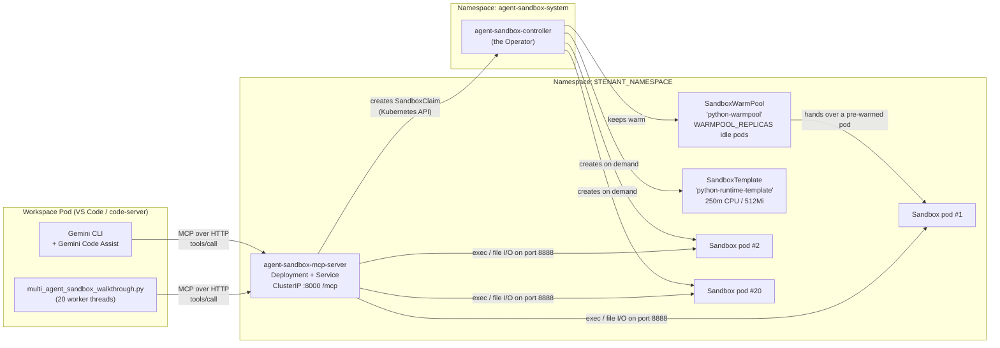

# Agent Sandbox: Giving Your AI Coding Agent a Fleet of Disposable Computers

Run untrusted, agent-generated code in throwaway Linux boxes inside your GKE
cluster — and fan a single agent out into 20 of them at once.

---

## Table of Contents

- [What this example does](#what-this-example-does)
- [How the pieces fit together](#how-the-pieces-fit-together)
- [Glossary for people who do not use Kubernetes](#glossary-for-people-who-do-not-use-kubernetes)
- [What is in this directory](#what-is-in-this-directory)
- [Prerequisites](#prerequisites)
- [Environment variables](#environment-variables)
- [Step 1: Deploy Agent Sandbox and MCP server](#step-1-deploy-agent-sandbox-and-mcp-server)
- [Step 2: Start a VS Code workspace](#step-2-start-a-vs-code-workspace)
- [Step 3: Configure Gemini in the workspace](#step-3-configure-gemini-in-the-workspace)
- [Step 4: Set GEMINI_API_KEY and test prompts](#step-4-set-gemini_api_key-and-test-prompts)
- [Step 5: Run the walkthrough notebook](#step-5-run-the-walkthrough-notebook)
- [Cost](#cost)
- [Troubleshooting](#troubleshooting)
- [Cleanup](#cleanup)
- [See also](#see-also)

---

> [!TIP]
> **Already completed the one-time platform setup?** If you already followed steps 1–6 in the [Examples README](../README.md#start-here-one-time-setup-the-order-things-have-to-happen-in), your GKE cluster, platform deployment, and `codeserver` WorkspaceKind are already in place. You can skip the cluster/platform setup prerequisites and jump straight to [Step 1: Deploy Agent Sandbox and MCP server](#step-1-deploy-agent-sandbox-and-mcp-server).

---

## What this example does

You are editing code in a **VS Code workspace that runs inside a Kubernetes
cluster** (a Kubeflow *Workspace*). Gemini is right there in the editor — the
`gemini` CLI in the terminal, and the Gemini Code Assist extension in the
sidebar.

You ask Gemini: *"scrape this API, parse the results, and plot them."* Gemini
writes some Python. Now what? Running it directly in your workspace means
whatever Gemini wrote — a bad `pip install`, an infinite loop, a `rm -rf` — runs
with your credentials, in your home directory, on your disk.

This example fixes that. It gives Gemini a **button that creates a brand-new,
empty, isolated Linux box on demand**, ~1 second, inside the same cluster.
Gemini uploads its script there, runs it, reads the result back, and throws the
box away. Your workspace never executes the code. If the script destroys its
environment, it destroys a container that was going to be deleted anyway.

The button is exposed through **MCP (Model Context Protocol)** — a small HTTP
server running in your cluster that advertises five tools to any AI agent:
`create_sandbox`, `upload_file`, `execute_command`, `download_file`,
`delete_sandbox`.

### The walkthrough: 20 agents at once

Because each sandbox is independent, you are not limited to one. The included
walkthrough plays out a concrete scenario:

> An AI risk-management **coordinator** manages a fictional \$1,000,000,000
> portfolio spread over 20 market sectors — AI hyperscalers, semiconductors,
> biotech, sovereign debt, crypto, and so on. It needs Value-at-Risk for each
> sector, and each sector has its own model parameters and must not contaminate
> the others.
>
> So it launches **20 worker agents in parallel**. Each one calls
> `create_sandbox`, gets its own pod, uploads a sector config and a Monte-Carlo
> simulation (15,000 Merton jump-diffusion price paths × 252 trading days),
> runs it, downloads a JSON risk report, and deletes its sandbox.
>
> The coordinator then aggregates all 20 reports into a single enterprise risk
> matrix and prints the three riskiest sectors.

Twenty pods appear in your cluster, do ~76 million floating-point path steps
between them, and vanish. That is the demo.

> [!NOTE]
> The simulation is deliberately pure-Python and CPU-bound so that you can
> actually *watch* the parallelism happen with `kubectl get pods -w`. No GPU or
> TPU is involved anywhere in this example.

---

## How the pieces fit together



Reading it as a story:

1. Gemini (or the walkthrough script) speaks **MCP over plain HTTP** to
   `agent-sandbox-mcp-server` on port `8000`, path `/mcp`.
2. The MCP server translates `create_sandbox` into a **Kubernetes API call** —
   it creates a `SandboxClaim` object.
3. The **Agent Sandbox controller** in `agent-sandbox-system` notices the claim.
   If the warm pool has an idle pod, it hands that over instantly; otherwise it
   creates a new pod from the `SandboxTemplate`.
4. The MCP server then talks **directly to the sandbox pod** on port `8888` to
   upload files, run commands, and download results.
5. `delete_sandbox` removes the claim; the controller deletes the pod and
   refills the warm pool.

---

## Glossary for people who do not use Kubernetes

| Term | What it actually is |
| :--- | :--- |
| **Pod** | The unit Kubernetes runs. In practice: one container (here, one Linux box) with its own filesystem, its own process tree, and its own IP address. |
| **Namespace** | A folder for Kubernetes objects. Used for isolation and access control. This example puts the operator in `agent-sandbox-system` and everything user-facing in your *tenant namespace* (default `kubeflow-user`). |
| **ServiceAccount** | The identity a pod runs as when it talks to the Kubernetes API. Not a human account. The MCP server has one so that it is allowed to create sandboxes. |
| **CRD / Custom Resource** | Kubernetes lets you invent new object types. A **CRD** (CustomResourceDefinition) registers the type; a **Custom Resource** is one instance of it. `Sandbox`, `SandboxClaim`, `SandboxTemplate` and `SandboxWarmPool` are all custom resources added by the Agent Sandbox project. |
| **Operator / controller** | A program running in the cluster that watches custom resources and makes reality match them. `agent-sandbox-controller` is the operator: you write "I want a sandbox", it creates the pod. |
| **ClusterRole** | A named list of permissions (e.g. "may create sandboxes"). Cluster-wide, but grants nothing on its own. |
| **RoleBinding** | Attaches a ClusterRole to a ServiceAccount *within one namespace*. This example creates the ClusterRole `agent-sandbox-kubeflow-edit` and binds it to the MCP server's ServiceAccount, and to every Workspace pod's ServiceAccount. |
| **MCP (Model Context Protocol)** | An open JSON-RPC protocol that lets an AI model discover and call external tools. A "MCP server" is just an HTTP endpoint advertising a list of callable tools. Throughout this README, **"the MCP server"** always means one specific thing: the `agent-sandbox-mcp-server` Deployment running in your tenant namespace — never the protocol itself. |
| **Sandbox** | A single isolated pod, managed by the operator. |
| **SandboxTemplate** | The blueprint: which image, how much CPU/memory, which port. See [`manifests/sandbox-template.yaml`](manifests/sandbox-template.yaml). |
| **SandboxWarmPool** | "Always keep N sandboxes pre-created and idle." Makes `create_sandbox` return in ~1 second instead of waiting for a pod to schedule and start. |
| **SandboxClaim** | "I want one sandbox, now." The operator binds the claim to a warm pod, or creates a fresh one. Very similar to how a PersistentVolumeClaim gets bound to a disk. |

How the last four fit together, in order:
**`SandboxTemplate`** (the blueprint) → **`SandboxWarmPool`** (N idle copies of
that blueprint, kept ready) → **`SandboxClaim`** (your request for one) →
**`Sandbox`** + its pod (what you actually get). You create claims; the operator
creates everything else.

### Three different things here are called an "agent"

| When you read… | It means | Where it runs |
| :--- | :--- | :--- |
| **the agent**, Gemini | The AI assistant you prompt — the `gemini` CLI or the Gemini Code Assist sidebar. It is a *client* of the MCP server. | Your Workspace pod |
| **worker agent** | One of the `NUM_AGENTS` Python threads in [`multi_agent_sandbox_walkthrough.py`](multi_agent_sandbox_walkthrough.py) (a `ThreadPoolExecutor`). Each thread drives one sandbox. No AI model is involved. | Wherever you launch the walkthrough |
| **Agent Sandbox operator**, `agent-sandbox-controller` | The Kubernetes controller that turns `SandboxClaim`s into pods. Nothing to do with AI. | Namespace `agent-sandbox-system` |

> [!NOTE]
> **"Sandbox" here means the `Sandbox` custom resource — not gVisor.** A sandbox
> in this example is an ordinary pod created from the `SandboxTemplate`:
> [`manifests/sandbox-template.yaml`](manifests/sandbox-template.yaml) sets no
> `runtimeClassName`, so what you get is the normal container/pod boundary — its
> own filesystem, process tree and IP address — plus `runAsNonRoot` and a CPU/
> memory limit. Kernel-level gVisor sandboxing is a different mechanism, used by
> a different example ([`../resumable-notebooks/`](../resumable-notebooks/README.md)).

---

## What is in this directory

| File | Purpose |
| :--- | :--- |
| [`deploy_agent_sandbox.sh`](deploy_agent_sandbox.sh) | The script that deploys the operator, RBAC, template, warm pool, and MCP server. |
| [`setup_gemini.sh`](setup_gemini.sh) | Configures Gemini CLI and Code Assist to use the in-cluster MCP server. |
| [`manifests/clusterrole.yaml`](manifests/clusterrole.yaml) | `ClusterRole/agent-sandbox-kubeflow-edit` — permissions on sandbox resources, plus read-only on pods and pod logs. Labelled to aggregate into Kubeflow's `kubeflow-edit` role. |
| [`manifests/sandbox-template.yaml`](manifests/sandbox-template.yaml) | `SandboxTemplate/python-runtime-template` and `SandboxWarmPool/python-warmpool`. |
| [`manifests/mcp-server.yaml`](manifests/mcp-server.yaml) | ServiceAccount, RoleBinding, ClusterIP Service and Deployment for the MCP server. |
| [`multi_agent_sandbox_walkthrough.py`](multi_agent_sandbox_walkthrough.py) | The 20-agent demo, as a script. Reference implementation. |
| [`multi_agent_sandbox_walkthrough.ipynb`](multi_agent_sandbox_walkthrough.ipynb) | The same demo as a notebook you step through cell by cell. |

---

## Prerequisites

Work through these in order. Each one has a command that tells you whether you
are done.

> [!IMPORTANT]
> **Where the `${...}` variables below come from: you export them.** The commands
> in this README use `PROJECT_ID`, `CLUSTER_NAME`, `LOCATION`, `REGION`,
> `TENANT_NAMESPACE`, `REPO_NAME` and `REGISTRY`. Nothing sets them for you, so
> export them in your shell now — the block in
> [Step 1: Deploy Agent Sandbox and MCP server](#step-1-deploy-agent-sandbox-and-mcp-server) is the canonical copy.
> `deploy_agent_sandbox.sh` substitutes its own defaults when it is run without
> them (see [Environment variables](#environment-variables)), but the
> copy-paste commands here do not: an unset variable simply expands to an empty
> string.
>
> The verification commands also assume `kubectl` is already pointed at the
> cluster. The deploy script does that itself; to do it by hand first:
>
> ```bash
> gcloud container clusters get-credentials "${CLUSTER_NAME}" \
>   --location="${LOCATION}" --project="${PROJECT_ID}"
> ```

### 1. Required CLI tools

```bash
gcloud version        # Google Cloud CLI
kubectl version --client
envsubst --version    # from the 'gettext' package; the script pipes manifests through it
python3 --version     # 3.8+ is enough; the walkthrough uses only the standard library
```

> [!TIP]
> On Debian/Ubuntu, `envsubst` comes from `apt-get install gettext-base`. The
> deploy script will fail with `envsubst: command not found` without it.

### 2. A GKE cluster with the standalone Kubeflow Workspaces platform deployed

This example is an *add-on*. It assumes the core platform from
[`providers/gke/`](../../providers/gke/) is already running. If it is not,
follow [`providers/gke/USER_GUIDE.md`](../../providers/gke/USER_GUIDE.md) and
run:

```bash
providers/gke/deploy_standalone.sh
```

Verify:

```bash
kubectl get deploy -n kubeflow            # workspace controller etc.
kubectl get ns "${TENANT_NAMESPACE:-kubeflow-user}"
```

> [!IMPORTANT]
> `deploy_agent_sandbox.sh` and `deploy_standalone.sh` ship **identical defaults**
> (`CLUSTER_NAME=kubeflow-notebooks`, `LOCATION=us-central1-c`, `REGION=us-central1`,
> `TENANT_NAMESPACE=kubeflow-user`, `REPO_NAME=notebooks`), because the second script
> configures resources inside the cluster and namespace the first one created.
> If you overrode any of them when deploying the platform, export the **same**
> values here — easiest is to export them once and run both scripts from that
> shell. Otherwise this script points at a namespace that does not exist.

### 3. A running VS Code Workspace built from the `codeserver-python-cpu` image

The demo is driven from Gemini, and **Gemini CLI + Gemini Code Assist are only
baked into the `codeserver-python` image** — not into the JupyterLab image.
Verified in [`images/codeserver-python/Dockerfile`](../../images/codeserver-python/Dockerfile),
which runs `npm install -g @google/gemini-cli@nightly` and installs the
`Google.geminicodeassist` VS Code extension.

Build the image and register the WorkspaceKind by following
[`images/README.md`](../../images/README.md):

```bash
# Build and push — run this from the images/ directory.
./build.sh --codeserver --cpu --registry-path "${REGISTRY}"

# Register the 'codeserver' WorkspaceKind — run this from the repository root,
# because the path below is relative to it.
IMAGE_NAME="codeserver-python" \
CPU_IMAGE_TAG="latest-cpu" \
GPU_IMAGE_TAG="latest-gpu" \
TPU_IMAGE_TAG="latest-tpu" \
  envsubst < images/workspacekinds/codeserver-python.yaml | kubectl apply -f -
```

> [!WARNING]
> That `envsubst` reads **eight** variables in total. Four are set inline above;
> the other four must already be exported in the same shell:
>
> | Variable | Who sets it | Note |
> | :--- | :--- | :--- |
> | `PROJECT_ID` | You | Your Google Cloud Project ID. |
> | `REGION` | You | Same variable this README uses everywhere else. |
> | `REPO_NAME` | You | Artifact Registry repository name. |
> | `GCS_BUCKET` | You | Only used to populate a `$GCS_BUCKET` environment variable inside Workspace pods; nothing here creates a bucket, and this example does not use one. |
>
> An unset variable is **not** an error — `envsubst` replaces it with an empty
> string, so with `REGION`, `PROJECT_ID` and `REPO_NAME` missing the template
> renders `image: "-docker.pkg.dev///codeserver-python:latest-cpu"`, which
> `kubectl apply` happily accepts and no Workspace can ever pull.
> See [Ready-made WorkspaceKind templates](../../images/README.md#ready-made-workspacekind-templates)
> for the full list and a dry-run check.

Then create a Workspace in the Kubeflow UI choosing WorkspaceKind
**`codeserver`** and image option **`codeserver-python-cpu`**.

Verify:

```bash
kubectl get workspacekinds
# NAME          DISPLAY NAME              DEPRECATED   HIDDEN   AGE
# codeserver    VS Code (code-server)                          3m

kubectl get pods -n "${TENANT_NAMESPACE}" -l notebooks.kubeflow.org/workspace-name
# NAME              READY   STATUS    RESTARTS   AGE
# my-workspace-0    1/1     Running   0          2m
```

> [!NOTE]
> You do not need to have a workspace running before executing the deploy script.
> `deploy_agent_sandbox.sh` provisions the cluster-level and tenant-level infrastructure
> (operator, templates, warm pool, and MCP server). You will launch your workspace
> in [Step 2](#step-2-start-a-vs-code-workspace) and configure Gemini in
> [Step 3](#step-3-configure-gemini-in-the-workspace).

### 4. CPU capacity (and therefore cluster autoscaling)

Per [`manifests/sandbox-template.yaml`](manifests/sandbox-template.yaml), every
sandbox pod requests **250m CPU / 512Mi memory** and is limited to
**1 CPU / 1Gi**. The MCP server itself requests another 250m / 256Mi (limit
1 CPU / 1Gi), per [`manifests/mcp-server.yaml`](manifests/mcp-server.yaml).

| Scenario | Requested (schedulable floor) | Limit (burst ceiling) |
| :--- | :--- | :--- |
| Idle (`WARMPOOL_REPLICAS=1`) | 0.25 vCPU / 512Mi | 1 vCPU / 1Gi |
| Walkthrough, `NUM_AGENTS=20` | **5 vCPU / 10Gi** | **20 vCPU / 20Gi** |

The simulation is CPU-bound, so all 20 pods will happily try to burst to their
1-CPU limit at the same time. On a fixed 1-node `e2-standard-4` cluster (4 vCPU
in total, before system pods take their share) even the 5 vCPU of *requests* does
not fit, so some pods sit `Pending` and the run is very slow. **Enable cluster
autoscaling or node auto-provisioning**, or lower `NUM_AGENTS`.

Verify you have autoscaling. These are two different mechanisms and either one is
enough: **node auto-provisioning** lets GKE create entirely new node pools, while
**node pool autoscaling** grows a pool you already created.

```bash
# Node auto-provisioning (cluster-wide): expect "True"
gcloud container clusters describe "${CLUSTER_NAME}" \
  --location="${LOCATION}" --project="${PROJECT_ID}" \
  --format="value(autoscaling.enableNodeAutoprovisioning)"

# Per-node-pool autoscaling: expect at least one pool with enabled=True
gcloud container node-pools list --cluster="${CLUSTER_NAME}" \
  --location="${LOCATION}" --project="${PROJECT_ID}" \
  --format="table(name,autoscaling.enabled,autoscaling.maxNodeCount)"
```

> [!TIP]
> **No GPU or TPU is needed for this example.** You do not need anything from
> [`examples/compute-classes/README.md`](../compute-classes/README.md) — that is
> only for the GPU/TPU examples. It is still worth reading if your *Workspace*
> uses a GPU pod option.

### 5. The Agent Sandbox operator

You do not have to install this yourself — `deploy_agent_sandbox.sh` installs it
if the CRDs are missing, from the upstream release artifact:

```
https://github.com/kubernetes-sigs/agent-sandbox/releases/download/v1.0.3/sandbox-with-extensions.yaml
```

That single YAML contains a Namespace (`agent-sandbox-system`), four CRDs
(`sandboxes.agents.x-k8s.io`, `sandboxclaims`, `sandboxtemplates`,
`sandboxwarmpools` — all `extensions.agents.x-k8s.io`), two ClusterRoles, two
ClusterRoleBindings, a ServiceAccount, a Service, and the
`agent-sandbox-controller` Deployment running
`registry.k8s.io/agent-sandbox/agent-sandbox-controller:v1.0.3`.

Check whether it is already there:

```bash
kubectl get crd | grep agents.x-k8s.io
kubectl get deploy -n agent-sandbox-system
```

### 6. Build and push the `agent-sandbox-mcp-server` image

This repo builds the MCP server image for you. It is **not** part of
`./build.sh --all` — you have to opt in, because it is only needed by this
example.

```bash
cd images
./build.sh --mcp-server --registry-path "${REGISTRY}"
```

> [!NOTE]
> `--registry-path`, the `REGISTRY` variable used everywhere in this README, and
> `<registry-path>` in the output below are all the **same string**:
> `${REGION}-docker.pkg.dev/${PROJECT_ID}/${REPO_NAME}`, which is also the default
> `deploy_agent_sandbox.sh` computes for `REGISTRY`. The Artifact Registry
> repository `${REPO_NAME}` must already exist —
> [`providers/gke/deploy_standalone.sh`](../../providers/gke/deploy_standalone.sh)
> creates it and runs `gcloud auth configure-docker` for you (prerequisite 2).

That produces and pushes exactly two tags:

```
<registry-path>/agent-sandbox-mcp-server:v<YYYYMMDD-HHMMSS>   # immutable; the timestamp is generated at build time
<registry-path>/agent-sandbox-mcp-server:latest
```

`v20260923-151757` wherever it appears below is an **example** of that generated
tag — substitute the one `build.sh` actually printed for your build.

Useful variations (see [`images/README.md`](../../images/README.md) for the full
CLI):

```bash
# Equivalent long forms
./build.sh --agent-sandbox-mcp-server --registry-path "${REGISTRY}"
./build.sh --image mcp-server --registry-path "${REGISTRY}"

# Pin your own tag instead of the timestamp
./build.sh --mcp-server --tag v1.0.3 --registry-path "${REGISTRY}"

# Build without Docker locally
./build.sh --mcp-server --cloud-build --registry-path "${REGISTRY}"

# Preview without building
./build.sh --mcp-server --registry-path "${REGISTRY}" --dry-run
```

> [!NOTE]
> The hardware flags (`--cpu` / `--gpu` / `--tpu`) do not apply to this target —
> it is a single generic image and is built once regardless.

Verify the image landed in your registry before deploying:

```bash
gcloud artifacts docker images list "${REGISTRY}/agent-sandbox-mcp-server" \
  --project="${PROJECT_ID}" --include-tags
# DIGEST          TAGS                      CREATE_TIME
# sha256:a14f61…  latest,v20260923-151757   2026-09-23T15:19:55
```

Then point the deploy script at it. The script's default is
`${REGISTRY}/agent-sandbox-mcp-server:latest`, which is exactly what `build.sh`
pushes — so if your `REGISTRY` matches, **you do not need to set anything**. To
pin a specific build instead:

```bash
export AGENT_SANDBOX_MCP_IMAGE="${REGISTRY}/agent-sandbox-mcp-server:v20260923-151757"
```

> [!NOTE]
> **Why this repo builds the image at all.** Upstream ships the full source for
> this server at
> [`clients/integrations/mcp-server/`](https://github.com/kubernetes-sigs/agent-sandbox/tree/main/clients/integrations/mcp-server),
> but as of **v1.0.3 it publishes no prebuilt image**: `registry.k8s.io/agent-sandbox/mcp-server`
> returns an empty tag list (only `agent-sandbox-controller` and
> `python-runtime-sandbox` are published there), the release ships only
> `sandbox.yaml` / `extensions.yaml` / `sandbox-with-extensions.yaml`, and the
> `k8s-agent-sandbox-mcp-server` package is not on PyPI. So
> [`images/agent-sandbox-mcp-server/Dockerfile`](../../images/agent-sandbox-mcp-server/Dockerfile)
> does a two-stage build: `git clone --depth 1 --branch v1.0.3` of the upstream
> repo, then `pip install` of `clients/integrations/mcp-server` onto
> `python:3.12-slim`. Nothing third-party is vendored into this repository.

> [!TIP]
> `AGENT_SANDBOX_VERSION` names **two independent settings that happen to share
> a name** and are *not* linked to each other:
> 1. a Docker **build arg** (default `v1.0.3`) in
>    [`images/agent-sandbox-mcp-server/Dockerfile`](../../images/agent-sandbox-mcp-server/Dockerfile),
>    which picks the upstream source tag the MCP server is built from;
> 2. an **environment variable** read by `deploy_agent_sandbox.sh`, which picks
>    the operator release YAML and the sandbox runtime image tag.
>
> `build.sh` does **not** pass `--build-arg`, so to build against a different
> upstream tag either edit the `ARG AGENT_SANDBOX_VERSION=` line or invoke Docker
> directly:
> ```bash
> docker build --build-arg AGENT_SANDBOX_VERSION=v1.0.4 \
>   -t "${REGISTRY}/agent-sandbox-mcp-server:v1.0.4" \
>   images/agent-sandbox-mcp-server
> ```
> Keeping the two in step is manual — nothing checks it for you.

> [!NOTE]
> The image runs as a system user called `appuser`.
> [`manifests/mcp-server.yaml`](manifests/mcp-server.yaml) overrides that at the
> pod level with `runAsUser: 1000` / `runAsGroup: 1000` / `runAsNonRoot: true`.
> That works, because the package is `pip install`ed into world-readable system
> site-packages — but if you substitute a differently built image that needs to
> write inside its own home directory, you may have to adjust the
> `securityContext`.

> [!IMPORTANT]
> If you skip this step, the MCP server pod sits in `ImagePullBackOff` and the
> deploy script fails at
> `rollout status deployment/agent-sandbox-mcp-server`. Note also that
> `imagePullPolicy: Always` is set in the manifest, so re-pushing `:latest`
> is picked up on the next pod restart.

> [!WARNING]
> Upstream's own README states the MCP server ships with **no authentication**:
> anything that can reach port 8000 gets full access to every tool, in every
> namespace its ServiceAccount can touch. The Service created here is
> `ClusterIP`, so it is only reachable from inside the cluster — **keep it that
> way.** Do not put it behind a public LoadBalancer or Ingress without an
> authenticating proxy in front.

### 7. Gemini API Key (`GEMINI_API_KEY`)

To prompt Gemini interactively from inside your VS Code workspace (Gemini CLI or
Gemini Code Assist), obtain a Gemini API key from [Google AI Studio](https://aistudio.google.com/apikey).

Export it in your workspace terminal (or add it to `/home/jovyan/.bashrc`):

```bash
export GEMINI_API_KEY="your-api-key"
```

> [!NOTE]
> The walkthrough script ([`multi_agent_sandbox_walkthrough.py`](multi_agent_sandbox_walkthrough.py))
> does not require an API key — it talks directly to the in-cluster MCP server over HTTP.
> The API key is only needed when prompting Gemini CLI.

---

## Environment variables

All read at the top of [`deploy_agent_sandbox.sh`](deploy_agent_sandbox.sh).

| Variable | Default | Meaning |
| :--- | :--- | :--- |
| `PROJECT_ID` | `$(gcloud config get-value project)` | Google Cloud project. **The script exits with an error if this ends up empty.** (Accepts `PROJECT` as fallback). |
| `CLUSTER_NAME` | `kubeflow-notebooks` | GKE cluster name. (Accepts `CLUSTER` as fallback). |
| `LOCATION` | `us-central1-c` | Cluster location (zone *or* region) — used for `gcloud container clusters get-credentials` and to build `CONTEXT`. |
| `REGION` | `us-central1` | Region used to build the default `REGISTRY` hostname. |
| `TENANT_NAMESPACE` | `kubeflow-user` | Namespace that gets the SandboxTemplate, SandboxWarmPool and MCP server. Must already exist. |
| `REPO_NAME` | `notebooks` | Artifact Registry repository name, used to build the default `REGISTRY`. (Accepts `REPOSITORY` as fallback). |
| `CONTEXT` | `gke_${PROJECT_ID}_${LOCATION}_${CLUSTER_NAME}` | kubectl context name. Every `kubectl` call in the script passes `--context`. |
| `REGISTRY` | `${REGION}-docker.pkg.dev/${PROJECT_ID}/${REPO_NAME}` | Container registry path prefix. |
| `WARMPOOL_REPLICAS` | `1` | How many sandbox pods to keep pre-warmed and idle. Substituted into `SandboxWarmPool.spec.replicas`. It does **not** set the pool's name — that is hardcoded as `python-warmpool` in [`manifests/sandbox-template.yaml`](manifests/sandbox-template.yaml). |
| `AGENT_SANDBOX_VERSION` | `v1.0.3` | Upstream operator release. Controls both the release YAML URL and the default sandbox runtime image tag. |
| `SANDBOX_RUNTIME_IMAGE` | `registry.k8s.io/agent-sandbox/python-runtime-sandbox:${AGENT_SANDBOX_VERSION}` | Image each sandbox pod runs. This one *is* published upstream. |
| `AGENT_SANDBOX_MCP_IMAGE` | `${REGISTRY}/agent-sandbox-mcp-server:latest` | The MCP server image. Built by `images/build.sh --mcp-server`, which pushes exactly this `:latest` tag — so the default usually just works. See [prerequisite 6](#6-build-and-push-the-agent-sandbox-mcp-server-image). |

Variables read by the **walkthrough** (not the deploy script):

| Variable | Default | Meaning |
| :--- | :--- | :--- |
| `TENANT_NAMESPACE` | `kubeflow-user` | Namespace to create sandboxes in; also used to build the default MCP URL. Same variable as in the table above — set it to the same value for both, or the walkthrough will look for a warm pool and an MCP server in a namespace that does not have them. |
| `MCP_SERVER_URL` | `http://agent-sandbox-mcp-server.${TENANT_NAMESPACE}.svc.cluster.local:8000/mcp` | Where to reach the MCP server. Resolves via in-cluster DNS. |
| `WARMPOOL_NAME` | `python-warmpool` | Which warm pool to claim sandboxes from — the *name*, not the size. Must match the pool the deploy script created, which is always `python-warmpool`, so leave it alone unless you added a second pool by hand. |
| `NUM_AGENTS` | `20` | How many parallel agents/sandboxes. The built-in sector catalog has 20 entries, so higher values are silently truncated to 20. |

---

## Step 1: Deploy Agent Sandbox and MCP server

Deploy the Agent Sandbox operator, custom resources, RBAC permissions, and the in-cluster MCP server.

```bash
# 1. Point at your project and cluster.
export PROJECT_ID="your-gcp-project-id"
export CLUSTER_NAME="kubeflow-notebooks"
export LOCATION="us-central1-c"
export REGION="us-central1"
export TENANT_NAMESPACE="kubeflow-user"
export REPO_NAME="notebooks"
export REGISTRY="${REGION}-docker.pkg.dev/${PROJECT_ID}/${REPO_NAME}"

# 2. Build and push the MCP server image (prerequisite 6). It is not in --all.
(cd images && ./build.sh --mcp-server --registry-path "${REGISTRY}")

# The deploy script defaults to ${REGISTRY}/agent-sandbox-mcp-server:latest,
# which is exactly what the line above pushes. Only set this to pin a build:
# export AGENT_SANDBOX_MCP_IMAGE="${REGISTRY}/agent-sandbox-mcp-server:v20260923-151757"

# 3. Optional knobs.
export WARMPOOL_REPLICAS=1

# 4. Run it, from the repository root.
./examples/agent-sandbox/deploy_agent_sandbox.sh
```

What it does, in order:

1. `gcloud container clusters get-credentials` and `kubectl config use-context`.
2. Installs the Agent Sandbox operator **only if** `sandboxes.agents.x-k8s.io`
   is missing, then waits up to 3 minutes for `agent-sandbox-controller` to roll
   out.
3. Applies `ClusterRole/agent-sandbox-kubeflow-edit`, then **checks** (without
   changing anything) that each WorkspaceKind references `kubeflow-edit`.
4. `envsubst` + apply the SandboxTemplate and SandboxWarmPool.
5. `envsubst` + apply the MCP ServiceAccount / RoleBinding / Service /
   Deployment, waits up to 3 minutes for rollout, then verifies the MCP server
   health check on port 8000.

> [!NOTE]
> **Step 3 changes no WorkspaceKind, and needs to change none.**
> [`manifests/clusterrole.yaml`](manifests/clusterrole.yaml) carries the label
> `rbac.authorization.kubeflow.org/aggregate-to-kubeflow-edit: "true"`, and
> `kubeflow-edit` is an *aggregated* ClusterRole whose selector matches exactly
> that label. Kubernetes therefore folds the sandbox rules into `kubeflow-edit`
> by itself the moment the ClusterRole is applied, and every WorkspaceKind that
> already lists `kubeflow-edit` — which all three kinds shipped in this repo do —
> inherits them. You can see the result with:
>
> ```bash
> kubectl get clusterrole kubeflow-edit -o json \
>   | jq '[.rules[] | select(.apiGroups[]? | test("agents.x-k8s.io"))]'
> ```
>
> The script only *reports* which WorkspaceKinds reference `kubeflow-edit`. If
> one does not, it prints an append-only `jq` command you can run yourself
> rather than editing anything on your behalf.

### Verify the deployment

Run these after `deploy_agent_sandbox.sh` has exited successfully, in a shell
where `TENANT_NAMESPACE` is still exported.

**The operator is running:**

```bash
kubectl get pods -n agent-sandbox-system
# NAME                                        READY   STATUS    RESTARTS   AGE
# agent-sandbox-controller-7c9f8d5b64-2xk4p   1/1     Running   0          2m
```

**The CRDs are established:**

```bash
kubectl get crd | grep agents.x-k8s.io
# sandboxclaims.extensions.agents.x-k8s.io       2026-09-23T15:04:11Z
# sandboxes.agents.x-k8s.io                      2026-09-23T15:04:11Z
# sandboxtemplates.extensions.agents.x-k8s.io    2026-09-23T15:04:12Z
# sandboxwarmpools.extensions.agents.x-k8s.io    2026-09-23T15:04:12Z
```

**The template and warm pool exist in your namespace:**

```bash
kubectl get sandboxtemplates,sandboxwarmpools -n "$TENANT_NAMESPACE"
# NAME                                                                  AGE
# sandboxtemplate.extensions.agents.x-k8s.io/python-runtime-template    90s
#
# NAME                                                              AGE
# sandboxwarmpool.extensions.agents.x-k8s.io/python-warmpool        90s
```

**The warm pool has actually warmed up** (`WARMPOOL_REPLICAS` idle pods):

```bash
kubectl get pods -n "$TENANT_NAMESPACE" -l agents.x-k8s.io/sandbox-claim-name
# (or, more simply, look for pods running the python-runtime-sandbox image)
kubectl get sandboxes -n "$TENANT_NAMESPACE"
```

**The MCP server is up and healthy:**

```bash
kubectl get deploy agent-sandbox-mcp-server -n "$TENANT_NAMESPACE"
# NAME                       READY   UP-TO-DATE   AVAILABLE   AGE
# agent-sandbox-mcp-server   1/1     1            1           90s

kubectl get svc agent-sandbox-mcp-server -n "$TENANT_NAMESPACE"
# NAME                       TYPE        CLUSTER-IP     EXTERNAL-IP   PORT(S)    AGE
# agent-sandbox-mcp-server   ClusterIP   34.118.x.x     <none>        8000/TCP   90s
```

---

## Step 2: Start a VS Code workspace

Create and connect to a VS Code workspace in the Kubeflow Workspaces UI:

1. Open the Kubeflow Workspaces UI in your browser.
2. Select your namespace (e.g. `kubeflow-user`).
3. Click **Create Workspace**.
4. Configure the workspace:
   - **Name**: e.g., `agent-sandbox-dev`
   - **WorkspaceKind**: Select **`codeserver`** (VS Code)
   - **Image**: Select **`codeserver-python-cpu`** (which includes the `gemini` CLI and Gemini Code Assist extension)
5. Click **Create** and wait for the workspace status to turn **Ready** (green).
6. Click **Connect** to open VS Code in your browser.
7. Open a terminal in VS Code: select **Terminal** > **New Terminal** (or press ``Ctrl+` ``).

---

## Step 3: Configure Gemini in the workspace

Configure Gemini to speak to the in-cluster Agent Sandbox MCP server.

Inside the **VS Code workspace terminal**, run:

```bash
bash examples/agent-sandbox/setup_gemini.sh
```

> [!TIP]
> Alternatively, from your administrative workstation (outside the cluster), you can configure a specific workspace by passing its name:
> ```bash
> bash examples/agent-sandbox/setup_gemini.sh <WORKSPACE_NAME>
> ```

### What `setup_gemini.sh` configures

The script creates three configuration files in `/home/jovyan/.gemini/`:

#### 1. `~/.gemini/settings.json`

Registers the in-cluster MCP server with the Gemini CLI using Kubernetes internal DNS:

```json
{
  "mcpServers": {
    "agent-sandbox": {
      "url": "http://agent-sandbox-mcp-server.<TENANT_NAMESPACE>.svc.cluster.local:8000/mcp",
      "type": "http",
      "trust": true
    }
  }
}
```

#### 2. `~/.gemini/trustedFolders.json`

Prevents Gemini CLI from interactively prompting for folder trust:

```json
{
  "/": "TRUST_PARENT",
  "/home/jovyan": "TRUST_FOLDER"
}
```

#### 3. `~/.gemini/GEMINI.md`

Provides standing instructions that instruct Gemini to delegate execution into an isolated sandbox rather than executing code directly in your workspace:

1. Provision an isolated environment with `mcp_agent-sandbox_create_sandbox`
   (`namespace: <TENANT_NAMESPACE>`, `warmpool: python-warmpool`).
2. Upload files with `mcp_agent-sandbox_upload_file`.
3. Run the workload with `mcp_agent-sandbox_execute_command`.
4. Retrieve results with `mcp_agent-sandbox_download_file`.
5. Always clean up with `mcp_agent-sandbox_delete_sandbox`.

### The five tools Gemini is told to use

| Tool | Key arguments | Returns |
| :--- | :--- | :--- |
| `create_sandbox` | `warmpool`, `namespace`, `labels`, `shutdown_after_seconds`, `sandbox_ready_timeout` | The `sandbox_claim_name` of the new sandbox |
| `upload_file` | `sandbox_claim_name`, `namespace`, `path`, `content`, `binary` | Bytes written |
| `execute_command` | `sandbox_claim_name`, `namespace`, `command`, `timeout` | `exit_code`, `stdout`, `stderr` |
| `download_file` | `sandbox_claim_name`, `namespace`, `path`, `binary` | File content and byte count |
| `delete_sandbox` | `sandbox_claim_name`, `namespace` | — |

> [!NOTE]
> The upstream server actually exposes **eight** tools — the five above plus
> `get_sandbox_status`, `list_files` and `file_exists` — and a `get_sandboxes`
> resource. The walkthrough uses `get_sandbox_status` for its readiness polling.
> `GEMINI.md` only advertises the five that make up the core lifecycle.
>
> `list_tools` is **not** a tool. It is the MCP protocol method `tools/list`;
> calling `call_tool("list_tools", {})` is an error. Use the client's
> `list_tools()` helper.

---

## Step 4: Set GEMINI_API_KEY and test prompts

In your VS Code workspace terminal, export your Gemini API key:

```bash
export GEMINI_API_KEY="your-gemini-api-key"
```

> [!TIP]
> Add `export GEMINI_API_KEY="your-api-key"` to `/home/jovyan/.bashrc` to persist it across terminal sessions in this workspace.

### Test tool discovery

Verify that the Gemini CLI discovers the Agent Sandbox tools over MCP:

```bash
gemini -p 'List the tools available from the agent-sandbox MCP server.'
```

### Try example prompts

Run these directly in your workspace terminal:

```bash
# 1. Minimal round trip: create sandbox, execute Python, return output, cleanup
gemini -p 'Create a sandbox from warmpool python-warmpool, run
           python3 -c "print(2**64)", show me the output, and delete the sandbox.'

# 2. Compute-intensive code isolated from your workspace
gemini -p 'Write a Python script that brute-forces the collatz conjecture for
           all n under 1,000,000 and reports the longest chain. Run it in a
           fresh sandbox, not here, and download the results file when done.'

# 3. Parallel sandbox fan-out
gemini -p 'Create three sandboxes. In each one, install nothing and run a
           different sorting algorithm benchmark on 1e6 random integers using
           only the standard library. Compare the timings and clean up.'
```

If you prefer the **Gemini Code Assist** sidebar in VS Code instead of the CLI, the exact same MCP server tools and `GEMINI.md` policy apply to chat prompts in the sidebar.

---

## Step 5: Run the walkthrough notebook

Now run the 20-agent Monte Carlo portfolio risk simulation directly from inside your workspace.

You can step through the `examples/agent-sandbox/multi_agent_sandbox_walkthrough.ipynb` notebook interactively or in your VS Code terminal:

```bash
# Default: 20 agents, in-cluster MCP DNS name, namespace kubeflow-user.
python3 examples/agent-sandbox/multi_agent_sandbox_walkthrough.py

# Or run with a smaller fan-out while testing:
NUM_AGENTS=5 python3 examples/agent-sandbox/multi_agent_sandbox_walkthrough.py
```

### Watch it happen in Kubernetes

In a separate terminal on your administrative workstation, watch the Kubernetes resources in real time:

```bash
# Watch claims and sandboxes appearing and binding
kubectl get sandboxclaims,sandboxes,sandboxwarmpools -n "$TENANT_NAMESPACE" -w

# Watch the 20 pods spreading across your nodes
kubectl get pods -n "$TENANT_NAMESPACE" -l agents.x-k8s.io/sandbox-claim-name -o wide

# Stream MCP server JSON-RPC calls
kubectl logs -n "$TENANT_NAMESPACE" -l app=agent-sandbox-mcp-server -f
```

### What the output looks like

```
==============================================================================
Massively Parallel Multi-Agent Kubernetes Sandbox Walkthrough
Enterprise Monte Carlo Portfolio Risk Analysis across 20 Agents
==============================================================================
[INFO] Target MCP Server:   http://agent-sandbox-mcp-server.kubeflow-user.svc.cluster.local:8000/mcp
[INFO] Tenant Namespace:    kubeflow-user
[INFO] Warm Pool Template:  python-warmpool
[INFO] Parallel Agents:     20 autonomous sandboxes

=== Step 1: Initializing Coordinator & Tool Discovery ===
[SUCCESS] Connected to MCP Server: agent-sandbox-mcp-server
[INFO] Discovered 8 tools: ['create_sandbox', 'delete_sandbox', 'execute_command', ...]

=== Step 2: Launching 20 Autonomous Worker Agents in Parallel ===
[Agent::tech-ai             ] Created Sandbox -> claim-abc123 (Warm Pool ~0.41s)
[Agent::semiconductors      ] Created Sandbox -> claim-def456 (Scheduled in 22.13s)
...
[Agent::tech-ai             ] Sandbox Ready in 3.2s
[Agent::tech-ai             ] Finished 15,000 Monte Carlo paths in 64.80s
[Agent::tech-ai             ] Torn down sandbox claim claim-abc123
...
[SUCCESS] All 20 autonomous worker agents completed in 214.55s!

=== Step 3: Synthesizing Global Enterprise Portfolio Risk Report ===
==============================================================================
ENTERPRISE GLOBAL RISK MATRIX (20 PARALLEL WORKERS)
==============================================================================
SECTOR NAME                        |   ALLOCATION |    VOL |      99% VaR |     99% CVaR |  STRESS LOSS
-------------------------------------------------------------------------------------------------------
Digital Assets & Smart Contracts   |       $25.0M |    72% |       $19.7M |       $21.3M |       $22.7M
Genomic Therapeutics               |       $45.0M |    45% |       $30.1M |       $33.4M |       $45.0M
...
```

> [!NOTE]
> **Expected runtime.** Exact numbers depend entirely on your cluster.
> - **Sandbox startup.** Only `WARMPOOL_REPLICAS` sandboxes come from the warm
>   pool (sub-second). The other ~19 must be scheduled and started from scratch,
>   which takes tens of seconds — and several minutes if the cluster autoscaler
>   needs to provision new nodes first.
> - **The simulation.** 15,000 paths × 252 days of pure-Python floating point
>   per agent, with each pod limited to 1 CPU and requesting 250m.
>
> Budget **5–15 minutes** for a cold 20-agent run on an autoscaling cluster.
> Each worker has a 90-second readiness timeout, and sandboxes self-destruct after
> `shutdown_after_seconds: 900`.

> [!TIP]
> Start with `NUM_AGENTS=3` or `NUM_AGENTS=5` to verify the end-to-end flow in about
> a minute before scaling up to 20 agents.

---

## Cost

Everything here is ordinary GKE compute — there is no separate Agent Sandbox
charge.

| What | When it costs you |
| :--- | :--- |
| **Warm pool** | `WARMPOOL_REPLICAS` pods sit idle **24/7**, each reserving 250m CPU / 512Mi. With the default of `1` that is small, but it is continuous. Set `WARMPOOL_REPLICAS=0` when you are not using the example. |
| **MCP server** | One pod, 250m CPU / 256Mi reserved, running continuously. |
| **A walkthrough run** | 20 pods × (250m request, 1 CPU limit) for the duration of the run, then gone. On an autoscaling cluster this typically means one or two extra nodes for 5–15 minutes. |
| **Autoscaled nodes** | The real cost. Nodes added to fit 20 pods are billed per second until the autoscaler removes them, which lags the workload by ~10 minutes. |
| **Gemini API** | Gemini CLI prompts use your Gemini API key (free tier or billed per token via Google AI Studio). |

> [!TIP]
> To shrink the idle footprint to almost nothing without uninstalling anything:
> ```bash
> kubectl scale deploy agent-sandbox-mcp-server -n "$TENANT_NAMESPACE" --replicas=0
> kubectl patch sandboxwarmpool python-warmpool -n "$TENANT_NAMESPACE" \
>   --type=merge -p '{"spec":{"replicas":0}}'
> ```

---

## Troubleshooting

| Symptom | Likely cause | Fix |
| :--- | :--- | :--- |
| MCP pod `ImagePullBackOff` / `ErrImagePull`; script fails at `rollout status deployment/agent-sandbox-mcp-server` | `AGENT_SANDBOX_MCP_IMAGE` points at an image that has not been pushed yet. The MCP server image is **not** built by `./build.sh --all` — it is opt-in. | Run `cd images && ./build.sh --mcp-server --registry-path "${REGISTRY}"`, then re-run the deploy script. See [prerequisite 6](#6-build-and-push-the-agent-sandbox-mcp-server-image). Confirm the exact image being pulled with `kubectl describe pod -n "$TENANT_NAMESPACE" -l app=agent-sandbox-mcp-server`, and that it exists with `gcloud artifacts docker images list "${REGISTRY}/agent-sandbox-mcp-server" --include-tags`. |
| Sandbox pods stuck `Pending`; `0/N nodes are available: Insufficient cpu` | 20 sandboxes request 5 vCPU total, plus the warm pool and MCP server, plus your Workspace pod. Your node pool is too small and is not autoscaling. | Enable node autoscaling / auto-provisioning, add nodes, or run with a smaller `NUM_AGENTS`. Diagnose with `kubectl describe pod <pod> -n "$TENANT_NAMESPACE"` and read `Events`. |
| `[WARN] Agent <sector> timed out waiting for sandbox readiness.`, then failures downstream | `wait_for_sandbox_ready` gives up after 90s. Usually the pod is still `Pending` (see the row above) or the image is still being pulled onto a brand-new node. | Pre-warm more pods (`WARMPOOL_REPLICAS=5`), reduce `NUM_AGENTS`, or run the walkthrough twice — the second run starts on warm nodes with the image cached. |
| `gemini` says it has no tools, or never mentions `agent-sandbox` | `~/.gemini/settings.json` was not created, or points to an unreachable MCP URL. | Open your VS Code workspace terminal and run `bash examples/agent-sandbox/setup_gemini.sh`. Check inside the terminal: `cat ~/.gemini/settings.json`, then test connectivity: `curl -s http://agent-sandbox-mcp-server.$TENANT_NAMESPACE.svc.cluster.local:8000/healthz`. |
| `gemini` returns authentication error or invalid API key | `GEMINI_API_KEY` is not set or invalid. | Run `export GEMINI_API_KEY="your-api-key"` in your workspace terminal before running `gemini`. |
| `error: no matches for kind "SandboxTemplate"` or `timed out waiting for deployment/agent-sandbox-controller` | The operator install did not finish; CRDs are not established yet, or the controller image cannot be pulled. | `kubectl get crd \| grep agents.x-k8s.io` and `kubectl -n agent-sandbox-system describe deploy agent-sandbox-controller`. Re-apply: `kubectl apply --server-side -f https://github.com/kubernetes-sigs/agent-sandbox/releases/download/v1.0.3/sandbox-with-extensions.yaml`. |
| Script dies with `envsubst: command not found` | `gettext` is not installed on the machine running the script. | `sudo apt-get install -y gettext-base` (Debian/Ubuntu) or `brew install gettext`. |
| Sandbox pods created with an empty image name, or `SandboxWarmPool` has `replicas: ` | An environment variable referenced by a manifest was unset when `envsubst` ran, so it was substituted with an empty string. | Export `TENANT_NAMESPACE`, `SANDBOX_RUNTIME_IMAGE`, `WARMPOOL_REPLICAS` and `AGENT_SANDBOX_MCP_IMAGE` before running, or let the script's own defaults apply by invoking it directly rather than sourcing pieces of it. |
| `Unknown tool: list_tools` from your own MCP client code | `list_tools` is the MCP protocol method `tools/list`, not a callable tool. | Call the client helper `client.list_tools()` instead of `client.call_tool("list_tools", {})`. |
| Sandboxes are left behind after a crashed run | The worker agent died before reaching `delete_sandbox`. Each sandbox does self-destruct after `shutdown_after_seconds: 900`. | Wait 15 minutes, or force it: `kubectl delete sandboxclaims -n "$TENANT_NAMESPACE" -l app.kubernetes.io/managed-by=massive-agent-walkthrough`. |

---

## Cleanup

Undo everything the script created, in reverse order.

Every command below uses `$TENANT_NAMESPACE` and `$PROJECT_ID` — the same variables
you exported in [Step 1: Deploy Agent Sandbox and MCP server](#step-1-deploy-agent-sandbox-and-mcp-server) — and assumes
`kubectl` is still pointed at the cluster. Export them again if you are in a new
shell.

**1. Any leftover sandboxes:**

```bash
kubectl delete sandboxclaims --all -n "$TENANT_NAMESPACE"
```

**2. The warm pool and template:**

```bash
kubectl delete sandboxwarmpool python-warmpool -n "$TENANT_NAMESPACE"
kubectl delete sandboxtemplate python-runtime-template -n "$TENANT_NAMESPACE"
```

**3. The MCP server (Deployment, Service, ServiceAccount, RoleBinding):**

```bash
kubectl delete -n "$TENANT_NAMESPACE" \
  deployment/agent-sandbox-mcp-server \
  service/agent-sandbox-mcp-server \
  serviceaccount/agent-sandbox-mcp-server \
  rolebinding/agent-sandbox-mcp-server
```

Or, equivalently, delete exactly what was applied — run this from the repository
root, with `TENANT_NAMESPACE` still exported (if it is unset, `envsubst` renders
an empty `namespace:` and `kubectl` falls back to your current context's default
namespace):

```bash
envsubst < examples/agent-sandbox/manifests/mcp-server.yaml | kubectl delete -f -
```

**4. WorkspaceKinds need no cleanup.** The deploy script does not modify them, so
there is nothing to revert. Removing `ClusterRole/agent-sandbox-kubeflow-edit` in
the next step is what withdraws the sandbox permissions: because they reached
workspaces purely through RBAC aggregation into `kubeflow-edit`, deleting the
ClusterRole makes them disappear from `kubeflow-edit` automatically.

> [!NOTE]
> If you previously ran a version of the script that *did* patch WorkspaceKinds,
> that version set `clusterRoles` to exactly
> `[{"name":"kubeflow-edit"},{"name":"agent-sandbox-kubeflow-edit"}]`. Drop the
> stale entry without clobbering anything else with:
>
> ```bash
> for wk in $(kubectl get workspacekinds -o jsonpath='{.items[*].metadata.name}'); do
>   kubectl get workspacekind "$wk" -o json \
>     | jq '.spec.podTemplate.serviceAccount.clusterRoles =
>           [(.spec.podTemplate.serviceAccount.clusterRoles // [])[]
>            | select(.name != "agent-sandbox-kubeflow-edit")]' \
>     | kubectl apply -f -
> done
> ```

**5. The ClusterRole:**

```bash
kubectl delete clusterrole agent-sandbox-kubeflow-edit
```

**6. The operator** (removes the `agent-sandbox-system` namespace, the four CRDs,
and therefore *every* sandbox object cluster-wide):

```bash
kubectl delete -f \
  https://github.com/kubernetes-sigs/agent-sandbox/releases/download/v1.0.3/sandbox-with-extensions.yaml
```

**7. Optional — the Gemini config inside the Workspace pod:**

Inside your VS Code workspace terminal:

```bash
rm -f /home/jovyan/.gemini/settings.json \
      /home/jovyan/.gemini/trustedFolders.json \
      /home/jovyan/.gemini/GEMINI.md
```

Or from your administrative workstation (outside the cluster):

```bash
WORKSPACE_POD=$(kubectl -n "$TENANT_NAMESPACE" get pods \
  -l notebooks.kubeflow.org/workspace-name \
  --field-selector=status.phase=Running -o jsonpath='{.items[0].metadata.name}')

kubectl -n "$TENANT_NAMESPACE" exec "$WORKSPACE_POD" -c main -- \
  rm -f /home/jovyan/.gemini/settings.json \
        /home/jovyan/.gemini/trustedFolders.json \
        /home/jovyan/.gemini/GEMINI.md
```

---

## See also

- [`providers/gke/USER_GUIDE.md`](../../providers/gke/USER_GUIDE.md) — deploying the underlying platform
- [`images/README.md`](../../images/README.md) — building the `codeserver-python` image and registering WorkspaceKinds
- [`examples/compute-classes/README.md`](../compute-classes/README.md) — GPU/TPU capacity (not needed for this example)
- [kubernetes-sigs/agent-sandbox](https://github.com/kubernetes-sigs/agent-sandbox) — the upstream operator
- [Upstream MCP server source and docs](https://github.com/kubernetes-sigs/agent-sandbox/tree/main/clients/integrations/mcp-server)
- [Model Context Protocol](https://modelcontextprotocol.io/)
