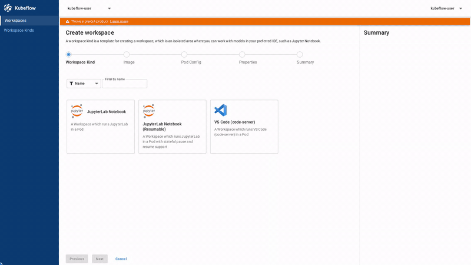
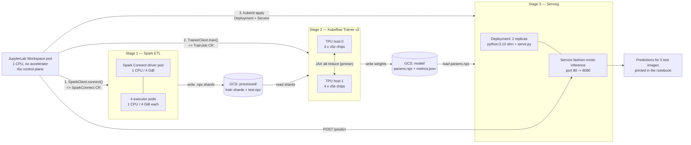

# Distributed ML from a Notebook: Spark ETL → multi-host TPU training → inference

**Audience:** engineers who know Python and ML but have never used Kubernetes.
Everything Kubernetes-specific is explained in the [Glossary](#glossary) below.

> [!TIP]
> **Demo Walkthrough:**
>
> 
>
> *A complete 3-minute narrated walkthrough is available at [`demo_workspaces_distributed.mp4`](demo_workspaces_distributed.mp4).*

---

## What this example does

You open a JupyterLab notebook in your browser. The machine behind that notebook
is deliberately tiny — one CPU, no accelerator, a few cents an hour. From that
notebook you run three cells, and those cells go and rent hundreds of dollars
worth of distributed compute, use it, and hand the results back:

| Stage | What actually runs | How much hardware | Where the output goes |
| :--- | :--- | :--- | :--- |
| **1. Data processing (ETL)** | Apache Spark preprocesses the 60,000-image Fashion-MNIST training set — normalize pixels, one-hot encode labels, random horizontal flip | 1 Spark driver pod + 4 executor pods (1 CPU / 4 GiB each) | `gs://<bucket>/processed/train/shard-000.npz` … and `processed/test/test.npz` |
| **2. Model training** | A JAX MLP (784 → 256 → 10) trained data-parallel, with gradients averaged across every chip on every host (`jax.lax.pmean`) | A **multi-host Cloud TPU v5e slice**: 2 hosts × 4 chips = 8 chips | `gs://<bucket>/model/params.npz`, `model/metrics.json`, `model/checkpoint-<step>.npz` |
| **3. Inference** | A tiny HTTP server loads `params.npz` and answers `POST /predict` | 2 CPU pods (100m CPU each) behind one in-cluster address | Predictions for 5 real test images, printed in the notebook |

**Why this matters.** You never write a line of YAML, never `ssh` into a machine,
and never create a TPU VM. You call three Python functions. Kubernetes finds (or
creates) the machines, runs the work, and tears the machines down afterwards. The
notebook is a *control plane*, not a workhorse — so the expensive hardware only
exists while it is actually computing.

All three stages exchange data through a single **GCS bucket**, using the
`google-cloud-storage` Python SDK. There is **no GCSFuse mount and no shared
network disk** — every read and write is an ordinary object-storage call,
authorized by Workload Identity.

> [!TIP]
> **Already completed the one-time platform setup?** If you already followed steps 1–6 in the [Examples README](../README.md#start-here-one-time-setup-the-order-things-have-to-happen-in), your GKE cluster, GCS bucket, `jupyterlab` WorkspaceKind, and TPU ComputeClass are already set up. You can skip the setup prerequisites and jump straight to [Create the Workspace](#7-create-the-workspace-with-the-right-options) or [Running it](#running-it).
>
> **One exception: the Spark image.** The custom images are optional in the one-time setup, but this example needs `spark-py312` for Stage 1. If you haven't pushed it yet, build it first (see [3. The Spark image is built and pushed](#3-the-spark-image-is-built-and-pushed)):
>
> ```bash
> ./images/build.sh --spark --registry-path "${REGION}-docker.pkg.dev/${PROJECT_ID}/${REPO_NAME}"
> ```

### Flow



### Files in this example

| File | What it is |
| :--- | :--- |
| [`demo_workspaces_distributed.mp4`](demo_workspaces_distributed.mp4) | Full video walkthrough showcasing the end-to-end distributed ML pipeline from a lightweight workspace. |
| [`demo_workspaces_distributed.gif`](demo_workspaces_distributed.gif) | Animated GIF preview of key workflow milestones (workspace creation, Spark ETL, TPU training, inference). |
| [`distributed_tpu_example.ipynb`](distributed_tpu_example.ipynb) | The notebook you run. Cells for setup, Stage 1, Stage 2, Stage 3, and cleanup. |
| [`jobs/pipeline.py`](jobs/pipeline.py) | Orchestration helpers: `run_data_processing()`, `run_training()`, log printers. Also resolves the namespace, bucket, and images. |
| [`jobs/data_processing.py`](jobs/data_processing.py) | The Spark ETL logic (`run_etl`). Runs on the Spark driver/executors. |
| [`jobs/train.py`](jobs/train.py) | The JAX training function. Runs on every TPU host. |
| [`jobs/serve.py`](jobs/serve.py) | The inference HTTP server. Injected into the serving pods via a ConfigMap. |
| [`inference-service.yaml`](inference-service.yaml) | The Stage 3 `Deployment` + `Service`. `BUCKET_NAME_PLACEHOLDER` is substituted by the notebook. |
| [upload_to_jupyter.py](../upload_to_jupyter.py) | Utility script to sync local `jobs/` and manifests to the remote workspace over HTTP without `kubectl`. |

> [!IMPORTANT]
> The notebook and the `jobs/` folder must be uploaded into the **same
> directory** inside the Workspace (or synced to `/home/jovyan` via
> [upload_to_jupyter.py](../upload_to_jupyter.py) if connecting from local VS Code).
> The notebook searches the working directory, its parents, and `$HOME`
> (plus one level of subdirectories) for `jobs/pipeline.py`, and stops with
> instructions if it cannot find it.

---

## Glossary

Read this once if Kubernetes is new to you; the rest of the document assumes it.

| Term | What it means here |
| :--- | :--- |
| **Pod** | The smallest unit Kubernetes runs: one or more containers scheduled together on one machine. Your notebook is a pod. Each Spark executor is a pod. Each TPU host is a pod. |
| **Deployment** | A controller that says "keep N identical pods running". Stage 3 uses one with `replicas: 2` — if a pod dies, Kubernetes starts a replacement. |
| **Service** | A stable in-cluster name and IP in front of a set of pods. The notebook calls `http://fashion-mnist-inference.<namespace>.svc.cluster.local/predict` and does not care which of the 2 pods answers. |
| **Namespace** | A folder-like partition of the cluster. Your Workspace lives in one (e.g. `kubeflow-user`), and everything this example creates goes into the same one. The notebook reads it at runtime from its own ServiceAccount token, so you never hard-code it. |
| **ServiceAccount** | The identity a pod runs as. It decides what the pod may do in the cluster (via RBAC) **and**, through Workload Identity, what it may do in Google Cloud (e.g. read/write your GCS bucket). |
| **CRD / Custom Resource** | Kubernetes lets add-ons define new object types. A *CustomResourceDefinition* (CRD) registers the type; a *custom resource* is an instance. `SparkConnect` and `TrainJob` are custom resources — they are not built into Kubernetes, they come from the Spark Operator and Kubeflow Trainer. |
| **Operator** | A program running in the cluster that watches custom resources and makes them real. The Spark Operator sees a `SparkConnect` object and creates the driver and executor pods. Kubeflow Trainer sees a `TrainJob` and creates the JobSet of TPU pods. |
| **ComputeClass** | A GKE feature: a named recipe for a kind of machine ("4 TPU v5e chips, Spot, 2x4 topology"). A pod asks for it via `nodeSelector`, and GKE **auto-creates the node pool**. Without the right ComputeClass, TPU pods sit in `Pending` forever. See [`../compute-classes/README.md`](../compute-classes/README.md). |
| **Node pool** | A group of identical VMs in your cluster. The TPU node pool here is created on demand and removed when nothing needs it. |
| **Spot VM** | Heavily discounted, interruptible capacity. Google can reclaim it with ~30 seconds' notice. The TPU ComputeClass this example uses is Spot. |
| **Workload Identity** | The mechanism that lets a Kubernetes ServiceAccount act as a Google Cloud identity — no service-account key files. This is how the pods get permission on your GCS bucket. |
| **GCS bucket** | Google Cloud Storage. Object storage (`gs://bucket/path/object`), not a filesystem. This example uses it as the data bus between stages. |
| **Spark Connect** | A Spark client/server protocol. `SparkClient.connect()` gives your notebook a `spark` session object whose work actually executes in the remote driver/executor pods. The Spark Operator models the server side as a `SparkConnect` custom resource. |
| **TrainJob / ClusterTrainingRuntime** | Kubeflow Trainer v2 objects. A **ClusterTrainingRuntime** (here: `jax-distributed`) is a cluster-wide template describing how to run a distributed framework. A **TrainJob** is one submission against that template; it produces a JobSet of pods and injects the coordination env vars JAX needs. |

---

## Prerequisites

Work through this checklist before opening the notebook. Every item has a
verification command; each one should print something, not an error.

Set these first:

```bash
export PROJECT_ID="$(gcloud config get-value project)"
export PROJECT_NUMBER="$(gcloud projects describe "${PROJECT_ID}" --format='value(projectNumber)')"
export CLUSTER_NAME="kubeflow-notebooks"
export LOCATION="us-west1"
export REGION="us-west1"
export TENANT_NAMESPACE="kubeflow-user"       # the namespace your Workspace runs in
export REPO_NAME="kubeflow-repo"
export NS="${TENANT_NAMESPACE}"               # shorthand used below
```

> [!NOTE]
> `kubeflow-user` is only an example name. Use whatever namespace your Workspace
> is in — the notebook prints it as `NAMESPACE` in the setup cell, and
> `kubectl get ns` lists the candidates.

### 1. The standalone platform is deployed

Deploy with [`../../providers/gke/deploy_standalone.sh`](../../providers/gke/deploy_standalone.sh);
the full walkthrough is in [`../../providers/gke/USER_GUIDE.md`](../../providers/gke/USER_GUIDE.md).

That script also installs the two add-ons this example depends on, because
`INSTALL_TRAINER` and `INSTALL_SPARK_OPERATOR` both default to `true`: **Kubeflow
Trainer v2** (into `kubeflow-system`) and the **Kubeflow Spark Operator** (into
`kubeflow`).

```bash
# The custom resource types must exist:
kubectl get crd trainjobs.trainer.kubeflow.org sparkconnects.sparkoperator.k8s.io

# The operators must be running:
kubectl get deploy -n kubeflow-system     # kubeflow-trainer-controller-manager, jobset-controller-manager
kubectl get deploy -n kubeflow            # spark-operator-controller, spark-operator-webhook
```

If the CRDs are missing, re-run the deploy script with
`INSTALL_TRAINER=true INSTALL_SPARK_OPERATOR=true`.

### 2. The `jax-distributed` ClusterTrainingRuntime is present

`jobs/pipeline.run_training()` submits its TrainJob with `runtime="jax-distributed"`.

**You normally do not have to do anything here.** Step 7 of
`deploy_standalone.sh` installs the Kubeflow Trainer overlays from
[kubeflow/community-distribution](https://github.com/kubeflow/community-distribution)
(`applications/trainer/overlays`), and those ship `jax-distributed` along with the
other stock runtimes. Just confirm it:

```bash
kubectl get clustertrainingruntimes
# NAME                     AGE
# deepspeed-distributed    ...
# jax-distributed          ...   <- the one this example uses
# mlx-distributed          ...
# torch-distributed        ...
# xgboost-distributed      ...
```

> [!NOTE]
> Fallback, only if `jax-distributed` is absent: the Trainer install did not
> complete. Re-run the deploy script with `INSTALL_TRAINER=true` and re-check.
> Without the runtime the TrainJob is rejected and Stage 2 never starts a pod.

### 3. The Spark image is built and pushed

Stage 1 needs a custom Spark image, `spark-py312`. Build it with
[`../../images/build.sh`](../../images/build.sh); details in
[`../../images/README.md`](../../images/README.md).

```bash
export REGISTRY="${REGION}-docker.pkg.dev/${PROJECT_ID}/${REPO_NAME}"

./images/build.sh --spark --registry-path "${REGISTRY}"   # REQUIRED for Stage 1
```

Verify:

```bash
gcloud artifacts docker images list "${REGISTRY}" --include-tags \
  | grep spark-py312
```

> [!WARNING]
> `spark-py312` is not optional and has no public substitute. Stage 1 runs
> PySpark 4 with Python 3.12 on both driver and executors; the stock Apache Spark
> images ship a different Python and the Spark Connect session will fail to start.

The custom `jupyterlab` Workspace image is **optional**. The Workspace runs on
the upstream base image by default, and the notebook's setup cell installs the
missing SDKs (`kubeflow[spark]`) on first run. To use the custom image instead,
build it with `./images/build.sh --jupyterlab --cpu --registry-path "${REGISTRY}"`
and re-apply the WorkspaceKind as described in
[`../../images/README.md`](../../images/README.md).

### 4. The `jupyterlab` WorkspaceKind is registered

`deploy_standalone.sh` registers it by default from
[`../../images/workspacekinds/jupyterlab.yaml`](../../images/workspacekinds/jupyterlab.yaml),
using the upstream base images. Confirm it:

```bash
kubectl get workspacekind jupyterlab
```

If it is missing (for example, you deployed with `APPLY_SAMPLE_WORKSPACEKIND=false`),
register it as described in [`../../images/README.md`](../../images/README.md).

> [!IMPORTANT]
> You must use **this** WorkspaceKind, not `jupyterlab-resumable`.
> Only this template injects two environment variables the notebook reads:
> * **`REGISTRY`** — without it `jobs/pipeline.py` raises a `RuntimeError` rather
>   than guessing a registry, and Stage 1 cannot start.
> * **`GCS_BUCKET`** — the bucket used as the data bus. Without it the code falls
>   back to `<namespace>-bucket`.
>
> Check from a terminal inside your Workspace:
>
> ```bash
> echo "$REGISTRY" "$GCS_BUCKET"
> # us-west1-docker.pkg.dev/<your-project>/kubeflow-repo  <your-project>-<your-namespace>-bucket
> ```

> [!TIP]
> On the default upstream base image, the `pip install` guard in the notebook's
> setup cell installs `kubeflow[spark]` on first run. The optional custom
> `jupyterlab` CPU image already ships everything the notebook needs —
> `kubeflow 0.4.0`, `kubeflow_spark_api 2.4.0`, `kubeflow_trainer_api 2.2.0`,
> `kfp 2.16.1`, `google-cloud-storage 3.11.0`, and `jax`/`jaxlib 0.11.1` — so on
> that image the guard is a **no-op**.

### 5. The TPU ComputeClass is applied

Stage 2 pins its pods to `cloud.google.com/compute-class: tpu-v5-8-multi-host`
(defined in [`../compute-classes/tpu-compute-class.yaml`](../compute-classes/tpu-compute-class.yaml):
TPU v5e, Spot, 4 chips per host, 2x4 topology, 2 hosts, with node pool
auto-creation).

```bash
kubectl apply -f ../compute-classes/tpu-compute-class.yaml
kubectl get computeclass tpu-v5-8-multi-host
```

Background and troubleshooting: [`../compute-classes/README.md`](../compute-classes/README.md).

You also need **TPU v5e Spot quota** in your region — the relevant quota is
`PREEMPTIBLE_TPU_LITE_PODSLICE_V5`, and this example needs at least 8 chips:

```bash
gcloud compute regions describe "${REGION}" --project="${PROJECT_ID}" \
  --format="table(quotas.metric,quotas.limit,quotas.usage)" | grep -i tpu
```

Applying a ComputeClass costs nothing; machines appear only when a pod asks.

### 6. A GCS bucket exists, with the Workload Identity binding

> [!CAUTION]
> The core deploy script does **not** create this bucket. It only creates the
> unrelated snapshot bucket (`<project>-<tenant>-snapshots-bucket`) used by pause/resume.
> Create the data bucket and grant access here, unless you already did in
> [step 2 of the Examples README](../README.md#2-create-the-cloud-storage-gcs-data-bucket).

#### First: one bucket, three variable names

The same bucket is referred to by three different names depending on where you
are. This trips people up, so it is worth 30 seconds now:

| Name | Where it lives | Who sets it | Default |
| :--- | :--- | :--- | :--- |
| `GCS_BUCKET` | Environment variable **inside the Workspace pod** | Injected automatically by the `jupyterlab` WorkspaceKind ([prerequisite 4](#4-the-jupyterlab-workspacekind-is-registered)) — you do not set it by hand | `<project-id>-<namespace>-bucket` (deploy's `GCS_BUCKET` default) |
| `GCS_BUCKET` | Shell variable **on your laptop**, used only by the `gcloud` commands below | **You**, with the `export` in the next code block | — |
| `BUCKET_NAME` | Environment variable **inside the Spark / TrainJob / inference pods** | Set programmatically by `run_training()` and by the `inference-service.yaml` substitution — you never set it | — |

They always hold the **same bucket name**. `jobs/pipeline.py` reads `GCS_BUCKET`
once at import and exposes it as the module constant `BUCKET_NAME`, which it then
passes down to every job it launches.

> [!TIP]
> To see the value your Workspace will actually use, run this **in a terminal
> inside the Workspace** (not on your laptop):
>
> ```bash
> echo "$GCS_BUCKET"
> ```
>
> If it prints nothing, you are on the wrong WorkspaceKind — see
> [prerequisite 4](#4-the-jupyterlab-workspacekind-is-registered). The code would
> silently fall back to `<namespace>-bucket`, which may not be the bucket you created.

#### Create the bucket and grant access

Run these **on your laptop**. `GCS_BUCKET` here must match what the Workspace
reports above; the default `<project-id>-<namespace>-bucket` is what
`deploy_standalone.sh` has the WorkspaceKind inject, so if you have not customised
anything, this just works.

```bash
export GCS_BUCKET="${PROJECT_ID}-${TENANT_NAMESPACE}-bucket"

gcloud storage buckets create "gs://${GCS_BUCKET}" \
  --location="${REGION}" --project="${PROJECT_ID}"

gcloud storage buckets add-iam-policy-binding "gs://${GCS_BUCKET}" \
  --member="principalSet://iam.googleapis.com/projects/${PROJECT_NUMBER}/locations/global/workloadIdentityPools/${PROJECT_ID}.svc.id.goog/namespace/${TENANT_NAMESPACE}" \
  --role="roles/storage.objectUser"
```

The `principalSet://…/namespace/${TENANT_NAMESPACE}` form grants **every** ServiceAccount
in the namespace. That is what you want here: four different identities touch the
bucket (the Workspace pod, the Spark driver/executors, the TrainJob pods, and the
inference pods), and binding them individually is fragile.

> [!NOTE]
> **Those two commands are the whole setup.** This path has been verified
> end-to-end: with only the `principalSet://…/namespace/<ns>` binding and
> `roles/storage.objectUser`, pods in the namespace can read, write, and delete
> objects in the bucket. You do **not** need a dedicated Google service account,
> and you do **not** need to annotate the Kubernetes ServiceAccount with
> `iam.gke.io/gcp-service-account`. Ignore older GKE Workload Identity guides
> that tell you to do either.

Verify from your laptop:

```bash
gcloud storage buckets describe "gs://${GCS_BUCKET}" --format='value(name)'
gcloud storage buckets get-iam-policy "gs://${GCS_BUCKET}" --format=json | grep -A3 objectUser
```

And, conclusively, from a terminal **inside the Workspace** (where `$GCS_BUCKET`
is already set for you):

```bash
echo hello | gcloud storage cp - "gs://${GCS_BUCKET}/wi-check.txt" \
  && gcloud storage cat "gs://${GCS_BUCKET}/wi-check.txt" \
  && gcloud storage rm "gs://${GCS_BUCKET}/wi-check.txt" \
  && echo "Workload Identity OK"
```

### 7. Create the Workspace with the right options

In the Kubeflow Workspaces UI:

| Field | Choose |
| :--- | :--- |
| WorkspaceKind | **`jupyterlab`** (the one from step 4) |
| Image | **`jupyter-scipy:v1.11.0 (CPU)`** on the default base images (**`jupyterlab (CPU)`** if you re-applied the kind with custom images) — image id `jupyterlab-cpu` either way |
| Pod config | **`Small CPU`** — pod config id `small_cpu` (1 CPU request / 2 GiB, limit 2 CPU / 4 GiB) |

The Workspace itself needs **no GPU and no TPU**. It only submits work and waits.
(`tiny_cpu`, 0.1 CPU, also works and makes the point more dramatically;
`small_cpu` is the default and leaves headroom for the kernel and the
`kubectl`/SDK calls.)

This combination has been verified to have the RBAC it needs. From a terminal
inside the Workspace, every line below should print `yes`:

```bash
for r in trainjobs.trainer.kubeflow.org sparkconnects.sparkoperator.k8s.io \
         sparkapplications.sparkoperator.k8s.io deployments.apps services configmaps pods; do
  printf '%-45s %s\n' "$r" "$(kubectl auth can-i create "$r")"
done
```

### 8. Get the notebook and `jobs/` into the Workspace

The notebook requires the `jobs/` folder (`__init__.py`, `pipeline.py`, `data_processing.py`, `train.py`, `serve.py`) and `inference-service.yaml` available in the Workspace environment:

* **If running from local VS Code (Option A below):** You do not need to manually drag-and-drop files or use `kubectl`. Run [upload_to_jupyter.py](../upload_to_jupyter.py) with `--dir examples/distributed` to sync them directly over HTTP using your workspace connection URL.
* **If running in the in-browser JupyterLab UI (Option B below):** Upload `distributed_tpu_example.ipynb`, the `jobs/` folder, and `inference-service.yaml` into the same directory via the JupyterLab file browser or clone the repo from a Workspace terminal:
  ```bash
  git clone <this-repo-url> /home/jovyan/gke-workspaces
  cd /home/jovyan/gke-workspaces/examples/distributed
  ```
  Sanity check from the Workspace terminal:
  ```bash
  ls            # distributed_tpu_example.ipynb  inference-service.yaml  jobs/
  ls jobs       # __init__.py data_processing.py pipeline.py serve.py train.py
  ```

---

## Environment variables

All defaults below are what the code actually does when the variable is unset.

| Variable | Read by | Default | Purpose |
| :--- | :--- | :--- | :--- |
| `DEMO_NAMESPACE` | [`jobs/pipeline.py`](jobs/pipeline.py) (`_get_current_namespace`) | the pod's ServiceAccount namespace, else `default` | Override the target namespace. Normally leave unset. |
| `GCS_BUCKET` | [`jobs/pipeline.py`](jobs/pipeline.py) (exposed as `BUCKET_NAME`), notebook setup cell, `data_processing.main()` | `<namespace>-bucket` | The shared data bus. **Injected into the Workspace pod by the `jupyterlab` WorkspaceKind** — you do not set it by hand. See [one bucket, three variable names](#first-one-bucket-three-variable-names). |
| `REGISTRY` | [`jobs/pipeline.py`](jobs/pipeline.py) | **none — raises `RuntimeError`** | Registry holding `spark-py312`. Injected by the `jupyterlab` WorkspaceKind. |
| `TAG` | [`jobs/pipeline.py`](jobs/pipeline.py) | `latest` | Tag for the Spark image. |
| `DEMO_TPU_IMAGE` | [`jobs/pipeline.py`](jobs/pipeline.py) (`TPU_IMAGE`) | `us-docker.pkg.dev/cloud-tpu-images/jax-ai-image/tpu:latest` | Container image for the TPU training pods. |
| `EPOCHS` | [`jobs/train.py`](jobs/train.py) | `5` | Training epochs. `run_training(epochs=…)` sets it on the TrainJob. |
| `LEARNING_RATE` | [`jobs/train.py`](jobs/train.py) | `0.1` | SGD learning rate. Not set by `run_training()`; add it to the trainer `env` to change it. |
| `GLOBAL_BATCH_SIZE` | [`jobs/train.py`](jobs/train.py) | `1024` | Batch size across all 8 chips. `run_training(global_batch_size=…)` sets it. |
| `CHECKPOINT_EVERY` | [`jobs/train.py`](jobs/train.py) | `50` | Steps between checkpoints (`0` disables). Not set by `run_training()`. |
| `BUCKET_NAME` | [`jobs/train.py`](jobs/train.py), [`jobs/serve.py`](jobs/serve.py), [`inference-service.yaml`](inference-service.yaml) | **required** — both raise `ValueError` if unset | Bucket name inside the training and serving pods. Set for you by `run_training()` and by the manifest substitution. |
| `NUM_SHARDS` | [`jobs/data_processing.py`](jobs/data_processing.py) (`main()` only) | `4` | Output shard count on the standalone Spark-driver path. From the notebook, pass `run_data_processing(num_shards=…)` instead. |
| `PORT` | [`jobs/serve.py`](jobs/serve.py), set in [`inference-service.yaml`](inference-service.yaml) | `8080` | Port the inference server listens on. |

## Images

| Image | Used by | Notes |
| :--- | :--- | :--- |
| `${REGISTRY}/spark-py312:${TAG}` | Stage 1 Spark Connect driver + executors | You build this: `./images/build.sh --spark`. Apache Spark 4.0.1 on Python 3.12. |
| `us-docker.pkg.dev/cloud-tpu-images/jax-ai-image/tpu:latest` | Stage 2 TPU training pods | Public Google image; contains JAX with TPU support. Override with `DEMO_TPU_IMAGE`. |
| `python:3.12-slim` | Stage 3 inference pods | Public Docker Hub image. `serve.py` arrives via ConfigMap and the pod `pip install`s `numpy` + `google-cloud-storage` at startup. |

---

## Running it

> [!CAUTION]
> **This costs real money.** Stage 2 creates a 2-host TPU v5e slice and Stage 1
> creates 5 Spark pods. A full run is typically well under an hour of TPU time,
> but a slice left running overnight is expensive. Two things to internalize:
> 1. **Always run the cleanup** at the end — deleting the TrainJob is what lets
>    GKE remove the TPU node pool.
> 2. **Spot capacity can be reclaimed mid-run** with ~30 seconds' notice. If that
>    happens the TrainJob pods die; re-run Stage 2 (Stage 1's output in GCS is
>    still there, so you do not have to redo the ETL).

You can run this notebook through either workflow:

### Option A: Connect from Local VS Code with `upload_to_jupyter.py`

Run the notebook directly from your local machine while executing against the remote GKE Workspace kernel (similar to the [TPU example](../tpu/README.md#option-a-connect-from-local-vs-code)):

1. **Open local VS Code**:
   - Open this repository on your laptop in VS Code.
   - Ensure the **Jupyter** extension (`ms-toolsai.jupyter`) is installed.
   - Open [`distributed_tpu_example.ipynb`](distributed_tpu_example.ipynb).

2. **Generate a connection token**:
   - In your browser, navigate to `https://${WORKSPACES_HOST}/workspaces/connections` and sign in with Google.
   - Select your running workspace (e.g. `distributed-workspace` or `test-workspace`).
   - Select the port: **`jupyterlab`**.
   - Choose a token duration (e.g. 8 hours), click **Generate connection**, and click **Copy URL**.
   - The copied URL has the format:
     ```
     https://${DESKTOP_HOST}/workspace/connect/<tenant-namespace>/<workspace-name>/jupyterlab/?token=<token>
     ```

3. **Sync `jobs/` and manifests to the remote workspace**:
   - Because the remote kernel executes on the GKE pod, it needs `jobs/` and `inference-service.yaml` on the remote filesystem.
   - In your local terminal, run [upload_to_jupyter.py](../upload_to_jupyter.py) with the connection URL you just copied (no `kubectl` needed):
     ```bash
     python3 examples/upload_to_jupyter.py "<copied-connection-url>" --dir examples/distributed
     ```
   - *Tip (Auto-sync during development)*: Add `--watch` to keep syncing any local edits to `jobs/` or `inference-service.yaml` automatically whenever you save them:
     ```bash
     python3 examples/upload_to_jupyter.py "<copied-connection-url>" --dir examples/distributed --watch
     ```
   - Files are placed in the remote user's home directory (`~`, matching Jupyter's root), where the notebook discovers them automatically.

4. **Connect to the remote kernel in VS Code**:
   - In the upper right corner of the notebook editor in VS Code, click **Select Kernel** (or the current kernel indicator).
   - Choose **Select Another Kernel...** → **Existing Jupyter Server...**.
   - Paste the connection URL (including `?token=...`) and press **Enter**.
   - Select the remote kernel: **`Python 3 (ipykernel)`**.

5. **Execute cells**:
   - Run the cells top to bottom! Keep a terminal open next to it for the `kubectl` watches below.

### Option B: Run in JupyterLab UI (In-Browser)

If you prefer to work inside the browser:

1. In the Kubeflow Workspaces UI (`https://${WORKSPACES_HOST}/workspaces/`), click **Connect** on your workspace to open JupyterLab in your browser.
2. Upload `distributed_tpu_example.ipynb`, the `jobs/` folder, and `inference-service.yaml` into the same directory (see [Step 8](#8-get-the-notebook-and-jobs-into-the-workspace) above).
3. Open `distributed_tpu_example.ipynb` in the JupyterLab UI and run the cells top to bottom. Keep a terminal open next to it for the `kubectl` watches below.

---

### Step 0 — Setup cell

Finds the `jobs/` package, prints `DEMO_DIR` and `NAMESPACE`, and runs
`kubectl auth can-i create` for trainjobs, sparkconnects, deployments, services,
and configmaps — every line should print `yes`. On the default upstream base
image, the first run takes **1–2 minutes** while the import-guarded
`kubeflow[spark]` install runs. On the optional custom `jupyterlab-cpu` image
those packages are already baked in, so it takes **a few seconds**.

Then run the bucket cell; it prints the bucket in use and the IAM command.

### Step 1 — Spark ETL

```python
data_job = pipeline.run_data_processing(num_executors=4, num_shards=4, wait=True)
```

**≈5–10 minutes**: pulling `spark-py312` onto the nodes, starting the Spark
Connect session, downloading Fashion-MNIST on the driver, then the distributed
transform and 4 shard uploads.

Watch it:

```bash
kubectl get sparkconnect,pods -n $NS -w
```

You should see a `fashion-mnist-etl` SparkConnect object, one server/driver pod,
and 4 executor pods. Then run the next cell to print driver logs and list the
shards in GCS.

> [!TIP]
> Re-running this cell is safe: it deletes any previous `fashion-mnist-etl`
> session and waits for its pods to disappear first.

### Step 2 — Multi-host TPU training

```python
train_job = pipeline.run_training(num_hosts=2, epochs=5, global_batch_size=1024, wait=True)
```

**≈10–25 minutes on the first run**, dominated by GKE creating the TPU node pool
(10+ minutes is normal) and pulling the multi-GB JAX TPU image. The training
itself is a couple of minutes. `wait=True` blocks with a 30-minute timeout.

Watch it:

```bash
kubectl get trainjob -n $NS
kubectl get pods -n $NS -w                  # pods stay Pending until the TPU nodes exist
kubectl describe pod <pending-pod> -n $NS   # the Events section explains any hold-up

# Logs from every host of the job (job_id is printed by the cell):
kubectl logs -l jobset.sigs.k8s.io/jobset-name=<job_id> -n $NS --all-containers --tail=50
```

Look for `local TPU cores=4, global cores=8` in the logs — that is the proof both
hosts joined one JAX runtime. The next cell prints the per-host logs and the
final `model/metrics.json`.

### Step 3 — Inference

The Stage 3 cell creates the `ml-demo-serve-code` ConfigMap from `jobs/serve.py`,
applies `inference-service.yaml`, and waits for the rollout.
**≈2–4 minutes** (the pods `pip install` numpy and the GCS SDK on startup, and
the readiness probe only passes once `model/params.npz` has been downloaded).

```bash
kubectl get deploy,svc,pods -n $NS -l app=fashion-mnist-inference
kubectl logs -l app=fashion-mnist-inference -n $NS --tail=20
```

The final cell downloads `processed/test/test.npz`, posts 5 images to the
Service, and prints predicted vs. true labels with ✅/❌.

---

## Troubleshooting

| Symptom | Cause | Fix |
| :--- | :--- | :--- |
| `ModuleNotFoundError: No module named 'jobs'` (or the setup cell's `FileNotFoundError: Could not find the jobs package`) | The `jobs/` folder is not in the same directory as the notebook, or only some of its files were uploaded/copied. | Upload the entire `jobs/` folder next to the notebook (via JupyterLab file browser or clone the repo). Verify with `ls jobs` in a Workspace terminal — you need `__init__.py`, `pipeline.py`, `data_processing.py`, `train.py`, `serve.py`. Then re-run the setup cell. |
| `RuntimeError: The Spark image for Stage 1 cannot be resolved…` | `REGISTRY` is not set — the Workspace was probably not created from the `jupyterlab` WorkspaceKind. | Recreate the Workspace from the `jupyterlab` WorkspaceKind (prerequisite 4), or set `os.environ["REGISTRY"]` before importing `jobs.pipeline`, or assign `pipeline.SPARK_IMAGE` directly. |
| Spark pods `ErrImagePull` / `ImagePullBackOff` on `spark-py312` | Image never built/pushed, wrong `REGISTRY`/`TAG`, or the nodes' service account lacks `roles/artifactregistry.reader`. | `gcloud artifacts docker images list "${REGISTRY}"` to confirm the tag exists; `kubectl describe pod <pod> -n $NS` for the exact pull error; grant the reader role as shown in [`../../images/README.md`](../../images/README.md). |
| Spark Connect fails to start, or errors mentioning a Python/protocol version mismatch | Driver and executors must run the same Python and Spark version as the client SDK. Anything other than `spark-py312` (Spark 4.0.1 + Python 3.12) will mismatch. | Use the `spark-py312` image. The pipeline already forces `PYSPARK_PYTHON=/usr/bin/python3.12` on both roles; do not override it with a different image. |
| `[NO_ACTIVE_SESSION] No active Spark session found`, or the server log shows `[INVALID_HANDLE.SESSION_CHANGED] … The existing Spark server driver instance has restarted` | You reconnected too soon after deleting and recreating the `SparkConnect` resource. The Service briefly still resolved to the *old* driver pod, so the client handshook with one driver and then issued RPCs against a different one. | Wait until the new server is settled before reconnecting: `kubectl get sparkconnect fashion-mnist-etl -n $NS -w` until `STATUS=Ready`, confirm exactly one `fashion-mnist-etl-server` pod is `Running`, then re-run the cell. You do **not** normally need to delete the `SparkConnect` between runs — `run_data_processing()` reuses a healthy one. |
| GCS calls fail with `403 … does not have storage.objects.create access` | **(a)** The Workload Identity binding on the bucket is missing, or was granted for a different namespace. **(b)** A ServiceAccount in the namespace carries an `iam.gke.io/gcp-service-account` annotation. That switches the pod from direct Workload Identity Federation to impersonating a Google service account, so the bucket's `principalSet` grant no longer applies — and the error names that service account rather than the namespace. | **(a)** Re-run the `add-iam-policy-binding` from prerequisite 6 with the namespace the notebook printed. IAM changes can take a minute to propagate. **(b)** Check with `kubectl get sa -n "$NS" -o jsonpath='{range .items[*]}{.metadata.name}{"\t"}{.metadata.annotations.iam\.gke\.io/gcp-service-account}{"\n"}{end}'`; if the second column is non-empty, clear it with `kubectl -n "$NS" annotate sa --all "iam.gke.io/gcp-service-account-"` and restart the affected pods. |
| TPU pods stuck `Pending` — `0/N nodes are available: node(s) didn't match Pod's node affinity/selector` | The `tpu-v5-8-multi-host` ComputeClass does not exist. | `kubectl get computeclass tpu-v5-8-multi-host`; apply [`../compute-classes/tpu-compute-class.yaml`](../compute-classes/tpu-compute-class.yaml). |
| TPU pods stuck `Pending` for 10+ minutes with quota or "no capacity" events | No TPU v5e Spot quota in the region, or no Spot capacity right now. | `kubectl describe pod <pod> -n $NS` and read `Events`. Check your quota with `gcloud compute regions describe "$REGION" --format="value(quotas)" \| tr ',' '\n' \| grep -i podslice` — the metric is named **`PREEMPTIBLE_TPU_LITE_PODSLICE_V5`** (not `PREEMPTIBLE_TPU_V5_LITE_PODSLICE_CHIPS`, which some docs cite and which `gcloud` does not recognise). If quota is fine, it is capacity: retry, or try another region. A scale-up can also fail in one zone and succeed in another on retry, which is normal for Spot. Note that a first-time node pool creation legitimately takes 10+ minutes. |
| TPU pods schedule onto a node but never see a TPU, or are evicted immediately | TPU nodes carry the `google.com/tpu` taint; a pod without the matching toleration/nodeSelector cannot use them. | `run_training()` already patches both (`TPU_NODE_SELECTOR`, `TPU_TOLERATIONS` in [`jobs/pipeline.py`](jobs/pipeline.py)). If you customized the runtime patch, make sure the `replicated_job_name` still matches the runtime's replicated job (`node` for `jax-distributed`). |
| TrainJob is created but no pods ever appear | The `jax-distributed` ClusterTrainingRuntime is missing, so nothing materializes the job. | `kubectl get clustertrainingruntimes`; re-run the deploy script with `INSTALL_TRAINER=true`. Also check the controller: `kubectl logs deploy/kubeflow-trainer-controller-manager -n kubeflow-system`. |
| Training pods crash on `KeyError: 'JAX_COORDINATOR_ADDRESS'` | The job was not launched through Kubeflow Trainer (those variables are injected per pod), or the runtime was overridden. | Submit via `pipeline.run_training()` with `runtime="jax-distributed"`. |
| Inference pods `CrashLoopBackOff` | `serve.py` raises `ValueError: BUCKET_NAME environment variable must be set` (placeholder not substituted), or the ConfigMap is missing/stale. | `kubectl logs -l app=fashion-mnist-inference -n $NS`; confirm `kubectl get cm ml-demo-serve-code -n $NS`; re-run the Stage 3 cell, which recreates the ConfigMap and restarts the rollout. |
| Inference pods stay `0/2 READY`, rollout times out | The readiness probe (`/healthz`) returns 503 until `model/params.npz` exists in the bucket. | Finish Stage 2 first. Check with `gcloud storage ls gs://${GCS_BUCKET}/model/`. |
| `/predict` returns `{"error": "model not loaded yet"}` | The pod started before training finished and has not reloaded yet. | Wait for the readiness probe to pass (it hot-reloads on change), or `kubectl rollout restart deployment/fashion-mnist-inference -n $NS`. |
| The notebook's `urlopen` to the Service hangs or fails to resolve | Wrong namespace in the URL, or the Service has no ready endpoints. | `kubectl get endpoints fashion-mnist-inference -n $NS` should list 2 pod IPs. The URL is `http://fashion-mnist-inference.<namespace>.svc.cluster.local/predict`. |

---

## Cleanup

> [!WARNING]
> Deleting the notebook, or just closing the browser tab, does **not** stop any
> of this. Run these commands.

```bash
TENANT_NAMESPACE=<your-namespace>
NS="${TENANT_NAMESPACE}"
GCS_BUCKET=<your-bucket>          # same value as $GCS_BUCKET inside the Workspace

# --- Stage 3: inference ---
kubectl delete deployment fashion-mnist-inference -n "$NS" --ignore-not-found
kubectl delete service    fashion-mnist-inference -n "$NS" --ignore-not-found
kubectl delete configmap  ml-demo-serve-code      -n "$NS" --ignore-not-found

# --- Stage 1: Spark ---
kubectl delete sparkconnect fashion-mnist-etl -n "$NS" --ignore-not-found

# --- Stage 2: TPU training (the expensive one) ---
kubectl get trainjob -n "$NS"
kubectl delete trainjob --all -n "$NS"
```

The last cell of the notebook does the Stage 1 and Stage 3 part for you and then
prints any TrainJobs still alive.

Optional — remove the data and the model:

```bash
gcloud storage rm -r "gs://${GCS_BUCKET}/processed" "gs://${GCS_BUCKET}/model"
# or the whole bucket:
gcloud storage rm -r "gs://${GCS_BUCKET}"
```

Optional — the auto-created TPU node pool. GKE scales it down and removes it on
its own once no pod needs it, which takes a few minutes after the TrainJob is
gone. Confirm, and only intervene if it lingers:

```bash
kubectl get nodes -l cloud.google.com/compute-class=tpu-v5-8-multi-host
gcloud container node-pools list --cluster="${CLUSTER_NAME}" --location="${LOCATION}" --project="${PROJECT_ID}"
gcloud container node-pools delete <auto-created-pool> \
  --cluster="${CLUSTER_NAME}" --location="${LOCATION}" --project="${PROJECT_ID}"
```

Deleting the ComputeClass itself is not necessary — it costs nothing when idle.
Finally, stop or delete the Workspace in the Kubeflow UI so the notebook pod
stops billing too.
