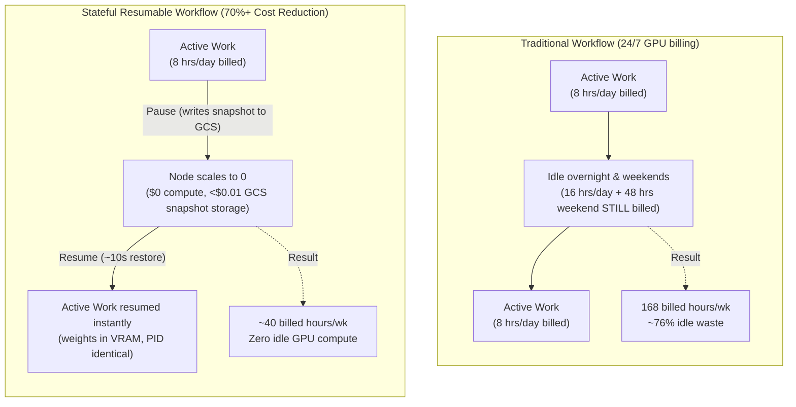

# Stateful Resumable Notebooks on GKE (CPU & GPU)

**Pause a JupyterLab notebook, walk away, come back tomorrow, and find every variable,
thread, and even GPU memory exactly where you left it — eliminating the massive
cost of keeping idle GPU machines running overnight and over weekends.**

Normally, stopping a Kubernetes workload destroys it: your Python process dies,
your variables are gone, and restarting means re-running everything from the top.
Because of this friction, machine learning teams routinely leave expensive GPU
instances running 24/7 just to avoid re-initializing their workspaces.

This example demonstrates **stateful pause & resume** (supported for JupyterLab workspaces),
where GKE takes a full snapshot of the running container — CPU registers, the entire
process tree, RAM, open threads, and GPU VRAM — writes it to Cloud Storage, deletes the
machine to **drop compute billing to $0**, and later restores the *identical* process on a
fresh machine in seconds.

| | Ordinary stop/start | Stateful pause/resume (this example) |
| :--- | :--- | :--- |
| **Python variables** | Lost | Preserved |
| **Process ID** | New | **Same PID** |
| **Background threads** | Killed | Still running |
| **Loaded model in GPU VRAM** | Must reload (~30–60+ s) | **Bit-identical, instant in VRAM** |
| **Compute cost while paused** | $0 (if stopped) | **$0 compute** (node scales to 0) |
| **Storage cost while paused** | Standard PVC disk cost | Standard PVC + pennies for GCS snapshot |
| **Real-world team behavior** | **Left running 24/7** to keep state | **Safely paused** overnight and weekends |
| **Weekly GPU billed hours** | **168 hours** (70%+ idle waste) | **~40 hours** (active working hours only) |
| **Morning ramp-up time** | 15–45 min re-executing notebooks | **~4–12 seconds** instant resume |

Two self-contained verification notebooks are provided:

| Notebook | What it proves | Hardware |
| :--- | :--- | :--- |
| [`cpu_checkpoint_restore_example.ipynb`](cpu_checkpoint_restore_example.ipynb) | A ~160 MB NumPy array is bit-identical, the PID is unchanged, a 1 Hz ticker thread resumes, and wall-clock shows the freeze | CPU only |
| [`gpu_checkpoint_restore_example.ipynb`](gpu_checkpoint_restore_example.ipynb) | A 3-billion-parameter LLM (`Qwen/Qwen2.5-3B-Instruct`, ~6 GB fp16) stays resident in GPU VRAM with bit-identical weights and reproducible greedy decoding | 1 × NVIDIA T4 |

> [!TIP]
> **Already completed the one-time platform setup?** If you already followed steps 1–6 in the [Examples README](../README.md#start-here-one-time-setup-the-order-things-have-to-happen-in), your cluster, storage, images, and ComputeClasses are already in place. You can skip the prerequisites and jump straight to [Registering the `jupyterlab-resumable` WorkspaceKind](#registering-the-jupyterlab-resumable-workspacekind) (or [Running the Examples](#running-the-examples) if already registered).

---

## Why this matters: Slashing GPU cloud costs by 70%+

### The idle GPU dilemma

Interactive ML development is inherently bursty. Data scientists and ML engineers actively write code, run experiments, and inspect outputs for ~8 hours a day, 5 days a week (~40 hours a week).

However, setting up an exploratory environment is expensive in developer time:
1. Downloading and loading multi-gigabyte models into GPU VRAM (e.g. 5–30+ minutes).
2. Fetching, preprocessing, and tokenizing datasets.
3. Iteratively creating intermediate variables and calculation checkpoints.

When engineers step away for lunch, meetings, or the evening, they face an uncomfortable trade-off:

* **Stop the instance:** Saves compute money, but forfeits all in-memory state. Every morning begins with 20–40 minutes of frustrating re-runs, reloading weights, and waiting.
* **Leave the instance running:** Preserves work and momentum, but burns expensive GPU hours 24/7.

In practice, **almost everyone leaves their machines running**. Out of 168 hours in a week, ~128 hours (76%) are spent paying for idle GPU compute that nobody is using. Across a team of 10 engineers on dedicated GPUs, this idle tax easily burns thousands of dollars every month.

### Decoupling state preservation from compute billing

Stateful pause & resume eliminates the dilemma by decoupling **state preservation** from **compute billing**:

1. **True $0 compute while idle:** Pausing deletes the Pod. When no other workloads need the node, GKE node autoscaling removes the VM entirely. You pay zero for GPU, CPU, and node memory.
2. **Cloud Storage pennies vs. GPU dollars:** The memory snapshot (e.g., ~8.3 GiB for a 3B LLM in VRAM) is stored in Google Cloud Storage. At standard GCS pricing (~$0.020/GB/month), holding that 8.3 GiB snapshot costs **~$0.17 for an entire month** — or less than **half a cent ($0.005) overnight**. Leaving even an entry-level GPU VM running overnight costs $5–$25+ in idle compute.
3. **Frictionless automated idle shutoff:** Platform administrators can safely implement aggressive auto-culling policies (e.g., auto-pausing notebooks after 30–60 minutes of inactivity). Because users know their variables, processes, and CUDA tensors are preserved bit-for-bit, auto-culling faces zero user resistance.
4. **Zero re-computation waste:** Resuming takes seconds (4–8 s for CPU, ~11 s for GPU). No developer time or cloud compute is wasted re-executing cells or re-downloading model weights.



---

## What survives a pause (and what does not)

The checkpoint captures the container's **init process tree** — everything under
the workspace's supervisor, including `jupyter-lab` and every notebook kernel it
spawned.

| Started how | Survives a pause? |
| :--- | :--- |
| A notebook kernel (any cell you ran in JupyterLab) | ✅ Yes — same PID, all Python variables, **and GPU memory** |
| A process launched from a JupyterLab **terminal** | ✅ Yes — it is also a child of `jupyter-lab` |
| In-browser VS Code (`codeserver` WorkspaceKind) | ❌ **No** — `codeserver` uses **stateless pause & resume** (files on `/home/jovyan` persist, but in-memory state does not) |
| A process launched with `kubectl exec … &` from your laptop | ❌ **No** — silently gone after resume |

> [!IMPORTANT]
> **JupyterLab only (`jupyterlab` / `jupyterlab-resumable`)**:
> Stateful memory-recoverable pause and resume is currently **only supported for JupyterLab workspaces**.
> In-browser VS Code (`codeserver`) does **not** support stateful memory snapshots (due to gVisor CRIU pseudoterminal `/dev/pts/*` desynchronization in Node.js `libuv`), and instead uses **stateless pause and resume** (the pod scales down to 0 to eliminate compute cost, and resuming starts a fresh container where files on `/home/jovyan` persist, but in-memory variables and execution state do not). See [docs/gke-pilot-codelab.md](../../docs/gke-pilot-codelab.md#2026-09-18-deep-dive-jupyterlab-vs-vs-code-pause-resume--gvisor-criu-limitations) for the technical analysis.

> [!NOTE]
> Verified on a T4: a kernel holding both a Python variable and a live CUDA
> tensor came back after pause/resume with the **same kernel PID**, the variable
> intact, and the GPU tensor's checksum unchanged — the GPU allocation itself is
> restored, not just recreated.

> [!WARNING]
> `kubectl exec` starts processes in a separate exec session that is **not** part
> of the checkpointed process tree, so they are terminated by a pause and never
> come back. This surprises people who script a long job with
> `kubectl exec … -- nohup python train.py &` and then pause. Start long-running
> work from a **notebook cell or a JupyterLab terminal** instead.

---

## Glossary (if you are new to Kubernetes)

| Term | What it means here |
| :--- | :--- |
| **Pod** | The smallest unit Kubernetes runs: one or more containers on one machine. Your notebook is a Pod. |
| **Node** | A virtual machine in the cluster that Pods run on. |
| **Namespace** | A folder that groups and isolates resources. Your workspaces live in a *tenant namespace* such as `kubeflow-user`. |
| **PVC (PersistentVolumeClaim)** | A network disk mounted at `/home/jovyan`. It survives a restart, but it only holds *files* — not running memory. |
| **WorkspaceKind** | A cluster-wide template listing which images and machine sizes a user may pick when creating a workspace. |
| **gVisor** | A user-space sandbox that GKE runs your container inside. It is what makes checkpointing the process possible. Pods get `runtimeClassName: gvisor` injected automatically. |
| **GKE Pod Snapshots** | The GKE feature that writes the sandboxed process state to a Cloud Storage bucket and restores it later. |
| **ComputeClass** | A named recipe telling GKE what kind of machine to auto-create when a Pod asks for it (used here for the T4 GPU). See [`../compute-classes/`](../compute-classes/). |
| **`PodSnapshotStorageConfig`** | A cluster-scoped object that says *which Cloud Storage bucket* snapshots go to. |
| **Workload Identity** | How Pods authenticate to Google Cloud APIs (such as Cloud Storage) without any key files. |

---

## Prerequisites

Work through this checklist before you start. Each item has a command that tells
you whether you already satisfy it.

### 1. A GKE cluster with Pod Snapshots and gVisor

The cluster must have been created with `--enable-pod-snapshots`, and the node
pool running your workspaces must use `--image-type=cos_containerd --sandbox type=gvisor`.
For the GPU notebook the node must also be a **T4** that supports gVisor
(GKE 1.29.2+ provides the required nvproxy support).

```bash
gcloud container clusters describe "${CLUSTER_NAME}" \
  --location="${LOCATION}" --project="${PROJECT_ID}" \
  --format='value(podAutoscaling,currentMasterVersion)'

# The Pod Snapshot CRDs must exist:
kubectl get crd | grep podsnapshot
# podsnapshotpolicies.podsnapshot.gke.io
# podsnapshots.podsnapshot.gke.io
# podsnapshotstorageconfigs.podsnapshot.gke.io
```

See [`../../providers/gke/USER_GUIDE.md`](../../providers/gke/USER_GUIDE.md) for
the full `gcloud container clusters create` command.

### 2. The standalone Kubeflow Workspaces platform

Deploy it with [`../../providers/gke/deploy_standalone.sh`](../../providers/gke/deploy_standalone.sh).
That script installs the `gke-workspace-snapshot-addon`, creates the snapshot
bucket, wires up the IAM bindings, and creates the default
`PodSnapshotStorageConfig`.

```bash
kubectl -n kubeflow-workspaces get deploy gke-workspace-snapshot-addon
kubectl get podsnapshotstorageconfigs
# NAME                                    READY
# kubeflow-pod-snapshot-storage-config    True
```

### 3. Workspace images (custom images optional)

Neither notebook needs a custom image. The public upstream Kubeflow base images
are enough:

| Notebook | Base image | Extra dependencies |
| :--- | :--- | :--- |
| CPU | `ghcr.io/kubeflow/kubeflow/notebook-servers/jupyter-scipy:v1.11.0` | None (only `numpy`, already included) |
| GPU | `ghcr.io/kubeflow/kubeflow/notebook-servers/jupyter-pytorch-cuda-full:v1.11.0` | `transformers>=5`, installed by the notebook's **Step 0** cell (`pip install --user`, so it lands on the home PVC and survives restarts) |

These are the images the registration command below uses by default.

If you would rather have everything preinstalled, build the custom JupyterLab CPU
and GPU images with [`../../images/build.sh`](../../images/build.sh) (the GPU
image ships `transformers`, `accelerate`, and JAX on CUDA) and note the tags it
prints:

```bash
cd images
./build.sh --jupyterlab --cpu --gpu --registry-path "${REGION}-docker.pkg.dev/${PROJECT_ID}/${REPO_NAME}"
```

See [`../../images/README.md`](../../images/README.md) for the full reference.

### 4. The GPU ComputeClass (GPU notebook only)

The `GPU T4 Spot` pod option selects nodes through the `gpu-t4-spot`
ComputeClass. Without it, the workspace Pod stays `Pending` forever.
`deploy_standalone.sh` applies it for you; to apply it by hand:

```bash
kubectl apply -f ../compute-classes/gpu-compute-class.yaml
kubectl get computeclass gpu-t4-spot
```

You also need **T4 Spot quota** in your region. See
[`../compute-classes/README.md`](../compute-classes/README.md).

> [!NOTE]
> This example deliberately pins the GPU to **T4** rather than using the
> `gpu-best-available` ComputeClass that the other WorkspaceKinds use. A GPU
> snapshot can only be restored onto the **same GPU model** it was taken on, so a
> class that may pick a T4 on pause and an L4 on resume would break the restore.
> The trade-off: when Spot T4 is stocked out (`FailedScaleUp ... GCE out of
> resources`), the workspace waits until capacity returns.

### 5. Internet access from the workspace (GPU notebook only)

The GPU notebook downloads `Qwen/Qwen2.5-3B-Instruct` (~6 GB) from Hugging Face
on first run into `~/.cache/huggingface` on the home PVC.

---

## Registering the `jupyterlab-resumable` WorkspaceKind

[`manifests/workspacekind-resumable.yaml`](manifests/workspacekind-resumable.yaml)
is the WorkspaceKind that carries the two annotations that switch snapshotting on:

```yaml
podsnapshot.gke.kubeflow.org/enabled: "true"
podsnapshot.gke.kubeflow.org/storage-config: "kubeflow-pod-snapshot-storage-config"
```

It contains three placeholders you must replace. Run this from the repository
root. By default it uses the public upstream base images (see
[Workspace images](#3-workspace-images-custom-images-optional)):

```bash
export PROJECT_ID="my-project"
export TENANT_NAMESPACE="kubeflow-user"
export GCS_BUCKET="${PROJECT_ID}-${TENANT_NAMESPACE}-bucket"

# Public upstream base images (no build needed)
export CPU_IMAGE="ghcr.io/kubeflow/kubeflow/notebook-servers/jupyter-scipy:v1.11.0"
export GPU_IMAGE="ghcr.io/kubeflow/kubeflow/notebook-servers/jupyter-pytorch-cuda-full:v1.11.0"

# Or, if you built the custom images with images/build.sh:
# export REGION="us-west1"
# export REPO_NAME="kubeflow-repo"
# export CPU_IMAGE="${REGION}-docker.pkg.dev/${PROJECT_ID}/${REPO_NAME}/jupyterlab:latest-cpu"
# export GPU_IMAGE="${REGION}-docker.pkg.dev/${PROJECT_ID}/${REPO_NAME}/jupyterlab:latest-gpu"

sed -e "s|<YOUR_CPU_IMAGE>|${CPU_IMAGE}|g" \
    -e "s|<YOUR_GPU_IMAGE>|${GPU_IMAGE}|g" \
    -e "s|<YOUR_GCS_BUCKET>|${GCS_BUCKET}|g" \
    examples/resumable-notebooks/manifests/workspacekind-resumable.yaml \
  | kubectl apply -f -
```

> [!WARNING]
> Do not run a bare `kubectl apply -f examples/resumable-notebooks/manifests`.
> The unsubstituted `<YOUR_CPU_IMAGE>` placeholder is not a valid image
> reference, and every Workspace created from the kind will fail to start with
> `InvalidImageName`.

Verify:

```bash
kubectl get workspacekind jupyterlab-resumable
kubectl get workspacekind jupyterlab-resumable \
  -o jsonpath='{.spec.podTemplate.options.imageConfig.values[*].spec.image}{"\n"}'
```

### Automatic Inactivity Pausing (`activityRules`)

To prevent idle workspaces from running indefinitely and driving up cloud spend, [`manifests/workspacekind-resumable.yaml`](manifests/workspacekind-resumable.yaml) configures **`activityRules`** out of the box:

```yaml
activityRules:
  - config:
      secondsSinceActive: 14400 # auto pauses the notebook after 4h of inactivity
    match: {}
    effect:
      pauseWorkspace: true
```

#### How activity probing and auto-pausing work

1. **Activity probing**: The `WorkspaceKind` defines an `activityProbe` under `spec.podTemplate`:
   ```yaml
   activityProbe:
     minProbeIntervalSeconds: 100
     probeIntervalSeconds: 300
     jupyter:
       lastActivity: true
       portId: "jupyterlab"
   ```
   The Kubeflow Workspaces controller periodically queries the workspace's Jupyter REST API for kernel executions, open WebSocket connections, and user interactions.
2. **Inactivity evaluation**: When a running workspace has seen no activity for longer than `secondsSinceActive` (here: `14400` seconds / 4 hours), the controller triggers the rule's effect.
3. **Stateful pause on idle**: Because this is a resumable workspace, the `pauseWorkspace: true` effect triggers GKE Pod Snapshots to checkpoint container memory to Cloud Storage and terminate the pod. GKE node autoscaling can then scale down the underlying nodes to 0, completely stopping compute billing.
4. **Instant resumption**: Unlike traditional notebook culling where users lose in-memory variables and loaded model weights, users can click **Resume** / **Start** in the UI at any time and resume with bit-identical state in seconds.

#### Customizing rules (e.g. Culling GPUs faster than CPUs)

Rules can match specific pod configurations (`matchPodConfig`) or namespaces (`matchNamespace`), evaluated top-to-bottom. For instance, to aggressively pause costly GPU instances after 1 hour (3,600 s) while giving CPU instances 4 hours (14,400 s):

```yaml
activityRules:
  # Rule 1: Auto-pause GPU workspaces after 1 hour of inactivity
  - config:
      secondsSinceActive: 3600
    match:
      matchPodConfig:
        selector:
          matchLabels:
            accelerator: gpu
    effect:
      pauseWorkspace: true

  # Rule 2: Catch-all — auto-pause CPU and other workspaces after 4 hours
  - config:
      secondsSinceActive: 14400
    match: {}
    effect:
      pauseWorkspace: true
```

---

## Running the Examples

The verification workflow is self-contained within each notebook. Upload the file
to your workspace and follow the instructions inside the notebook:

1. **CPU Example**:
   - In Kubeflow Workspaces, create or open a **CPU workspace** using `jupyterlab-resumable` (or any workspace annotated with `podsnapshot.gke.kubeflow.org/enabled: "true"`), pod config `small_cpu` or `medium_cpu`.
   - Upload [`cpu_checkpoint_restore_example.ipynb`](cpu_checkpoint_restore_example.ipynb) using the upload button in the JupyterLab file browser.
   - Run **Steps 1 & 2** in the notebook to set up the in-memory state and ticker thread.
   - Pause the workspace using the **Stop** / **Pause** button in the Kubeflow Workspaces UI.
   - Once paused, resume the workspace using the **Start** / **Resume** button in the UI.
   - Run **Step 3** to verify that variables, process PID, array memory, and compute resumed intact.

2. **GPU Example**:
   - Create or open a **GPU workspace** using the `GPU T4 Spot` pod config and the GPU image.
   - Upload [`gpu_checkpoint_restore_example.ipynb`](gpu_checkpoint_restore_example.ipynb).
   - Run **Step 0** to install `transformers` (needed on the upstream base image; a quick no-op on the custom GPU image).
   - Run **Steps 1 & 2** to load the model into VRAM and compute initial tokens and weight fingerprint.
   - Pause the workspace using the **Stop** / **Pause** button in the UI, then resume it using the **Start** / **Resume** button.
   - Run **Step 3** to verify that model weights in VRAM remain bit-identical and generation continues without reloading.

> [!IMPORTANT]
> Only the container's own process tree is checkpointed. Anything you started
> through `kubectl exec` is killed when the workspace pauses. Run everything you
> want preserved from inside the notebook.

### What to expect

| Phase | CPU workspace | GPU workspace (T4, 3B model fp16) |
| :--- | :--- | :--- |
| Checkpoint (pause) | 12–25 s, ~0.5–1.2 GB to Cloud Storage | 115–127 s, ~8.3 GiB to Cloud Storage |
| Restore (resume) | 4–8 s | 11–12 s |

> [!TIP]
> **Snapshot storage economics:** Every pause writes a full memory image to Cloud
> Storage — ~8.3 GiB for the GPU example. At standard GCS pricing (~$0.020/GB/month),
> storing an 8.3 GiB snapshot for an entire 16-hour overnight pause costs
> **under $0.005 (half a cent)**, compared to paying for a running GPU node. The
> deployment also sets a 14-day object lifecycle rule on the snapshot bucket as an
> automated billing backstop so decommissioned workspaces never accumulate storage
> costs; see
> [Changing the Controller's Default Bucket](#optional-changing-the-controllers-default-bucket-cluster-wide).

### Watching it happen

```bash
# The addon that drives snapshotting:
kubectl -n kubeflow-workspaces logs -l app=gke-workspace-snapshot-addon -f

# The snapshot objects themselves:
kubectl -n "${TENANT_NAMESPACE}" get podsnapshots,podsnapshotpolicies

# Confirm gVisor was injected into your workspace pod:
kubectl -n "${TENANT_NAMESPACE}" get pod -l notebooks.kubeflow.org/workspace-name \
  -o jsonpath='{.items[*].spec.runtimeClassName}{"\n"}'
# gvisor
```

---

## Creating a Custom `PodSnapshotStorageConfig` from a Bucket

If you do **not** want to use the default bucket supplied when deploying the controller, you do **not need to reconfigure or restart the controller**. You can define a custom `PodSnapshotStorageConfig` pointing to any bucket and configure individual workspaces (or custom WorkspaceKinds) to use it.

This allows different teams, tenants, or workspaces to use dedicated GCS buckets independently.

### Step 1: Prepare the Custom GCS Bucket & IAM Permissions

Ensure the custom bucket exists and has the required IAM bindings for both identities:

```bash
export REGION="us-central1"
export PROJECT_ID="my-gcp-project"
export TENANT_NAMESPACE="kubeflow-user"
export CUSTOM_SNAPSHOT_BUCKET="my-team-snapshots"

PROJECT_NUMBER=$(gcloud projects describe "${PROJECT_ID}" --format='value(projectNumber)')

# 1. Create the bucket
gcloud storage buckets create "gs://${CUSTOM_SNAPSHOT_BUCKET}" \
  --location="${REGION}" \
  --project="${PROJECT_ID}" \
  --uniform-bucket-level-access || true

# 2. Grant node-level Workload Identity access (checkpoint & restore)
gcloud storage buckets add-iam-policy-binding "gs://${CUSTOM_SNAPSHOT_BUCKET}" \
  --member="principalSet://iam.googleapis.com/projects/${PROJECT_NUMBER}/locations/global/workloadIdentityPools/${PROJECT_ID}.svc.id.goog/namespace/${TENANT_NAMESPACE}" \
  --role="roles/storage.objectUser"

gcloud storage buckets add-iam-policy-binding "gs://${CUSTOM_SNAPSHOT_BUCKET}" \
  --member="principalSet://iam.googleapis.com/projects/${PROJECT_NUMBER}/locations/global/workloadIdentityPools/${PROJECT_ID}.svc.id.goog/namespace/${TENANT_NAMESPACE}" \
  --role="roles/storage.bucketViewer"

# 3. Grant GKE Service Agent robot access (automatic snapshot deletion & cleanup)
gcloud storage buckets add-iam-policy-binding "gs://${CUSTOM_SNAPSHOT_BUCKET}" \
  --member="serviceAccount:service-${PROJECT_NUMBER}@container-engine-robot.iam.gserviceaccount.com" \
  --role="roles/storage.objectUser"

# 4. Set a 14-day lifecycle delete rule as a billing backstop
cat <<EOF > /tmp/snapshot-lifecycle.json
{
  "rule": [{"action": {"type": "Delete"}, "condition": {"age": 14}}]
}
EOF
gcloud storage buckets update "gs://${CUSTOM_SNAPSHOT_BUCKET}" \
  --lifecycle-file=/tmp/snapshot-lifecycle.json --project="${PROJECT_ID}"
rm -f /tmp/snapshot-lifecycle.json
```

### Step 2: Create the `PodSnapshotStorageConfig` Custom Resource

Create a cluster-scoped `PodSnapshotStorageConfig` defining your custom bucket and snapshot path:

```yaml
# custom-storage-config.yaml
apiVersion: podsnapshot.gke.io/v1
kind: PodSnapshotStorageConfig
metadata:
  name: my-team-storage-config
spec:
  snapshotStorageConfig:
    gcs:
      bucket: "my-team-snapshots"
      path: "kubeflow-notebooks"
```

Apply it to the cluster:

```bash
kubectl apply -f custom-storage-config.yaml
```

Verify that GKE acknowledges the storage config:

```bash
kubectl get podsnapshotstorageconfigs
# NAME                     READY
# my-team-storage-config   True
```

### Step 3: Direct Workspaces to Use the Custom Storage Config

To route a workspace's snapshots to `my-team-storage-config`, set the `podsnapshot.gke.kubeflow.org/storage-config` annotation.

#### On an Individual Workspace
Annotate the `Workspace` resource:

```yaml
apiVersion: kubeflow.org/v1beta1
kind: Workspace
metadata:
  name: my-workspace
  namespace: kubeflow-user
  annotations:
    podsnapshot.gke.kubeflow.org/enabled: "true"
    podsnapshot.gke.kubeflow.org/storage-config: "my-team-storage-config"
spec:
  ...
```

Or patch an existing workspace from the CLI:

```bash
kubectl -n kubeflow-user patch workspace my-workspace --type=merge -p '{
  "metadata": {
    "annotations": {
      "podsnapshot.gke.kubeflow.org/enabled": "true",
      "podsnapshot.gke.kubeflow.org/storage-config": "my-team-storage-config"
    }
  }
}'
```

#### On a Custom `WorkspaceKind`
If you are creating a dedicated `WorkspaceKind` for your team, annotate the kind:

```yaml
apiVersion: kubeflow.org/v1beta1
kind: WorkspaceKind
metadata:
  name: jupyterlab-resumable
  annotations:
    podsnapshot.gke.kubeflow.org/enabled: "true"
    podsnapshot.gke.kubeflow.org/storage-config: "my-team-storage-config"
```

All workspaces spawned from this kind will automatically store their snapshots in `gs://my-team-snapshots/kubeflow-notebooks/`.

### How the Controller Handles Custom Storage Configs

When a workspace pauses, `gke-workspace-snapshot-addon`:
1. Reads the `podsnapshot.gke.kubeflow.org/storage-config` annotation (falling back to the `WorkspaceKind` annotation, and then to `kubeflow-pod-snapshot-storage-config`).
2. Creates the per-workspace `PodSnapshotPolicy` with `spec.storageConfigName: "my-team-storage-config"`.
3. GKE attaches the snapshot trigger to the policy, streaming the pod's checkpoint directly to `gs://my-team-snapshots/`.

---

## (Optional) Changing the Controller's Default Bucket Cluster-Wide

If cluster administrators want to change the fallback default bucket used by `gke-workspace-snapshot-addon` across the entire cluster:

- **Before Deployment**: Set `export SNAPSHOT_GCS_BUCKET="my-org-snapshots"` before running `deploy_standalone.sh`.
- **On a Running Cluster**:
  ```bash
  # 1. Update the addon ConfigMap and restart the deployment
  kubectl -n kubeflow-workspaces patch configmap gke-workspace-snapshot-addon \
    --type merge -p '{"data":{"SNAPSHOT_GCS_BUCKET":"my-org-snapshots"}}'
  kubectl -n kubeflow-workspaces rollout restart deployment/gke-workspace-snapshot-addon

  # 2. Update the default PodSnapshotStorageConfig
  kubectl patch podsnapshotstorageconfig kubeflow-pod-snapshot-storage-config \
    --type merge -p '{"spec":{"snapshotStorageConfig":{"gcs":{"bucket":"my-org-snapshots"}}}}'
  ```

---

## Troubleshooting

| Symptom | Cause | Fix |
| :--- | :--- | :--- |
| Workspace shows **`Error`** (not `Pending`) within a minute of creation, with `stateMessage: Workspace Pod is unschedulable: 0/N nodes are available…` | **Usually normal.** No GPU node exists yet, so the scheduler reports the pod unschedulable and the controller surfaces that as `Error` — *while* GKE provisions one in the background. A cold T4 Spot node typically takes 5–10 minutes. | Confirm a node really is coming: `kubectl describe pod <pod> -n "${TENANT_NAMESPACE}"` and look for a `TriggeredScaleUp` event (e.g. `nap-n1-standard-16-spot-gpu1-… 0->1`). If you see `TriggeredScaleUp`, just wait — the state flips to `Running` on its own. Only if there is **no** `TriggeredScaleUp`, or you see `FailedScaleUp`, is something actually wrong: see the next row. |
| Workspace Pod stuck `Pending` for >10 min (GPU) | The `gpu-t4-spot` ComputeClass is missing, you have no T4 Spot quota in the region, or Spot T4 is stocked out (`FailedScaleUp ... GCE out of resources`; wait for capacity). | `kubectl apply -f ../compute-classes/gpu-compute-class.yaml`; check quota per [`../compute-classes/README.md`](../compute-classes/README.md). `kubectl describe pod <pod>` shows the real reason under `Events`. |
| Pod starts, but `runtimeClassName` is empty | The `gke-workspace-snapshot-addon` mutating webhook did not fire. | Check the addon is running (`kubectl -n kubeflow-workspaces get deploy gke-workspace-snapshot-addon`) and that the WorkspaceKind or Workspace carries `podsnapshot.gke.kubeflow.org/enabled: "true"`. |
| Workspace fails with `InvalidImageName` | The `<YOUR_CPU_IMAGE>` / `<YOUR_GPU_IMAGE>` placeholders were never substituted. | Re-apply the WorkspaceKind through the `sed` pipeline above. |
| Pause hangs, or the workspace comes back with a fresh PID | The checkpoint failed and GKE fell back to a cold start. | `kubectl -n kubeflow-workspaces logs -l app=gke-workspace-snapshot-addon` and `kubectl -n "${TENANT_NAMESPACE}" describe podsnapshot <name>`. |
| Snapshot errors with a Cloud Storage `403` | Workload Identity or the GKE service agent binding is missing on the snapshot bucket. | Re-run the IAM bindings from [Step 1](#step-1-prepare-the-custom-gcs-bucket--iam-permissions), including the `service-<PROJECT_NUMBER>@container-engine-robot.iam.gserviceaccount.com` grant. |
| In-memory variables or kernel state lost in VS Code (`codeserver`) | Stateful pause & resume is only supported for JupyterLab. `codeserver` uses stateless pause & resume. | Use `jupyterlab` or `jupyterlab-resumable` if you need in-memory variables and loaded models preserved across pause/resume. In `codeserver`, save your work to `/home/jovyan` before pausing. |
| Variables survive, but a terminal you opened is gone | Expected. Only the container's own process tree is checkpointed; `kubectl exec` sessions are not. | Run long-lived work from inside the notebook. |
| GPU notebook OOMs while pausing | Snapshotting copies GPU state through Pod memory; the node needs headroom. | The `gpu_t4_spot` pod config requests 12 CPU / 40 Gi for exactly this reason. Do not shrink it. |
| Restore fails after switching machine types | A snapshot cannot be restored onto a different GPU model. | Resume on the same GPU model you paused on. This is why the example pins `gpu-t4-spot` instead of `gpu-best-available` (see [the GPU ComputeClass prerequisite](#4-the-gpu-computeclass-gpu-notebook-only)). |

> [!NOTE]
> Known constraints: fp16 only on Turing (T4), multi-GPU only on L4, MIG is not
> supported, and you cannot restore a snapshot onto a different GPU type.

---

## Cleanup

```bash
# Delete the workspaces (this also releases their PVCs if the kind is configured to).
kubectl -n "${TENANT_NAMESPACE}" delete workspaces --all

# Remove leftover snapshot objects.
kubectl -n "${TENANT_NAMESPACE}" delete podsnapshots,podsnapshotpolicies,podsnapshotmanualtriggers --all

# Remove the WorkspaceKind.
kubectl delete workspacekind jupyterlab-resumable

# Optional: remove the GPU ComputeClass (auto-created node pools scale to zero and are removed).
kubectl delete -f ../compute-classes/gpu-compute-class.yaml
```

Optional — delete the checkpoint data from Cloud Storage.

`SNAPSHOT_GCS_BUCKET` is the snapshot bucket created by
[`deploy_standalone.sh`](../../providers/gke/deploy_standalone.sh); it defaults to
`<project-id>-<tenant-namespace>-snapshots-bucket`. Read the value the cluster is actually using
rather than guessing:

```bash
SNAPSHOT_GCS_BUCKET=$(kubectl -n kubeflow-workspaces get configmap \
  gke-workspace-snapshot-addon -o jsonpath='{.data.SNAPSHOT_GCS_BUCKET}')
echo "${SNAPSHOT_GCS_BUCKET}"

gcloud storage rm --recursive "gs://${SNAPSHOT_GCS_BUCKET}/**"
```

> [!NOTE]
> Deleting a Workspace does **not** always delete its home PVC — that depends on the
> WorkspaceKind. Check for leftovers with
> `kubectl -n "${TENANT_NAMESPACE}" get pvc`; unused PVCs keep billing.

[`../../providers/gke/cleanup_standalone.sh`](../../providers/gke/cleanup_standalone.sh)
performs all of the in-cluster steps above as part of a full platform teardown.
