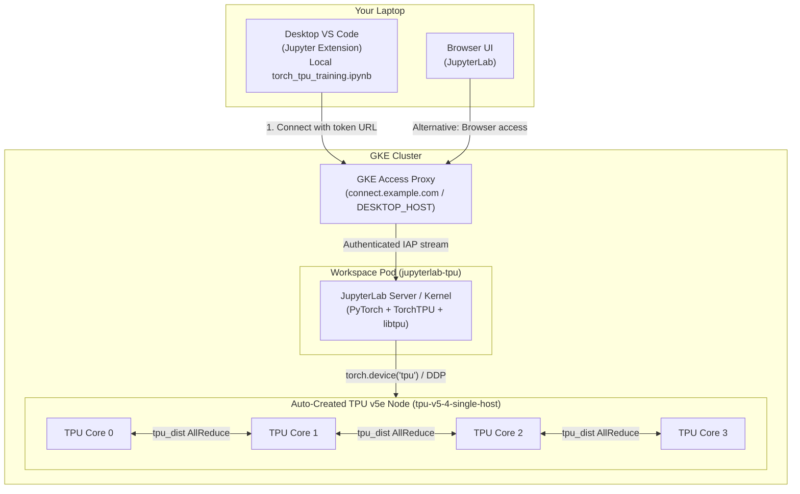

# Interactive PyTorch TPU Training with TorchTPU on GKE Workspaces

**Audience:** engineers and data scientists looking to develop and train models on Cloud TPUs with PyTorch and **TorchTPU (`torch_tpu`)**, without managing TPU VMs, SSH tunnels, or complex multi-file deployments.

---

*This example shows how to spin up an interactive development environment for 1 TPU or 4 TPUs in the Kubeflow Workspaces UI, develop and test models interactively in JupyterLab or local VS Code using PyTorch and `torch_tpu`, and scale out to multi-core Distributed Data Parallel (DDP) across all attached TPU cores using `torchrun`.*

---

## What this example does

This example demonstrates interactive single-device and multi-core neural network training with **PyTorch and TorchTPU on Cloud TPU v5e** inside a Kubeflow Workspace on GKE, scaling from interactive notebook cells to distributed training across attached TPU cores.

| Property | Details |
| :--- | :--- |
| **Model** | 3-layer MLP (`784 -> 256 -> 128 -> 10`) implemented in PyTorch (`nn.Module`) with `bfloat16` precision |
| **Hardware** | **1 TPU**: TPU v5 1x1 (`tpu_1`, 1 chip) or **4 TPU**: TPU v5 2x2 (`tpu_4`, 4 chips) on a single-host TPU slice |
| **Parallelism** | Interactive execution via `torch.device("tpu")`; multi-core scaling via `DistributedDataParallel` (DDP) with the `tpu_dist` collective backend |
| **Workflow** | Interactive single-TPU prototyping notebook ([`torch_tpu_training.ipynb`](torch_tpu_training.ipynb)) and dedicated distributed orchestrator notebook ([`torch_tpu_distributed.ipynb`](torch_tpu_distributed.ipynb)) |

> [!TIP]
> **Already completed the one-time platform setup?** If you already followed steps 1–6 in the [Examples README](../README.md#start-here-one-time-setup-the-order-things-have-to-happen-in), your GKE cluster, TPU ComputeClasses, and `jupyterlab` WorkspaceKind are already configured. Jump directly to [Step 1: Create the TPU Workspace](#step-1-create-the-tpu-workspace) or [Step 2: Run the Notebook](#step-2-run-the-notebook).

### Architecture Flow



---

## Glossary

| Term | What it means here |
| :--- | :--- |
| **Cloud TPU v5e** | Cost-effective Google Cloud TPU designed for training and inference. Each v5e chip has 1 TensorCore with 16 GB HBM and high-bandwidth interconnect (ICI). |
| **TorchTPU (`torch_tpu`)** | Google's PyTorch backend for Cloud TPUs using PJRT and OpenXLA, registering the native `"tpu"` device and `"tpu_dist"` backend with PyTorch. |
| **`torch.device("tpu")`** | PyTorch device string initialized by TorchTPU, allowing standard PyTorch tensors and modules to reside on TPU hardware. |
| **`tpu_dist`** | The PyTorch distributed collective communication backend for TPU meshes (AllReduce, AllGather, Broadcast). |
| **ComputeClass** | A GKE recipe (`tpu-v5-1-single-host`, `tpu-v5-4-single-host`) that automatically provisions and terminates TPU node pools on demand. |
| **WorkspaceKind** | A cluster-wide template (`jupyterlab`) defining container images and machine configurations available in the Kubeflow UI. |
| **`DESKTOP_HOST`** | The cluster-wide hostname (e.g., `connect.<IP>.sslip.io`) used by the VS Code Jupyter extension to connect to remote kernels. |
| **Connection Token** | A short-lived credential generated from `https://${WORKSPACES_HOST}/workspaces/connections` authorizing desktop VS Code to connect to your workspace. |
| **`torch.tpu.distributed.environment`** | TorchTPU's environment bootstrap module that configures mesh topology and slice builder addresses for `torchrun`. |

---

## Prerequisites

Work through this checklist before launching the workspace.

```bash
export PROJECT_ID="$(gcloud config get-value project)"
export CLUSTER_NAME="kubeflow-notebooks"
export LOCATION="us-west1"
export REGION="us-west1"               # Region where you have TPU v5e quota
export TENANT_NAMESPACE="kubeflow-user" # Your tenant namespace (e.g. team-b)
export REPO_NAME="kubeflow-repo"
export NS="${TENANT_NAMESPACE}"
```

### 1. Check TPU v5e Spot Quota

Verify that your project has TPU v5e Spot quota in your region (at least 4 chips for `tpu-v5-4-single-host`, or 1 chip for `tpu-v5-1-single-host`):

```bash
gcloud compute regions describe "${REGION}" --project="${PROJECT_ID}" \
  --format="value(quotas)" | tr ',' '\n' | grep -i podslice
```

Look for **`PREEMPTIBLE_TPU_LITE_PODSLICE_V5`** (limit $\ge$ 4).

### 2. Verify the TPU ComputeClasses

`deploy_standalone.sh` applies `examples/compute-classes/` by default (`APPLY_COMPUTE_CLASSES=true`). The `tpu-v5-1-single-host` and `tpu-v5-4-single-host` ComputeClasses let GKE auto-provision the TPU node pool when the workspace starts:

```bash
kubectl get computeclass tpu-v5-1-single-host tpu-v5-4-single-host
```

If they are missing (for example if you deployed with `APPLY_COMPUTE_CLASSES=false`), apply them:

```bash
kubectl apply -f examples/compute-classes/tpu-compute-class.yaml
```

### 3. Ensure the Custom TPU Image with `torch_tpu` is Registered

The custom JupyterLab TPU container image (`jupyterlab:latest-tpu`) pre-installs `torch_tpu`, PyTorch, `libtpu`, and supporting dependencies.

Build and push the image if you haven't already:

```bash
export REGISTRY="${REGION}-docker.pkg.dev/${PROJECT_ID}/${REPO_NAME}"

./images/build.sh --jupyterlab --tpu --torch-tpu --registry-path "${REGISTRY}"
```

Then register the image options in the `jupyterlab` WorkspaceKind:

```bash
cd images
IMAGE_NAME="jupyterlab" CPU_IMAGE_TAG="latest-cpu" GPU_IMAGE_TAG="latest-gpu" TPU_IMAGE_TAG="latest-tpu" \
  envsubst < workspacekinds/jupyterlab.yaml | kubectl apply -f -
cd ..
```

Verify the WorkspaceKind exists:

```bash
kubectl get workspacekinds jupyterlab
```

---

## Step 1: Create the TPU Workspace

In the Kubeflow Workspaces UI (`https://${WORKSPACES_HOST}/workspaces/`):

1. Click **Create Workspace**.
2. Configure the workspace options:

| Setting | Value | Notes |
| :--- | :--- | :--- |
| **Workspace Name** | `torch-tpu-workspace` | Unique name in your namespace |
| **WorkspaceKind** | **`jupyterlab`** | JupyterLab notebook environment |
| **Image** | **`jupyterlab (TPU)`** (custom image) or **`jupyter-scipy:v1.11.0 (TPU)`** | Custom image contains pre-installed `torch_tpu` and `libtpu` |
| **Pod Config** | **`TPU v5 1x1`** (`tpu_1`) or **`TPU v5 2x2`** (`tpu_4`) | Requests 1 chip via `tpu-v5-1-single-host` or 4 chips via `tpu-v5-4-single-host` |

3. Click **Create**.
4. GKE will automatically provision a TPU node pool and schedule the workspace pod. The pod transitions from `Pending` to `Running` once the node is ready (typically 5–10 minutes for initial TPU node pool creation).

Confirm from your terminal:

```bash
kubectl get workspaces -n "${TENANT_NAMESPACE}"
kubectl get pods -n "${TENANT_NAMESPACE}" -l notebooks.kubeflow.org/workspace-name=torch-tpu-workspace
```

---

## Step 2: Run the Notebook

### Option A: Connect from Local VS Code

Run the notebook directly from your local machine without uploading any files:

1. **Open local VS Code**:
   - Open this repository on your laptop in VS Code.
   - Ensure the **Jupyter** extension (`ms-toolsai.jupyter`) is installed.
   - Open [`examples/torch_tpu/torch_tpu_training.ipynb`](torch_tpu_training.ipynb).

2. **Generate a connection token**:
   - In your browser, navigate to `https://${WORKSPACES_HOST}/workspaces/connections` and sign in with Google.
   - Select your running workspace: **`torch-tpu-workspace`**.
   - Select the port: **`jupyterlab`**.
   - Choose a token duration (e.g. 8 hours), click **Generate connection**, and click **Copy URL**.
   - The copied URL has the format:
     ```
     https://${DESKTOP_HOST}/workspace/connect/<tenant-namespace>/torch-tpu-workspace/jupyterlab/?token=<token>
     ```

3. **Connect to the remote kernel in VS Code**:
   - In the upper right corner of the notebook editor in VS Code, click **Select Kernel**.
   - Choose **Select Another Kernel...** → **Existing Jupyter Server...**.
   - Paste the connection URL (including `?token=...`) and press **Enter**.
   - Select the remote kernel: **`Python 3 (ipykernel)`**.

4. **Execute cells**:
   - Run the notebook cells top to bottom!
   - Step 0 verifies `torch_tpu` and initializes `torch.device("tpu")`.
   - All tensor operations and model training execute directly on the remote Cloud TPU.

> [!TIP]
> **macOS Certificate Trust Note**: If VS Code on macOS reports `unable to get issuer certificate` when connecting to `DESKTOP_HOST`, open your VS Code settings (`settings.json`), set `"http.systemCertificatesNode": true`, and reload the window.

### Option B: Run in In-Browser JupyterLab

If you prefer using the browser:

1. In the Kubeflow Workspaces UI, click **Connect** next to `torch-tpu-workspace`.
2. Upload `torch_tpu_training.ipynb` and `torch_tpu_distributed.ipynb` into JupyterLab using the file browser upload button, or clone the repository:
   ```bash
   git clone <this-repo-url> /home/jovyan/gke-workspaces
   ```
3. Open `torch_tpu_training.ipynb` (or `torch_tpu_distributed.ipynb`) and run the cells.

---

## What the Notebook Does

The notebook ([`torch_tpu_training.ipynb`](torch_tpu_training.ipynb)) walks through an end-to-end interactive and distributed PyTorch workflow on Cloud TPU:

### 0. Hardware Discovery & TorchTPU Initialization
Verifies `torch_tpu` is present and initializes the TPU backend:

```python
import torch
import torch_tpu

device = torch.device("tpu")
print(f"PyTorch version: {torch.__version__}, device: {device}")
```

### 1. Working with Tensors on Cloud TPU
Demonstrates standard tensor creation, device placement, precision switching (`torch.bfloat16`), and materializing results back to CPU:

```python
cpu_tensor = torch.ones((5, 5))
tpu_tensor = cpu_tensor.to(device)
direct_tpu_tensor = torch.randn((5, 5), device="tpu", dtype=torch.bfloat16)
result_on_cpu = (tpu_tensor + direct_tpu_tensor.to(torch.float32)).cpu()
```

### 2. Dataset Generation
Generates a synthetic 10-class image classification dataset (8,192 training samples, 1,024 test samples, 784 features, 10 classes) using PyTorch `TensorDataset` and `DataLoader`.

### 3. Model Architecture & Forward Pass
Defines a 3-layer MLP (`784 -> 256 -> 128 -> 10`) in PyTorch using `nn.Module` and moves parameters to TPU in `bfloat16`:

```python
class MLPClassifier(nn.Module):
    def __init__(self, in_features=784, hidden1=256, hidden2=128, num_classes=10):
        super().__init__()
        self.fc1 = nn.Linear(in_features, hidden1)
        self.fc2 = nn.Linear(hidden1, hidden2)
        self.fc3 = nn.Linear(hidden2, num_classes)

    def forward(self, x):
        return self.fc3(F.relu(self.fc2(F.relu(self.fc1(x)))))

model = MLPClassifier().to(device=device, dtype=torch.bfloat16)
```

### 4. Interactive Training Loop on TPU
Executes a standard PyTorch training loop (`optimizer.zero_grad()`, `loss.backward()`, `optimizer.step()`) directly inside the notebook, tracking loss and throughput per epoch.

### 5. Model Evaluation & Sample Predictions
Evaluates model accuracy on the held-out test dataset and prints sample predictions alongside ground truth labels.

### 6. Distributed Training: TPU Hardware Locks & Kernel Isolation
Cloud TPU character devices (`/dev/vfio/*`) are claimed exclusively by whichever process first initializes the TPU runtime (such as calling `torch.device("tpu")`). Because `libtpu` and PJRT retain open file descriptors in the C++ layer for the entire lifetime of the process, standard Python garbage collection (`del model`, `del tensor`, `gc.collect()`) **cannot** release OS-level hardware file descriptors.

To ensure seamless transitions between interactive single-core prototyping and multi-core distributed runs, the example implements automated lock management:
1. **[`torch_tpu_training.ipynb`](torch_tpu_training.ipynb)**: Dedicated to interactive single-TPU prototyping (Sections 0–5).
   - **Startup**: Section 0 runs a pre-flight lock check (`tpu_lock.preflight_check()`) that verifies hardware availability and clears any orphaned worker processes before initializing TorchTPU.
   - **Shutdown**: Section 7 provides a dedicated cleanup cell (`tpu_lock.release_current_kernel(restart=True)`) that restarts the kernel to cleanly release `/dev/vfio/*` devices for other notebooks or sessions, while preserving all rendered outputs.
2. **[`torch_tpu_distributed.ipynb`](torch_tpu_distributed.ipynb)**: Dedicated to multi-core DDP (`torchrun`) across all attached TPU cores.
   - **Startup**: Section 1 checks if external sessions hold TPU devices and verifies that the *orchestrator kernel itself* has not claimed the devices. (If the orchestrator kernel initialized TPU, child `torchrun` workers would crash with `Device or resource busy`).
   - **Execution**: Section 3 wraps `torchrun` in robust interruption handling (`KeyboardInterrupt`) to prevent orphaned child worker processes from dangling in the background.
   - **Shutdown**: Section 4 verifies that all worker processes exited and that all `/dev/vfio/*` device nodes are completely unlocked.
3. **`tpu_lock.py` Utility**: A standalone CLI and Python module to inspect, verify, and clear TPU locks at any time:
   ```bash
   python3 tpu_lock.py --status    # Inspect TPU device nodes and conflicting processes
   python3 tpu_lock.py --clear     # Terminate any orphaned worker processes holding TPU locks
   ```

### 7. Multi-Core Execution with `torchrun`
Inside [`torch_tpu_distributed.ipynb`](torch_tpu_distributed.ipynb), Section 2 writes `train_worker.py` dynamically via `%%writefile train_worker.py`. Then `torchrun` launches across the attached TPU cores:

```bash
eval $(python3 -m torch.tpu.distributed.environment --nproc_per_node=4 | sed 's/^/export /')
torchrun --nproc_per_node=4 train_worker.py
```

Or from Python inside the notebook:

```python
import os
import subprocess
import sys
import tpu_lock
from torch.tpu.distributed import environment

environment.set_tpu_launch_env(nproc_per_node=world_size)

cmd = ["torchrun", f"--nproc_per_node={world_size}", "train_worker.py"]
process = subprocess.Popen(
    cmd,
    stdout=subprocess.PIPE,
    stderr=subprocess.STDOUT,
    text=True,
    bufsize=1,
)

try:
    for line in process.stdout:
        print(line, end="", flush=True)
    process.wait()
except KeyboardInterrupt:
    process.terminate()
    tpu_lock.clear_tpu_locks(verbose=False)
```

---

## Troubleshooting

| Symptom | Cause | Fix |
| :--- | :--- | :--- |
| Workspace pod stuck in `Pending` with `0/N nodes are available` | The `tpu-v5-4-single-host` ComputeClass is missing. | Run `kubectl apply -f examples/compute-classes/tpu-compute-class.yaml` and verify with `kubectl get computeclass`. |
| Workspace pod stuck in `Pending` for 10+ minutes with quota events | No TPU v5e Spot quota available in the region. | Check quota with `gcloud compute regions describe "${REGION}" --format="value(quotas)" \| tr ',' '\n' \| grep -i podslice`. Request `PREEMPTIBLE_TPU_LITE_PODSLICE_V5` quota in the Cloud Console. |
| `RuntimeError: Expected one of cpu, cuda... at start of device string: tpu` | `torch_tpu` is not imported, or the workspace is running on a CPU pod config without attached TPU devices. | Ensure `import torch_tpu` runs before `torch.device("tpu")`, and verify the Workspace pod config is set to **`TPU v5 1x1`** or **`TPU v5 2x2`**. |
| `[TorchTPU] Failed to acquire a TPU device node... already opened by another process` | 1. Another active notebook kernel (e.g. `torch_tpu_training.ipynb`) holds exclusive TPU access.<br>2. Orphaned worker processes from a previous run are lingering.<br>3. In `torch_tpu_distributed.ipynb`, the orchestrator kernel itself initialized `torch.device("tpu")`. | 1. In `torch_tpu_training.ipynb`, run Section 7 or restart the kernel (**Kernel** -> **Restart Kernel**).<br>2. Run `python3 tpu_lock.py --clear` or `fuser -k -9 /dev/vfio/*` to kill orphaned processes.<br>3. Restart the orchestrator notebook kernel before running `torchrun`. |
| `ModuleNotFoundError: No module named 'torch_tpu'` | `torch_tpu` is not installed on the base image. | Use the custom TPU image (`images/build.sh --jupyterlab --tpu --torch-tpu`) or install via pip in Step 0. |
| DDP job hangs during execution with `tpu_dist` | Process divergence: one rank evaluated `.item()` or branched conditionally while other ranks proceeded to a collective call. | Follow the Golden Rules: ensure all ranks run identical training steps and synchronize simultaneously. |
| VS Code reports `unable to get issuer certificate` | Node.js on macOS does not trust the system keychain by default. | In VS Code `settings.json`, set `"http.systemCertificatesNode": true` and reload the window. |
| VS Code reports `Failed to connect to Jupyter server` or `401 Unauthorized` | The connection token has expired or is invalid. | Generate a fresh token at `https://${WORKSPACES_HOST}/workspaces/connections` and reconnect. |


---

## Cost & Cleanup

> [!WARNING]
> TPU resources are billable. When you are finished with the example, delete or pause the workspace to let GKE automatically tear down the TPU node pool.

1. **Stop or Delete the Workspace**:
   - In the Kubeflow Workspaces UI, click **Stop** or **Delete** on `torch-tpu-workspace`.
   - Or from the CLI:
     ```bash
     kubectl delete workspace torch-tpu-workspace -n "${TENANT_NAMESPACE}"
     ```

2. **Verify Node Pool Removal**:
   Once no pod requests the ComputeClass, GKE automatically terminates the TPU node pool within a few minutes. Confirm:
   ```bash
   kubectl get nodes -l cloud.google.com/compute-class=tpu-v5-4-single-host
   ```
