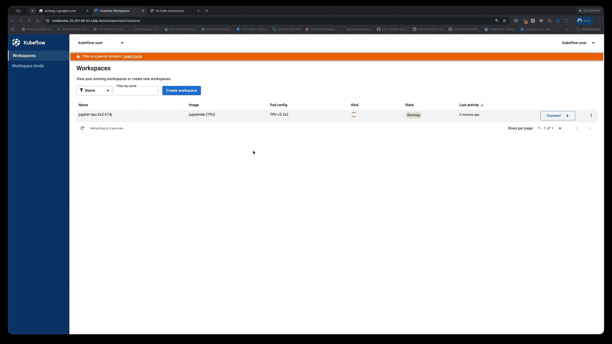
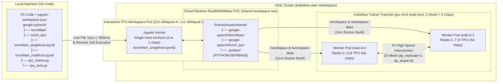

# End-to-End TorchTitan on Cloud TPU with GKE Workspaces

This directory provides a complete, end-to-end workflow for developing and scaling **[TorchTitan (`torchtitan/experiments/tpu`)](https://github.com/google-pytorch/torchtitan/tree/main/torchtitan/experiments/tpu)** on Google Kubernetes Engine (GKE) using **GKE Workspaces**, the **Jupyter Workspace Sync VS Code Extension** ([`vscode-extension`](../../vscode-extension/)), and **Kubeflow Trainer (`TrainJob`)**.

It follows a clean separation of concerns:
- **Generic, Project-Agnostic Infrastructure Utilities ([`tpu_trainer.py`](tpu_trainer.py), [`tpu_lock.py`](tpu_lock.py))**: Reusable across any PyTorch/TPU project (identical to [`../torch_tpu/tpu_trainer.py`](../torch_tpu/tpu_trainer.py) and [`../torch_tpu/tpu_lock.py`](../torch_tpu/tpu_lock.py)). They handle `/dev/vfio/*` TPU lock checks, single-host `torchrun` SliceBuilder initialization, shared `ReadWriteMany` Filestore PVC mounts (`/workspace` and `/workspace-deps`), and Kubeflow Trainer `TrainJob` orchestration.
- **Repo-Specific Logic in Notebooks ([`torchtitan_singlehost.ipynb`](torchtitan_singlehost.ipynb), [`torchtitan_multihost.ipynb`](torchtitan_multihost.ipynb))**: Installing TorchTitan's `requirements.txt` from the synced repository (`torchtitan/`), passing `torchtitan.experiments.tpu.train` CLI flags (`--module=torchtitan.experiments.tpu.llama3`, `--config=llama3_1b`), and inspecting TensorBoard outputs live directly in the notebooks.



---

## Why GKE Workspaces + `vscode-extension` Simplifies TorchTitan on TPU

The standard upstream process documented in `torchtitan/experiments/tpu/README.md` requires several manual, time-consuming steps before you can run or iterate on an experiment. Combining **GKE Workspaces** with **`jupyter-workspace-sync`** eliminates the heaviest bottlenecks:

| Stage | Standard `torchtitan/experiments/tpu/README.md` Process | GKE Workspaces + `vscode-extension` Workflow | Time Saved |
| :--- | :--- | :--- | :--- |
| **1. `torch_tpu` & PyTorch Setup** | Clone `torch_tpu`, edit `pyproject.toml` to `torch>=2.12.0`, and run `bazel build //ci/wheel:torch_tpu_wheel` from source. | Pre-installed in `jupyterlab:latest-tpu` (`torch==2.14.1+cpu`, `torch_tpu`, `jax`, `libtpu`). TorchTitan's `requirements.txt` installs once into `/home/jovyan/shared/.pydeps`. | **30–45 min saved** (0 Bazel builds) |
| **2. Single-Host Environment** | Provision a standalone GCE TPU VM via `gcloud compute tpus tpu-vm create`, manage SSH keys, and `scp` / `git clone` manually. | 1-click TPU Workspace (`tpu_1` or `tpu_4`) in the Workspaces UI with IAP + K8s RBAC. Edit your local `google-pytorch` checkout in VS Code with **~300 ms live sync** via `jupyter-workspace-sync`. | **10–15 min saved** per setup |
| **3. Multi-Host Code & Config Iteration** | Run `docker build -f torchtitan/experiments/tpu/Dockerfile .` and `docker push` to Artifact Registry after every code or config change. | Both the synced `torchtitan` repository and `/home/jovyan/shared/.pydeps` live on the shared `ReadWriteMany` Filestore PVC (`shared-workspace-rwx`) and mount directly at `/workspace` and `/workspace-deps` on all `TrainJob` worker pods. | **10–20 min saved per iteration** (<1s sync vs. Docker rebuild) |
| **4. Multi-Host Cluster & Rendezvous** | Provision a GKE cluster via `gcluster` (`Cluster Toolkit`) and manually wire `torchrun` rendezvous (`--nnodes`, `--node_rank`, `--rdzv_endpoint`) and TPU topology env vars. | Submit via `tpu_trainer.submit_multihost_training()`. Kubeflow Trainer (`torch-distributed`) + GKE's TPU webhook + TorchTitan's `_maybe_init_distributed_on_gke()` auto-configure the 8-chip mesh (`2,4,1`). | **Single Python call** from notebook |

> [!IMPORTANT]
> **Capacity Constraints vs. Machine Flexibility:** GKE Workspaces does **not** provide a workaround for underlying cloud resource capacity issues (such as TPU stockouts, quota limits, or reservation requirements). However, it gives you much greater flexibility in what machines and provisioning tiers you can use:
> - **Use Spot or Flex-Start VMs without risking your work:** Because your source code lives locally in VS Code (synced via `jupyter-workspace-sync`) and your workspace home directory (`/home/jovyan`), shared dependencies (`/home/jovyan/shared/.pydeps`), and outputs are backed by persistent storage (PVC / Cloud Filestore), you can run on cheaper, higher-availability **Spot** or **Flex-Start** TPUs without worrying about losing your code or development environment if a node is preempted.
> - **Automatic tier fallback & easy resizing:** Combined with GKE [`ComputeClass`](../compute-classes/tpu-compute-class.yaml) priorities (`spot` → `flex-start` → on-demand) and 1-click pod configurations (`1x1` single-chip, `2x2` 4-chip, or CPU-only), you can develop on whatever capacity is available and switch machine shapes without rebuilding your environment.

### Architecture Overview



---

## Directory Contents

| File | Description |
| :--- | :--- |
| [`torchtitan_singlehost.ipynb`](torchtitan_singlehost.ipynb) | Interactive notebook that installs TorchTitan's `requirements.txt` from the synced repository and runs single-host TorchTitan experiments (`llama3_debugmodel` and `llama3_1b` with FSDP2 + TensorBoard) across all local Workspace TPU chips (`2x2` `v5litepod-4` or `1x1` `v5litepod-1`). |
| [`torchtitan_multihost.ipynb`](torchtitan_multihost.ipynb) | Interactive notebook orchestrating a 2-host × 4-chip (`v5litepod-8`, 8 TPU chips total) distributed TorchTitan `llama3_1b` `TrainJob` mounted from the shared `ReadWriteMany` Filestore PVC. |
| [`tpu_trainer.py`](tpu_trainer.py) | Generic, reusable K8s/TPU helper library providing `configure_runtime_env()`, `resolve_shared_pvc_subpath()`, `run_singlehost_training()`, `submit_multihost_training()`, `wait_for_job_pods()`, `stream_job_logs()`, and `delete_training_job()`. |
| [`tpu_lock.py`](tpu_lock.py) | Generic pre-flight diagnostic and cleanup utility for `/dev/vfio/*` TPU hardware locks held by lingering `torchrun` processes. |
| [`workspace_coding_from_local_agent_to_remote_tpu.gif`](workspace_coding_from_local_agent_to_remote_tpu.gif) | End-to-end demo GIF showing a local coding agent connecting to a remote GKE TPU Workspace via `jupyter-sync`, syncing the local repository, running single-host `2x2` and multi-host `2x4` TorchTitan TPU benchmarks, and summarizing the results. |

---

## Step-by-Step Setup & End-to-End Workflow

### Step 0: Install the Jupyter Workspace Sync Extension (`jupyter-workspace-sync`)

Install the Microsoft Jupyter extension (`ms-toolsai.jupyter`) and the packaged [`jupyter-workspace-sync.vsix`](../../vscode-extension/jupyter-workspace-sync.vsix) extension in VS Code:

```bash
code --install-extension ms-toolsai.jupyter
code --install-extension /path/to/gke-workspaces/vscode-extension/jupyter-workspace-sync.vsix --force
```

*(Alternatively, in VS Code open the **Extensions** view (`Ctrl+Shift+X` / `Cmd+Shift+X`) → **`...`** → **Install from VSIX...** and select `vscode-extension/jupyter-workspace-sync.vsix`. See [`vscode-extension/README.md`](../../vscode-extension/README.md) for building from source.)*

Once activated in VS Code, the extension also automatically installs the companion `~/.local/bin/jupyter-sync` CLI and the `jupyter-workspace-sync` skill for AI coding agents (`~/.gemini/skills/` and `~/.claude/skills/`).

---

### Step 1: Set Up Your Local Project Directory (`google-pytorch/`)

1. Create a local root project directory (for example, `google-pytorch/`) and clone the `google-pytorch/torchtitan` and `google-pytorch/torch_tpu` repositories into it:

   ```bash
   mkdir -p ~/Projects/google-pytorch
   cd ~/Projects/google-pytorch

   git clone https://github.com/google-pytorch/torchtitan.git
   git clone https://github.com/google-pytorch/torch_tpu.git
   ```

2. Copy the TorchTitan notebooks (`torchtitan_singlehost.ipynb`, `torchtitan_multihost.ipynb`) and the generic TPU helper library files (`tpu_trainer.py`, `tpu_lock.py`) from this example directory into your `google-pytorch/` root folder:

   ```bash
   cp /path/to/gke-workspaces/examples/torchtitan/torchtitan_singlehost.ipynb \
      /path/to/gke-workspaces/examples/torchtitan/torchtitan_multihost.ipynb \
      /path/to/gke-workspaces/examples/torchtitan/tpu_trainer.py \
      /path/to/gke-workspaces/examples/torchtitan/tpu_lock.py \
      ~/Projects/google-pytorch/
   ```

   Your local directory structure should look like:

   ```text
   google-pytorch/
   ├── torchtitan/                  # Cloned from https://github.com/google-pytorch/torchtitan
   ├── torch_tpu/                   # Cloned from https://github.com/google-pytorch/torch_tpu
   ├── torchtitan_singlehost.ipynb  # Single-host interactive TPU training notebook
   ├── torchtitan_multihost.ipynb   # Multi-host distributed TPU training notebook
   ├── tpu_trainer.py               # Generic K8s / TPU training helper
   └── tpu_lock.py                  # Generic TPU /dev/vfio/* lock diagnostic helper
   ```

3. Configure VS Code workspace settings (`.vscode/settings.json`) inside `google-pytorch/` so that `jupyter-workspace-sync` syncs your project directly onto the Workspace pod's shared `ReadWriteMany` Filestore volume (`/home/jovyan/shared/google-pytorch`):

   ```bash
   mkdir -p .vscode
   cat << 'EOF' > .vscode/settings.json
   {
     "jupyterSync.remoteBaseDir": "shared/${workspaceFolderBasename}"
   }
   EOF
   ```

---

### Step 2: Create a TPU Workspace & Get a Connection Token URL from the Dashboard

1. **Create or start a TPU Workspace**:
   - Open the Kubeflow Workspaces Dashboard in your browser (`https://${WORKSPACES_HOST}/workspaces/`).
   - Click **Create Workspace** and select:
     - **WorkspaceKind**: `jupyterlab`
     - **Image**: `jupyterlab:latest-tpu` (pre-installed with `torch`, `torch_tpu`, `jax`, and `libtpu`)
     - **Pod Configuration**: **`TPU v5 2x2`** (`tpu_4`, 4 TPU v5e chips) or **`TPU v5 1x1`** (`tpu_1`, 1 TPU v5e chip)
   - Wait for the workspace status to reach **`Running`** (the shared `ReadWriteMany` PVC `shared-workspace-rwx` is automatically mounted at `/home/jovyan/shared`).

2. **Generate a Connection Token URL**:
   - In the Workspaces Dashboard, navigate to the **Connections** page (`https://${WORKSPACES_HOST}/workspaces/connections`) or click **Connect in IDE** next to your running TPU workspace.
   - Select your workspace (e.g., `jupyter-tpu-2x2-lw5a`).
   - Select port **`jupyterlab`** and choose a token duration (e.g., 8 or 24 hours).
   - Click **Generate connection** and click **Copy URL**. The token URL has the format:
     ```text
     https://${DESKTOP_HOST}/workspace/connect/<tenant-namespace>/<workspace-name>/jupyterlab/?token=<jwt-token>
     ```

---

### Step 3: Connect VS Code & Sync Your Local Project

Open `~/Projects/google-pytorch` in VS Code (`code ~/Projects/google-pytorch`) with the **Jupyter Workspace Sync** extension ([`vscode-extension`](../../vscode-extension/)) installed:

- **Option A — Connect via VS Code UI**:
  1. Open the Command Palette (`Ctrl+Shift+P` / `Cmd+Shift+P`) and run **`Jupyter Sync: Connect to Remote Jupyter Server`**.
  2. Paste the Connection Token URL from Step 2.
  3. The extension immediately syncs your local `google-pytorch/` folder (`torchtitan/`, `torch_tpu/`, notebooks, and `tpu_trainer.py`) to `/home/jovyan/shared/google-pytorch` on the remote TPU Workspace pod and starts continuous background watching.
  4. Open `torchtitan_singlehost.ipynb`, click **Select Kernel** in the top-right corner → **Existing Jupyter Server...**, paste the same token URL, and select **`Python 3 (ipykernel)`**.

- **Option B — Connect & Sync via `jupyter-sync` CLI**:
  ```bash
  cd ~/Projects/google-pytorch
  export JUPYTER_URL="https://${DESKTOP_HOST}/workspace/connect/kubeflow-user/<workspace-name>/jupyterlab/?token=<jwt-token>"

  # Check connection status and sync local repository to /home/jovyan/shared/google-pytorch
  jupyter-sync status --remote-dir shared/google-pytorch
  jupyter-sync sync --remote-dir shared/google-pytorch
  ```

---

### Step 4: Run Interactive Single-Host Training (`torchtitan_singlehost.ipynb`)

Run the cells of [`torchtitan_singlehost.ipynb`](torchtitan_singlehost.ipynb) interactively in VS Code (or from the terminal via `jupyter-sync run-cell`):

```bash
jupyter-sync run-cell torchtitan_singlehost.ipynb 2
jupyter-sync run-cell torchtitan_singlehost.ipynb 4
jupyter-sync run-cell torchtitan_singlehost.ipynb 6
jupyter-sync run-cell torchtitan_singlehost.ipynb 8
```

What each cell does:
1. **Cell 2 (Hardware Check & Install Requirements from Synced `torchtitan` Repo)**:
   - Checks `/dev/vfio/*` TPU device locks via `tpu_lock.preflight_check(is_distributed=True, auto_clear=True)`.
   - Locates your synced `torchtitan` repository (`/home/jovyan/shared/google-pytorch/torchtitan`).
   - Installs TorchTitan's dependencies directly from the repository's own requirement files (`torchtitan/experiments/tpu/requirements.txt`, `requirements.txt`, and `.ci/docker/requirements-flux.txt`) into `/home/jovyan/shared/.pydeps` (`PYTHONUSERBASE`).
2. **Cell 4 (`llama3_debugmodel` Smoke Test)**:
   - Calls `tpu_trainer.run_singlehost_training(main_script="torchtitan.experiments.tpu.train", module=True, src_dir=torchtitan_dir, args=[...])` across all attached TPU chips (`nproc_per_node=4`, `dp_shard=4` on a `2x2` TPU v5e workspace).
3. **Cell 6 (`llama3_1b` Training with FSDP2 & TensorBoard)**:
   - Trains the **1.24B-parameter Llama 3.2 1B** model (`--config=llama3_1b`) with FSDP2 across all local TPU chips and writes TensorBoard events to `outputs/tb/` inside the synced `torchtitan` repository.
4. **Cell 8 (Verify TPU Locks Released & Inspect TensorBoard Logs)**:
   - Confirms all `/dev/vfio/*` locks are released after `torchrun` exits and lists the generated TensorBoard event files.

---

### Step 5: Scale to Multi-Host GKE TPU Slices (`torchtitan_multihost.ipynb`)

Open [`torchtitan_multihost.ipynb`](torchtitan_multihost.ipynb) to scale the exact same synced `torchtitan` repository across a multi-host GKE TPU slice (`tpu-v5-8-multi-host`: 2 hosts × 4 chips = 8 TPU v5e chips) without building or pushing any Docker image:

```bash
jupyter-sync run-cell torchtitan_multihost.ipynb 2
jupyter-sync run-cell torchtitan_multihost.ipynb 4
jupyter-sync run-cell torchtitan_multihost.ipynb 6
jupyter-sync run-cell torchtitan_multihost.ipynb 8
jupyter-sync run-cell torchtitan_multihost.ipynb 10
```

What each cell does:
1. **Cell 2 (Verify Shared RWX PVC, Repo Subpath & Dependencies)**:
   - Resolves the exact Filestore PVC subpaths (`workspaces/<workspace-name>/google-pytorch/torchtitan` and `workspaces/<workspace-name>/.pydeps`) on `shared-workspace-rwx`.
2. **Cell 4 (Submit Multi-Host `TrainJob`)**:
   - Automatically detects the Workspace pod's TPU container image (`jupyterlab:latest-tpu`) and calls `tpu_trainer.submit_multihost_training()` to mount `/workspace` (`torchtitan`) and `/workspace-deps` (`.pydeps`) on all `TrainJob` worker pods.
3. **Cells 6 & 8 (Wait for Worker Pods & Stream Distributed Logs)**:
   - Waits for GKE Node Auto-Provisioning to schedule both TPU hosts (`node-0-0` and `node-0-1`) and streams the 8-chip FSDP2 (`dp_replicate=1, dp_shard=8`) training metrics live into the notebook.
4. **Cell 10 (Inspect Shared TensorBoard Logs & Clean Up)**:
   - Verifies the TensorBoard event files written by Rank 0 to `/home/jovyan/shared/google-pytorch/torchtitan/outputs/tb` and deletes the `TrainJob` via `tpu_trainer.delete_training_job()` so the multi-host TPU node pool scales down cleanly.
