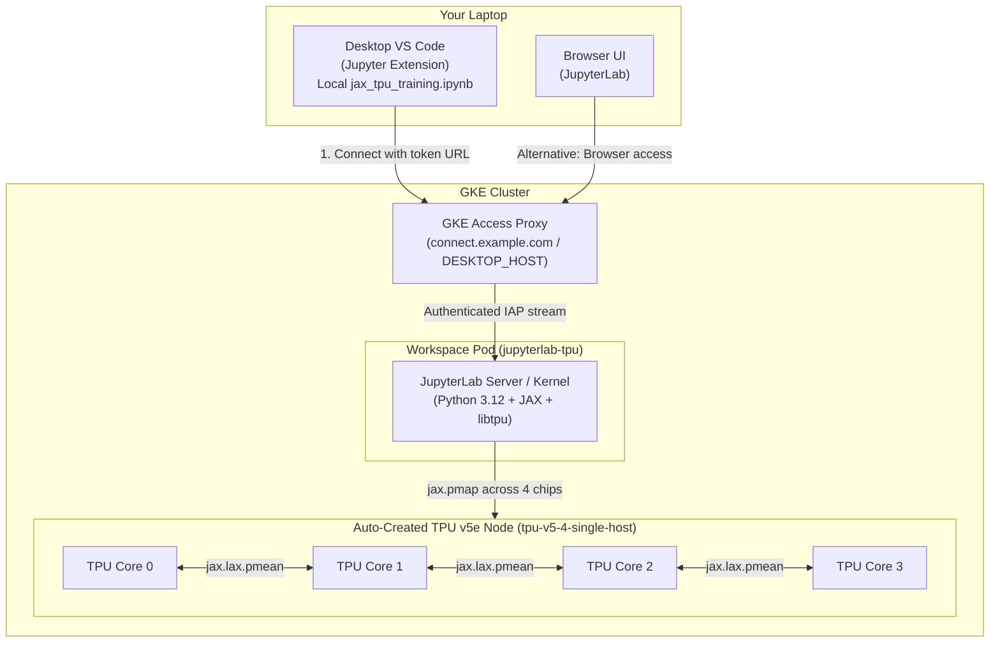

# Interactive TPU Training with JAX on GKE Workspaces

**Audience:** engineers and data scientists looking to develop and train models on Cloud TPUs with JAX, without managing TPU VMs, SSH tunnels, or complex multi-file deployments.

---

## Demo Walkthrough


*Watch how easy it is to spin up an interactive development environment for 1 TPU or 4 TPUs in the Kubeflow Workspaces UI, test training interactively in JupyterLab using `jax.pmap`, and scale out to a distributed multi-host TPU slice using the Kubeflow Trainer Python SDK—reusing the exact same `train_mlp` training function.*

---

## What this example does

This example demonstrates interactive, multi-device neural network training with **JAX on Cloud TPU v5e** inside a Kubeflow Workspace on GKE, and scaling to a distributed multi-host cluster.

| Property | Details |
| :--- | :--- |
| **Model** | 3-layer MLP (`784 -> 256 -> 128 -> 10`) implemented in pure JAX |
| **Interactive Hardware** | **1 TPU**: TPU v5 1x1 (`tpu_1`, 1 chip) or **4 TPU**: TPU v5 2x2 (`tpu_4`, 4 chips) |
| **Multi-Host Hardware** | **8 TPU slice**: 2 hosts × 4 chips = 8 chips (`tpu-v5-8-multi-host`) via Kubeflow Trainer |
| **Parallelism** | Data-parallel training across local chips (`jax.pmap`) and multi-host collective reduction (`jax.lax.pmean`) |
| **Workflow** | Self-contained notebook (`jax_tpu_training.ipynb`) executed remotely via VS Code or in-browser JupyterLab, scaling out via the Kubeflow Trainer Python SDK |

> [!TIP]
> **Already completed the one-time platform setup?** If you already followed steps 1–6 in the [Examples README](../README.md#start-here-one-time-setup-the-order-things-have-to-happen-in), your GKE cluster, TPU ComputeClass, TPU image, and `jupyterlab` WorkspaceKind are already configured. You can skip the prerequisites checklist and jump straight to [Step 1: Create the TPU Workspace](#step-1-create-the-tpu-workspace) or [Step 2: Run the Notebook](#step-2-run-the-notebook).

### Architecture Flow



---

## Glossary

| Term | What it means here |
| :--- | :--- |
| **Cloud TPU v5e** | Cost-effective Google Cloud TPU designed for training and inference. Each v5e chip has 1 TensorCore with 16 GB HBM. |
| **2x2 Topology** | A 4-chip TPU slice arranged in a 2D mesh, packaged as a single VM/node. |
| **ComputeClass** | A GKE recipe (`tpu-v5-4-single-host`) that automatically creates and deletes TPU node pools on demand. |
| **WorkspaceKind** | A cluster-wide template (`jupyterlab`) defining container images and machine shapes available in the Kubeflow UI. |
| **`DESKTOP_HOST`** | The cluster-wide hostname (e.g., `connect.<IP>.sslip.io`) used by the VS Code Jupyter extension to reach remote kernels. |
| **Connection Token** | A short-lived credential generated from `https://${WORKSPACES_HOST}/workspaces/connections` authorizing desktop VS Code to connect to your workspace. |
| **`jax.pmap`** | JAX's parallel mapping primitive that replicates and executes a function across multiple accelerator chips in parallel. |
| **`jax.lax.pmean`** | An all-reduce collective operation that averages values (such as gradients) across all TPU chips. |

---

## Prerequisites

Work through this checklist before launching the workspace.

```bash
export PROJECT_ID="$(gcloud config get-value project)"
export CLUSTER_NAME="kubeflow-notebooks"
export LOCATION="us-west1"
export REGION="us-west1"               # Region where you have TPU v5e quota
export TENANT_NAMESPACE="kubeflow-user" # Your tenant namespace
export REPO_NAME="kubeflow-repo"
export NS="${TENANT_NAMESPACE}"
```

### 1. Check TPU v5e Spot Quota

Verify that your project has at least 4 chips of TPU v5e Spot quota in your region:

```bash
gcloud compute regions describe "${REGION}" --project="${PROJECT_ID}" \
  --format="value(quotas)" | tr ',' '\n' | grep -i podslice
```

Look for **`PREEMPTIBLE_TPU_LITE_PODSLICE_V5`** (limit $\ge$ 4).

### 2. Apply the TPU ComputeClass

The `tpu-v5-4-single-host` ComputeClass enables GKE to auto-provision the TPU node pool when the workspace starts:

```bash
kubectl apply -f examples/compute-classes/tpu-compute-class.yaml
kubectl get computeclass tpu-v5-4-single-host
```

### 3. Build & Push the TPU JupyterLab Image

Ensure the custom TPU JupyterLab image is built and pushed (it includes `jax[tpu]` and `libtpu`):

```bash
export REGISTRY="${REGION}-docker.pkg.dev/${PROJECT_ID}/${REPO_NAME}"

./images/build.sh --jupyterlab --tpu --registry-path "${REGISTRY}"
```

Verify the image in Artifact Registry:

```bash
gcloud artifacts docker images list "${REGISTRY}" --include-tags | grep -E 'jupyterlab.*tpu'
```

### 4. Register the `jupyterlab` WorkspaceKind

Register the WorkspaceKind template so the UI offers the TPU option:

```bash
cd images
IMAGE_NAME="jupyterlab" CPU_IMAGE_TAG="latest-cpu" GPU_IMAGE_TAG="latest-gpu" TPU_IMAGE_TAG="latest-tpu" \
  envsubst < workspacekinds/jupyterlab.yaml | kubectl apply -f -
cd ..
```

Verify:

```bash
kubectl get workspacekinds jupyterlab
```

---

## Step 1: Create the TPU Workspace

In the Kubeflow Workspaces UI (`https://${WORKSPACES_HOST}/workspaces/`):

1. Click **Create Workspace**.
2. Configure the workspace options:

| Setting | Value | Notes |
| :--- | :--- | :--- |
| **Workspace Name** | `tpu-workspace` | Unique name in your namespace |
| **WorkspaceKind** | **`jupyterlab`** | |
| **Image** | **`jupyterlab (TPU)`** (`jupyterlab-tpu`) | Contains Python 3.12, JAX, and `libtpu` |
| **Pod Config** | **`TPU v5 1x1`** (`tpu_1`) or **`TPU v5 2x2`** (`tpu`) | Requests 1 chip via `tpu-v5-1-single-host` or 4 chips via `tpu-v5-4-single-host` |

3. Click **Create**.
4. GKE will automatically create a TPU node pool and schedule the workspace pod. The pod will transition from `Pending` to `Running` once the node pool is ready (typically 5–10 minutes for the initial TPU node pool creation).

Confirm from your terminal:

```bash
kubectl get workspaces -n "${TENANT_NAMESPACE}"
kubectl get pods -n "${TENANT_NAMESPACE}" -l notebooks.kubeflow.org/workspace-name=tpu-workspace
```

---

## Step 2: Run the Notebook

### Option A: Connect from Local VS Code

Run the notebook directly from your local machine without uploading any files:


1. **Open local VS Code**:
   - Open this repository on your laptop in VS Code.
   - Ensure the **Jupyter** extension (`ms-toolsai.jupyter`) is installed.
   - Open [`examples/tpu/jax_tpu_training.ipynb`](jax_tpu_training.ipynb).

2. **Generate a connection token**:
   - In your browser, navigate to `https://${WORKSPACES_HOST}/workspaces/connections` and sign in with Google.
   - Select your running workspace: **`tpu-workspace`**.
   - Select the port: **`jupyterlab`**.
   - Choose a token duration (e.g. 8 hours), click **Generate connection**, and click **Copy URL**.
   - The copied URL has the format:
     ```
     https://${DESKTOP_HOST}/workspace/connect/<tenant-namespace>/tpu-workspace/jupyterlab/?token=<token>
     ```

3. **Connect to the remote kernel in VS Code**:
   - In the upper right corner of the notebook editor in VS Code, click **Select Kernel** (or the current kernel indicator).
   - Choose **Select Another Kernel...** → **Existing Jupyter Server...**.
   - Paste the connection URL (including `?token=...`) and press **Enter**.
   - Select the remote kernel: **`Python 3 (ipykernel)`**.

4. **Execute cells**:
   - Run the notebook cells top to bottom!
   - Cell 1 verifies that `jax.devices()` discovers all 4 TPU v5e chips.
   - All computation executes directly on the remote TPU hardware while your notebook stays local.

> [!TIP]
> **macOS Certificate Trust Note**: If VS Code on macOS reports `unable to get issuer certificate` when connecting to `DESKTOP_HOST`, open your VS Code settings (`settings.json`), set `"http.systemCertificatesNode": true`, and reload the window.

### Option B: Run in In-Browser JupyterLab

If you prefer using the browser:

1. In the Kubeflow Workspaces UI, click **Connect** next to `tpu-workspace`.
2. Upload `jax_tpu_training.ipynb` into JupyterLab using the file browser upload button, or clone the repository in a JupyterLab terminal:
   ```bash
   git clone <this-repo-url> /home/jovyan/gke-workspaces
   ```
3. Open `jax_tpu_training.ipynb` and run the cells.

---

## What the Notebook Does

The notebook walks through a complete end-to-end interactive and distributed JAX training workflow:

### 1. TPU Hardware Discovery
```python
import jax
devices = jax.devices()
print(f"Available devices ({len(devices)}): {devices}")
```
Confirms connected TPU v5e cores (1 core for `tpu_1`, 4 cores for `tpu_4`).

### 2. Dataset Generation
Generates a self-contained multi-class classification dataset (8,192 training samples, 1,024 test samples, 784 features, 10 classes) using NumPy.

### 3. Model Architecture
Defines a 3-layer MLP (`784 -> 256 -> 128 -> 10`) with ReLU activations and cross-entropy loss.

### 4. Reusable JAX Training Function (`train_mlp`)
```python
def train_mlp(epochs=5, global_batch_size=256, lr=0.05):
    # 1. Automatic multi-host coordinator initialization (if running in Kubeflow TrainJob)
    if "JAX_COORDINATOR_ADDRESS" in os.environ:
        import jax.distributed as dist
        dist.initialize(...)

    # 2. Replicate model and data-parallel update step across local chips
    @partial(jax.pmap, axis_name="devices", in_axes=(0, 0, 0, None))
    def step(p, x, y, lr_rate):
        loss, grads = jax.value_and_grad(loss_fn)(p, x, y)
        grads = jax.lax.pmean(grads, axis_name="devices")
        loss = jax.lax.pmean(loss, axis_name="devices")
        return jax.tree_util.tree_map(lambda param, grad: param - lr_rate * grad, p, grads), loss
    ...
```
This function is **100% universal**:
- Automatically works on local 1 TPU or 4 TPUs via `jax.pmap`.
- Automatically connects across distributed multi-host nodes via `jax.distributed.initialize` when run by Kubeflow Trainer.

### 5. Interactive Local Training
```python
trained_params = train_mlp(epochs=5, global_batch_size=256, lr=0.05)
```
Executes directly in the notebook across your workspace's attached TPU cores, reporting epoch loss and throughput.

### 6. Evaluation & Inference
Computes test set accuracy and displays sample predictions alongside ground truth labels.

### 7. Scale to Multi-Host TPU Slice with Kubeflow Trainer Python SDK
Scale the **EXACT SAME** `train_mlp` function to a 2-node, 8-TPU multi-host slice (`tpu-v5-8-multi-host`) without writing raw Kubernetes YAML:

```python
from kubeflow.trainer import CustomTrainer, TrainerClient
from kubeflow.trainer.options import kubernetes as k8s_options

trainer_client = TrainerClient(backend_config=KubernetesBackendConfig(namespace="kubeflow-user"))

train_job = trainer_client.train(
    runtime="jax-distributed",
    trainer=CustomTrainer(
        func=train_mlp,  # Reuses the exact same Python function!
        image="us-docker.pkg.dev/cloud-tpu-images/jax-ai-image/tpu:latest",
        num_nodes=2,
        resources_per_node={"google.com/tpu": 4},
        env={"JAX_PLATFORMS": "tpu,cpu", "ENABLE_PJRT_COMPATIBILITY": "true"},
    ),
    options=[tpu_placement_patch],
)

# Stream multi-host logs from all TPU pods
trainer_client.wait_for_job_status(train_job, timeout=600)
for log_line in trainer_client.get_job_logs(train_job):
    print(log_line)
```

---

## Troubleshooting

| Symptom | Cause | Fix |
| :--- | :--- | :--- |
| Workspace pod stuck in `Pending` with `0/N nodes are available` | The `tpu-v5-4-single-host` ComputeClass is missing. | Run `kubectl apply -f examples/compute-classes/tpu-compute-class.yaml` and verify with `kubectl get computeclass`. |
| Workspace pod stuck in `Pending` for 10+ minutes with quota events | No TPU v5e Spot quota available in the region. | Check quota with `gcloud compute regions describe "${REGION}" --format="value(quotas)" \| tr ',' '\n' \| grep -i podslice`. Request `PREEMPTIBLE_TPU_LITE_PODSLICE_V5` quota in the Cloud Console. |
| `AssertionError: No accelerator devices found!` or devices show `CpuDevice` | The workspace was created with a CPU image or CPU pod config instead of TPU. | Ensure the workspace uses Image **`jupyterlab (TPU)`** and Pod Config **`TPU v5 2x2`**. |
| VS Code reports `unable to get issuer certificate` | Node.js on macOS does not trust the system keychain by default. | In VS Code `settings.json`, set `"http.systemCertificatesNode": true` and reload the window. |
| VS Code reports `Failed to connect to Jupyter server` or `401 Unauthorized` | The connection token has expired or is invalid. | Generate a fresh token at `https://${WORKSPACES_HOST}/workspaces/connections` and reconnect. |

---

## Cost & Cleanup

> [!WARNING]
> TPU resources are billable. When you are finished with the example, delete or pause the workspace to let GKE automatically tear down the TPU node pool.

1. **Stop or Delete the Workspace**:
   - In the Kubeflow Workspaces UI, click **Stop** or **Delete** on `tpu-workspace`.
   - Or from the CLI:
     ```bash
     kubectl delete workspace tpu-workspace -n "${TENANT_NAMESPACE}"
     ```

2. **Verify Node Pool Removal**:
   Once no pod requests the ComputeClass, GKE automatically terminates the TPU node pool within a few minutes. Confirm:
   ```bash
   kubectl get nodes -l cloud.google.com/compute-class=tpu-v5-4-single-host
   ```
