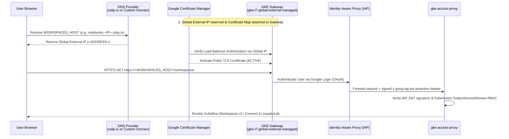

# Deploying Standalone Kubeflow Workspaces, Trainer, & Spark Operator on GKE (No Istio)

This guide provides a clear, step-by-step walkthrough for deploying **Standalone Kubeflow Workspaces (Notebooks v2)**, **Kubeflow Trainer (v2)**, and **Kubeflow Spark Operator** on Google Kubernetes Engine (GKE) **without depending on Istio**.

Instead of Istio service mesh, ingress gateways, and sidecars, this standalone architecture uses native Google Cloud and Kubernetes primitives:
- **GKE Gateway API (`gke-l7-global-external-managed`)**: Google-managed global external HTTPS load balancing.
- **Google Certificate Manager**: Automated public TLS certificates using Load Balancer Authorization.
- **Identity-Aware Proxy (IAP)**: Google authentication and identity assertion at the edge.
- **GKE Access Proxy (`gke-access-proxy`)**: Validates signed IAP JWT assertions, enforces per-request Kubernetes `SubjectAccessReview` RBAC checks, routes HTTP and WebSocket connections to workspaces, and supports optional Kubernetes-minted connection tokens for the VS Code Jupyter extension.
- **Kubernetes NetworkPolicy**: Strictly protects Workspace pods (`gke-tenant-ingress`) so **only `gke-access-proxy` and `workspaces-controller` can reach Workspace pods** (no direct pod-to-pod access to notebooks), while a separate scoped policy (`gke-tenant-workloads-ingress` excluding `notebooks.kubeflow.org/workspace-name`) allows non-workspace workload pods in `${TENANT_NAMESPACE}` (Spark driver/executors, multi-host TPU `TrainJob` hosts, and inference pods) to communicate within `${TENANT_NAMESPACE}`.

---

## Architecture Comparison & Document Guide

| Feature | Standalone GKE Deployment (`providers/gke`) | Community Distribution (`kubeflow/community-distribution`) |
| --- | --- | --- |
| **Service Mesh / Ingress** | **No Istio** — Native GKE Gateway API (`gke-l7-global-external-managed`) | Istio IngressGateway + Istio CNI + mTLS sidecars |
| **Public HTTPS / TLS** | Google Certificate Manager (Load Balancer Authorization) | `cert-manager` + Let's Encrypt ACME HTTP-01 solver |
| **Authentication** | Google Identity-Aware Proxy (IAP) + Signed JWT verification | Dex OIDC + `oauth2-proxy` |
| **Authorization** | Access Proxy + Kubernetes `SubjectAccessReview` RBAC | Istio `AuthorizationPolicy` + Kubeflow Profiles |
| **Workloads Supported** | Kubeflow Workspaces (v2), Kubeflow Trainer (v2), Spark Operator | Full Kubeflow Community Distribution |

> [!TIP]
> **Which document should I read?**
> - **[USER_GUIDE.md](USER_GUIDE.md) (this document)**: The authoritative, step-by-step deployment guide for the core standalone platform: configuration options (domain vs. `sslip.io`, Google-managed OAuth vs. custom OAuth), stateful pause & resume, and how to attach desktop VS Code to a remote Jupyter kernel running in the cluster.
> - **[docs/gke-pilot-codelab.md](../../docs/gke-pilot-codelab.md)**: A streamlined quickstart walkthrough using the automation scripts (`deploy_standalone.sh` and `cleanup_standalone.sh`) along with the historical pilot verification record.
> - **[DESIGN.md](DESIGN.md)**: Detailed security architecture and trade-offs of the Istio-free access proxy.

### Automated Deployment Scripts
To streamline the entire installation, use the scripts in this directory:
- **[`deploy_standalone.sh`](deploy_standalone.sh)**: Automates API enablement, Gateway controller setup, `cert-manager` installation, core image builds, Certificate Manager setup (with automatic `sslip.io` fallback if you don't have a domain), IAP audience discovery, Kubeflow Trainer + Spark Operator installation, tenant RBAC, and GCS Workload Identity IAM bindings.
- **[`cleanup_standalone.sh`](cleanup_standalone.sh)**: Cleanly tears down deployed resources.

---


## Where things live

| Directory | Purpose |
| --- | --- |
| `providers/gke/` (this directory) | The core standalone deployment only: [`deploy_standalone.sh`](deploy_standalone.sh), [`cleanup_standalone.sh`](cleanup_standalone.sh), the Go sources (`cmd/`, `internal/`), the Dockerfiles for the five platform images, [`manifests/`](manifests/) (`pilot`, `proxy`, `snapshot`, `tenant`, `upstream`), [`scripts/`](scripts/), and the [`Makefile`](Makefile). |
| [`images/`](../../images/README.md) | Custom workspace container images (JupyterLab, in-browser VS Code via `codeserver-python`, Spark, Agent Sandbox MCP server), the [`build.sh`](../../images/build.sh) builder, sample notebooks, and ready-made `WorkspaceKind` templates in [`images/workspacekinds/`](../../images/workspacekinds/). (`codeserver-python` is the *image* name; the `WorkspaceKind` it backs is named **`codeserver`**.) |
| [`examples/`](../../examples/README.md) | End-to-end examples: [`distributed/`](../../examples/distributed/) (Spark ETL + TPU training), [`resumable-notebooks/`](../../examples/resumable-notebooks/) (stateful pause & resume), [`agent-sandbox/`](../../examples/agent-sandbox/), and [`compute-classes/`](../../examples/compute-classes/) (GPU / TPU ComputeClasses). |

## 1. Prerequisites & Cluster Setup

### Required Tools
Ensure the following tools are installed on your workstation:
- `gcloud` CLI with `gke-gcloud-auth-plugin`
- `kubectl` (v1.28+)
- `docker` (with `linux/amd64` build support)
- `go` (v1.25+)
- `jq`, `curl`, `sha256sum`, `envsubst` (from `gettext`)

### GCP Organization Policy: External Load Balancer Permission
The standalone architecture uses the GKE Gateway API (`gke-l7-global-external-managed` GatewayClass), which creates a Google Cloud Global External Application Load Balancer (`GLOBAL_EXTERNAL_MANAGED_HTTP_HTTPS`).

If your GCP project is governed by organization policies (common in corporate and enterprise GCP environments), verify that the organization policy constraint `constraints/compute.restrictLoadBalancerCreationForTypes` permits external HTTP/HTTPS load balancers:

```bash
gcloud resource-manager org-policies describe compute.restrictLoadBalancerCreationForTypes \
  --project="${PROJECT_ID}" --effective
```

- If `allValues: ALLOW` or `allowedValues` includes `GLOBAL_EXTERNAL_MANAGED_HTTP_HTTPS`, your project is ready.
- If the effective policy restricts creation to internal load balancer types (such as `INTERNAL_HTTP_HTTPS` and `INTERNAL_TCP_UDP`), the GKE Gateway controller will be blocked from creating the forwarding rule and report:
  `Constraint constraints/compute.restrictLoadBalancerCreationForTypes violated for projects/... Forwarding Rule ... of type GLOBAL_EXTERNAL_MANAGED_HTTP_HTTPS is not allowed.`
- **Remediation**: Request an organization policy exemption for your project (e.g., via your organization's policy administrator, or Google-internally via [go/overground-quickstart#project-level](http://go/overground-quickstart#project-level) / [go/gcp-control-gclb](http://go/gcp-control-gclb)) to allow `GLOBAL_EXTERNAL_MANAGED_HTTP_HTTPS`, or deploy into an already-exempted project/folder (such as projects under `teams/gke/dev/dev_projects`).

### Create or Select a GKE Cluster
You need a VPC-native GKE cluster with **Dataplane V2** (`ADVANCED_DATAPATH`), **Workload Identity Federation for GKE**, **HTTP Load Balancing** and **GCE Persistent Disk CSI Driver** (both on by default), and **Gateway API (`--gateway-api=standard`)** enabled.

If you do not have a cluster yet, create one using `gcloud`:

```bash
export PROJECT_ID="your-gcp-project-id"
export CLUSTER_NAME="kubeflow-notebooks"
export LOCATION="us-central1-c"   # Zone or region where you have TPU / GPU quota
export REGION="us-central1"       # Region for Artifact Registry and GCS bucket

gcloud container clusters create "${CLUSTER_NAME}" \
  --project="${PROJECT_ID}" \
  --location="${LOCATION}" \
  --enable-pod-snapshots `# Required for Pause & Resume` \
  --enable-dataplane-v2 `# Required: Enforces Kubernetes NetworkPolicies` \
  --gateway-api=standard `# Required: Enables GKE Gateway API controller` \
  --workload-pool="${PROJECT_ID}.svc.id.goog" `# Required: Enables Workload Identity for GCS access` \
  --workload-metadata=GKE_METADATA \
  --num-nodes=1 \
  --machine-type=e2-standard-4 \
  --enable-image-streaming

# Optional: Create an autoscaling CPU node pool for Spark executors and inference pods
gcloud container node-pools create cpu-autoscaling-pool \
  --cluster="${CLUSTER_NAME}" \
  --project="${PROJECT_ID}" \
  --location="${LOCATION}" \
  --image-type=cos_containerd `# Required for Pause & Resume` \
  --sandbox type=gvisor `# Required for Pause & Resume` \
  --machine-type=e2-standard-4 \
  --enable-autoscaling \
  --min-nodes=0 \
  --max-nodes=3
```

<details>
<summary><b>Updating an existing GKE cluster instead of creating a new one</b> (click to expand)</summary>

If you already have a GKE cluster, you can update it to enable the required features rather than creating a new one from scratch.

#### Step 0: Verify non-updatable prerequisites
Dataplane V2 and VPC-native networking **cannot** be enabled after cluster creation. Verify your cluster already has them:

```bash
# Must return "ADVANCED_DATAPATH"
gcloud container clusters describe "${CLUSTER_NAME}" \
  --location="${LOCATION}" --project="${PROJECT_ID}" \
  --format='value(networkConfig.datapathProvider)'

# Must return "True"
gcloud container clusters describe "${CLUSTER_NAME}" \
  --location="${LOCATION}" --project="${PROJECT_ID}" \
  --format='value(ipAllocationPolicy.useIpAliases)'
```

> [!WARNING]
> If either check fails, the cluster cannot be converted in-place and you must create a new cluster.

#### Step 1: Update cluster features
Because `gcloud container clusters update` requires each feature flag to be executed individually:

```bash
# 1. Enable standard Gateway API (GKE Gateway controller)
gcloud container clusters update "${CLUSTER_NAME}" \
  --project="${PROJECT_ID}" --location="${LOCATION}" \
  --gateway-api=standard

# 2. Enable Workload Identity Federation (required for GCS bucket access)
gcloud container clusters update "${CLUSTER_NAME}" \
  --project="${PROJECT_ID}" --location="${LOCATION}" \
  --workload-pool="${PROJECT_ID}.svc.id.goog"

# 3. Enable GKE Pod Snapshots (required for stateful Pause & Resume)
gcloud container clusters update "${CLUSTER_NAME}" \
  --project="${PROJECT_ID}" --location="${LOCATION}" \
  --enable-pod-snapshots

# 4. Enable Image Streaming (recommended: faster container startup times)
gcloud container clusters update "${CLUSTER_NAME}" \
  --project="${PROJECT_ID}" --location="${LOCATION}" \
  --enable-image-streaming
```

#### Step 2: Update or create node pools (Standard clusters)
Cluster-level updates do not automatically reconfigure existing node pools:

```bash
# Enable Workload Identity & Image Streaming on an existing node pool:
NODE_POOL_NAME="default-pool" # Replace with your node pool name
gcloud container node-pools update "${NODE_POOL_NAME}" \
  --cluster="${CLUSTER_NAME}" --project="${PROJECT_ID}" --location="${LOCATION}" \
  --workload-metadata=GKE_METADATA --enable-image-streaming

# (Optional) If running the resumable-notebooks example on GKE Standard, create a gVisor pool:
gcloud container node-pools create gvisor-pool \
  --cluster="${CLUSTER_NAME}" --project="${PROJECT_ID}" --location="${LOCATION}" \
  --image-type=cos_containerd --sandbox type=gvisor --machine-type=e2-standard-4 \
  --workload-metadata=GKE_METADATA --enable-autoscaling --min-nodes=0 --max-nodes=3
```
*(On GKE Autopilot clusters, node pools are managed automatically; you only need to run the `clusters update` commands in Step 1.)*

</details>

### Set Environment Variables
Run all commands from the root of the repository. Export your deployment variables:

```bash
set -euo pipefail
export REPO_ROOT="$(pwd)"                         # Root of this repository
export PROJECT_ID="your-gcp-project-id"
export CLUSTER_NAME="kubeflow-notebooks"
export LOCATION="us-central1-c"
export REGION="us-central1"
export PILOT_USERS="user1@example.com,user2@example.com" # Comma- or space-separated Google account emails of users
export TENANT_NAMESPACE="kubeflow-user"           # Example tenant namespace for notebooks & jobs
export REPO_NAME="kubeflow-repo"                  # Artifact Registry repository name
export ADDRESS_NAME="notebooks-gke-global"        # Global static external IP name
export CERTIFICATE_NAME="notebooks-gke"
export CERTIFICATE_MAP="notebooks-gke"
export CONTEXT="gke_${PROJECT_ID}_${LOCATION}_${CLUSTER_NAME}"
export REGISTRY="${REGION}-docker.pkg.dev/${PROJECT_ID}/${REPO_NAME}"
export TAG="pilot-$(date -u +%Y%m%d%H%M%S)"
export BUILD_IMAGES="true"                        # Build & push the five core platform images
export INSTALL_TRAINER="true"
export INSTALL_SPARK_OPERATOR="true"
export APPLY_SAMPLE_WORKSPACEKIND="true"
export SAMPLE_WORKSPACEKINDS="${REPO_ROOT}/images/workspacekinds/jupyterlab.yaml ${REPO_ROOT}/images/workspacekinds/codeserver-python.yaml"
export GCS_BUCKET="${PROJECT_ID}-${TENANT_NAMESPACE}-bucket" # Injected into Workspace Pods as $GCS_BUCKET (not created by the script)
export SNAPSHOT_GCS_BUCKET="${PROJECT_ID}-${TENANT_NAMESPACE}-snapshots-bucket" # Dedicated GCS bucket for GKE Pod Snapshots (stateful Pause/Resume)
```

#### Environment Variable Reference

Every variable read by [`deploy_standalone.sh`](deploy_standalone.sh), with its default:

| Variable | Default | Purpose |
| --- | --- | --- |
| `PROJECT_ID` | `gcloud config get-value project` | GCP project ID. **Required** — the script exits if empty. (Legacy alias: `PROJECT`). |
| `PILOT_USERS` | *(empty)* | Comma- or space-separated Google account emails to admit via IAP + RBAC. **Required** — the script exits if empty. Falls back to `PILOT_USER`. |
| `CLUSTER_NAME` | `kubeflow-notebooks` | GKE cluster name. (Legacy alias: `CLUSTER`). |
| `LOCATION` | `us-central1-c` | Cluster zone or region. |
| `REGION` | `us-central1` | Region for Artifact Registry, the snapshot GCS bucket, and `REGISTRY`. |
| `TENANT_NAMESPACE` | `kubeflow-user` | Tenant namespace for Workspaces and jobs. |
| `REPO_NAME` | `kubeflow-repo` | Artifact Registry Docker repository name. (Legacy alias: `REPOSITORY`). |
| `ADDRESS_NAME` | `notebooks-gke-global` | Name of the reserved global external IPv4 address. |
| `CERTIFICATE_NAME` | `notebooks-gke` | Certificate Manager certificate for `WORKSPACES_HOST`. The desktop certificate is always `${CERTIFICATE_NAME}-desktop`. |
| `CERTIFICATE_MAP` | `notebooks-gke` | Certificate Manager map attached to the Gateway. |
| `CONTEXT` | `gke_${PROJECT_ID}_${LOCATION}_${CLUSTER_NAME}` | kubectl context. |
| `REGISTRY` | `${REGION}-docker.pkg.dev/${PROJECT_ID}/${REPO_NAME}` | Destination registry for the core images. |
| `TAG` | `pilot-$(date -u +%Y%m%d%H%M%S)` | Image tag. When `BUILD_IMAGES=false` and `TAG` is unset, the script resolves the newest existing `gke-access-proxy` tag instead. |
| `WORKSPACES_HOST` | *(empty)* | **Hostname #1 — the web dashboard.** Where users browse the Workspaces UI and open workspaces. When empty, defaults to `notebooks.<ADDRESS>.sslip.io`. Set this to your own domain — see [Option A2](#option-a2-what-to-do-if-you-have-your-own-custom-domain). |
| `DESKTOP_HOST` | *(empty)* | **Hostname #2 — the remote-kernel endpoint.** A second, cluster-wide hostname on the *same* IP, used by the Jupyter extension in **VS Code running on your laptop** to reach a Jupyter kernel inside an already-running JupyterLab workspace. Not related to the `codeserver` WorkspaceKind, and not per-workspace. When empty, defaults to `connect.<ADDRESS>.sslip.io`. See [Section 8](#8-remote-jupyter-kernels-from-desktop-vs-code-the-connect-endpoint). |
| `OAUTH_FILE` | *(empty)* | Path to a downloaded Web-application OAuth client JSON. Set only for Option B2. |
| `IAP_CLIENT_ID` | *(empty)* | OAuth client ID. Leave empty for Google-managed OAuth. Derived from `OAUTH_FILE` when that is set. |
| `IAP_SECRET_NAME` | *(empty)* | Kubernetes Secret holding the OAuth client secret. Defaults to `iap-oauth` when `OAUTH_FILE` is set. |
| `INSTALL_TRAINER` | `true` | Deploy Kubeflow Trainer (v2). |
| `INSTALL_SPARK_OPERATOR` | `true` | Deploy Kubeflow Spark Operator. |
| `BUILD_IMAGES` | `true` | Build & push the five core platform images (Section 3). |
| `APPLY_SAMPLE_WORKSPACEKIND` | `true` | Register the example `jupyterlab` and `codeserver` WorkspaceKinds (upstream base images) after tenant RBAC is applied. |
| `SAMPLE_WORKSPACEKINDS` | `<repo-root>/images/workspacekinds/jupyterlab.yaml <repo-root>/images/workspacekinds/codeserver-python.yaml` | Space-separated WorkspaceKind templates rendered by [`scripts/render_workspacekinds.py`](scripts/render_workspacekinds.py) when `APPLY_SAMPLE_WORKSPACEKIND=true`. |
| `APPLY_COMPUTE_CLASSES` | `true` | With `APPLY_SAMPLE_WORKSPACEKIND=true`, also apply the GPU/TPU ComputeClasses used by the WorkspaceKinds' accelerator pod options. |
| `COMPUTE_CLASSES_DIR` | `<repo-root>/examples/compute-classes` | Directory of ComputeClass manifests applied when `APPLY_COMPUTE_CLASSES=true`. |
| `GCS_BUCKET` | `${PROJECT_ID}-${TENANT_NAMESPACE}-bucket` | Bucket name injected into every Workspace Pod as `$GCS_BUCKET`. Not created by the script. |
| `KUBE_CLIENT_QPS` | `100` | Kubernetes client QPS for `gke-access-proxy`. |
| `KUBE_CLIENT_BURST` | `200` | Kubernetes client burst for `gke-access-proxy`. |
| `SNAPSHOT_GCS_BUCKET` | `${PROJECT_ID}-${TENANT_NAMESPACE}-snapshots-bucket` | Dedicated GCS bucket for GKE Pod Snapshots. |
| `SNAPSHOT_RETENTION_DAYS` | `14` | Age (days) for the GCS Object Lifecycle `Delete` rule on the snapshot bucket. |
| `CONTROL_PLANE_CIDR` | `<control-plane-ip>/32` (auto-discovered) | CIDR allowed to reach the admission webhooks. |
| `SKIP_ORG_POLICY_CHECK` | `false` | When `true`, skips the preflight check for `constraints/compute.restrictLoadBalancerCreationForTypes`. |
| `DIST_DIR` | `/tmp/kubeflow-community-distribution` | Local clone of `kubeflow/community-distribution`. |

> [!NOTE]
> [`cleanup_standalone.sh`](cleanup_standalone.sh) reads `PROJECT_ID`, `CLUSTER_NAME`, `LOCATION`, `TENANT_NAMESPACE`, `ADDRESS_NAME`, `CERTIFICATE_NAME`, `CERTIFICATE_MAP`, `CONTEXT`, `SNAPSHOT_GCS_BUCKET`, and `DIST_DIR`, plus two of its own: `DELETE_EDGE_RESOURCES` (default `false`) and `DELETE_SNAPSHOT_BUCKET` (default `false`).

Authenticate `kubectl` to your cluster:

```bash
gcloud container clusters get-credentials "${CLUSTER_NAME}" \
  --location="${LOCATION}" \
  --project="${PROJECT_ID}"
```

---

## 2. Enable GCP APIs, GKE Gateway Controller, & Cert-Manager

> [!IMPORTANT]
> You **must** enable the required Google Cloud APIs and enable `--gateway-api=standard` on your cluster **before** checking `kubectl get gatewayclasses` or installing Gateway resources.

### Step 2.1: Enable Google Cloud APIs
```bash
gcloud services enable \
  container.googleapis.com \
  compute.googleapis.com \
  artifactregistry.googleapis.com \
  certificatemanager.googleapis.com \
  iap.googleapis.com \
  --project="${PROJECT}"
```

### Step 2.2: Enable & Verify GKE Gateway API Controller
If you created an existing cluster without `--gateway-api=standard`, enable the standard Gateway API controller now and wait for the `gke-l7-global-external-managed` `GatewayClass` to become `Accepted`:

```bash
gcloud container clusters update "${CLUSTER}" \
  --location="${LOCATION}" \
  --project="${PROJECT}" \
  --gateway-api=standard \
  --quiet

# Wait for GKE to register and accept the global external GatewayClass
kubectl --context="${CONTEXT}" wait gatewayclass/gke-l7-global-external-managed \
  --for=condition=Accepted --timeout=10m

# Verify Gateway API and GKE policy CRDs are installed
kubectl --context="${CONTEXT}" get crd \
  gateways.gateway.networking.k8s.io \
  httproutes.gateway.networking.k8s.io \
  gcpbackendpolicies.networking.gke.io \
  healthcheckpolicies.networking.gke.io
```

### Step 2.3: Record Cluster Control Plane Endpoint
Inspect your cluster and record its verified control-plane IP address as `CONTROL_PLANE_CIDR`:

```bash
CONTROL_PLANE_IP=$(gcloud container clusters describe "${CLUSTER}" \
  --location="${LOCATION}" --project="${PROJECT}" \
  --format='value(privateClusterConfig.privateEndpoint,controlPlaneEndpointsConfig.ipEndpointsConfig.privateEndpoint)' | awk '{print $1}')
if [[ -z "${CONTROL_PLANE_IP}" ]]; then
  CONTROL_PLANE_IP=$(gcloud container clusters describe "${CLUSTER}" \
    --location="${LOCATION}" --project="${PROJECT}" \
    --format='value(endpoint)')
fi
export CONTROL_PLANE_CIDR="${CONTROL_PLANE_IP}/32"
echo "CONTROL_PLANE_CIDR: ${CONTROL_PLANE_CIDR}"
```

### Step 2.4: Create Artifact Registry Repository
Create the Docker repository in Artifact Registry if it does not exist:

```bash
gcloud artifacts repositories create "${REPO_NAME}" \
  --project="${PROJECT_ID}" \
  --location="${REGION}" \
  --repository-format=docker || true
```

### Step 2.5: Install Cert-Manager (v1.21.2)
`cert-manager` issues internal TLS certificates for the admission webhooks used by Kubeflow Workspaces, Trainer, and Spark Operator. Install `cert-manager` v1.21.2 if not already present:

```bash
mkdir -p providers/gke/bin
curl -fsSL https://github.com/cert-manager/cert-manager/releases/download/v1.21.2/cert-manager.yaml \
  -o providers/gke/bin/cert-manager-v1.21.2.yaml
printf '%s  %s\n' e03b668ec8675214af6b0a671699d088f2601fa3878e0dbe1b41d3feafd1879f \
  providers/gke/bin/cert-manager-v1.21.2.yaml | sha256sum --check
kubectl --context="${CONTEXT}" apply --server-side \
  --field-manager=notebooks-gke-platform -f providers/gke/bin/cert-manager-v1.21.2.yaml

for component in cert-manager cert-manager-webhook cert-manager-cainjector; do
  kubectl --context="${CONTEXT}" -n cert-manager rollout status \
    deployment/"${component}" --timeout=5m
done
```

---

## 3. Build & Push Application Images

### Step 3.1: Build & Push Standalone Workspaces Core Images
Build and push the five standalone core platform images (`gke-access-proxy`, `gke-snapshot-addon`, `gke-frontend`, `gke-controller`, `gke-backend`) and pin their registry digests. This is exactly what Step 3 of [`deploy_standalone.sh`](deploy_standalone.sh) does when `BUILD_IMAGES=true`:

```bash
make -C providers/gke test
gcloud auth configure-docker "${REGION}-docker.pkg.dev" --quiet

docker build --platform=linux/amd64 -t "${REGISTRY}/gke-access-proxy:${TAG}" providers/gke
docker build --platform=linux/amd64 -f providers/gke/snapshot.Dockerfile \
  -t "${REGISTRY}/gke-snapshot-addon:${TAG}" providers/gke
docker build --platform=linux/amd64 -f providers/gke/frontend.Dockerfile \
  -t "${REGISTRY}/gke-frontend:${TAG}" .
docker build --platform=linux/amd64 -f workspaces/controller/Dockerfile \
  -t "${REGISTRY}/gke-controller:${TAG}" workspaces/controller
docker build --platform=linux/amd64 -f workspaces/backend/Dockerfile \
  -t "${REGISTRY}/gke-backend:${TAG}" workspaces

for component in access-proxy snapshot-addon frontend controller backend; do
  docker push "${REGISTRY}/gke-${component}:${TAG}"
done
```

> [!NOTE]
> `make -C providers/gke test` (`go test -race ./... && go vet ./...`) is not run by `deploy_standalone.sh`; it is an optional pre-flight check.

### Step 3.2: Build Optional Custom Workspace Images

Custom workspace images (JupyterLab, in-browser VS Code via `codeserver-python`, Spark, and the Agent Sandbox MCP server) are **not** built by `deploy_standalone.sh` and are not required for the core deployment. Instead, the core deployment optionally registers a sample WorkspaceKind that uses public `ghcr.io/kubeflow` images.

If you want to build the custom images for the examples, use [`../../images/build.sh`](../../images/build.sh) and follow [`../../images/README.md`](../../images/README.md). Ready-made `WorkspaceKind` templates for those images live in [`../../images/workspacekinds/`](../../images/workspacekinds/).

---

## 4. Configuration Options: Domain, TLS Certificates, & Google Login (OAuth)

### Part A: Domain & TLS Certificate Configuration Options

The GKE Gateway serves HTTPS using a **Google Certificate Manager** certificate with **Load Balancer Authorization**. You can configure this with or without your own custom domain:



#### Step 4A.1: Reserve Global Static External IPv4 Address
First, reserve a global external IPv4 address for the Gateway:

```bash
gcloud compute addresses create "${ADDRESS_NAME}" --global --ip-version=IPV4 \
  --network-tier=PREMIUM --project="${PROJECT}" || true

export ADDRESS=$(gcloud compute addresses describe "${ADDRESS_NAME}" \
  --global --project="${PROJECT}" --format='value(address)')
echo "Reserved Global External IP: ${ADDRESS}"
```

Now choose **Option A1 (No Domain)** or **Option A2 (Custom Domain)**.

> [!IMPORTANT]
> **This deployment uses two hostnames, both pointing at the one IP you just reserved.**
>
> | Variable | What it serves | Who talks to it |
> | --- | --- | --- |
> | `WORKSPACES_HOST` | The Workspaces web dashboard and in-browser workspaces | Users, in a browser |
> | `DESKTOP_HOST` | The remote-kernel endpoint ([Section 8](#8-remote-jupyter-kernels-from-desktop-vs-code-the-connect-endpoint)) | The Jupyter extension in VS Code on a user's laptop |
>
> `deploy_standalone.sh` always provisions **both**, each with its own TLS
> certificate. If you set only `WORKSPACES_HOST`, your dashboard will be on your
> domain while the remote-kernel endpoint silently stays on `sslip.io`. That works,
> but it is rarely what you want. Set both, or neither.

---

#### Option A1: What To Do If You Do Not Have a Domain (`sslip.io` Zero-DNS Setup)
If you do not own a domain name or want an instant, zero-DNS setup, use **[sslip.io](https://sslip.io/)**. Any hostname of the form `notebooks.<IP>.sslip.io` automatically resolves to `<IP>` on public DNS without any configuration:

```bash
export WORKSPACES_HOST="notebooks.${ADDRESS}.sslip.io"
export DESKTOP_HOST="connect.${ADDRESS}.sslip.io"
echo "Dashboard:      ${WORKSPACES_HOST}"
echo "Remote kernels: ${DESKTOP_HOST}"

# Verify public DNS resolution
getent ahostsv4 "${WORKSPACES_HOST}"
getent ahostsv4 "${DESKTOP_HOST}"
```

*(Note: when running `./providers/gke/deploy_standalone.sh`, leaving **both** variables unset produces exactly these two values. You do not need to export anything for this option.)*

---

#### Option A2: What To Do If You Have Your Own Custom Domain
If you own a custom domain (e.g., `example.com`):

1. Set **both** hostnames:
   ```bash
   export WORKSPACES_HOST="workspaces.example.com"
   export DESKTOP_HOST="connect.example.com"
   ```
   The names are yours to choose; only the variables matter. If you do not intend
   to use desktop VS Code at all, still set `DESKTOP_HOST` to a name on your domain —
   the script provisions a certificate for it either way, and leaving it unset
   pins that certificate to an `sslip.io` name you do not control.

2. In your DNS provider (Cloud DNS, Route 53, Cloudflare, etc.), create **two A records**, both pointing at the same IP:

   | Name / Host | Type | Value | TTL |
   | --- | --- | --- | --- |
   | `workspaces` | `A` | `${ADDRESS}` | `300` |
   | `connect` | `A` | `${ADDRESS}` | `300` |

   *(If using Cloudflare, set proxy status to **DNS only / grey cloud** for both.)*

3. Verify **both** resolve to `${ADDRESS}` before continuing — certificate issuance
   fails if they do not:
   ```bash
   dig +short "${WORKSPACES_HOST}"
   dig +short "${DESKTOP_HOST}"
   ```

---

#### Step 4A.2: Create Google Certificate Manager Certificate & Map Entry
Once `WORKSPACES_HOST` is set (via either Option A1 or Option A2), create the Certificate Manager certificate and certificate map entry:

```bash
gcloud certificate-manager certificates create "${CERTIFICATE_NAME}" \
  --domains="${WORKSPACES_HOST}" --project="${PROJECT}"

gcloud certificate-manager maps create "${CERTIFICATE_MAP}" --project="${PROJECT}"

gcloud certificate-manager maps entries create notebooks \
  --map="${CERTIFICATE_MAP}" --certificates="${CERTIFICATE_NAME}" \
  --hostname="${WORKSPACES_HOST}" --project="${PROJECT}"
```
> [!NOTE]
> Because this certificate uses Load Balancer Authorization (no DNS challenge required), it will remain in `PROVISIONING` state until Step 5 creates the GKE Gateway and attaches the certificate map. Do **not** wait for `ACTIVE` before continuing to Step 5.

> [!IMPORTANT]
> The commands above cover **only** `WORKSPACES_HOST`. The second certificate
> (`${CERTIFICATE_NAME}-desktop`) and its `notebooks-desktop` map entry, which serve
> `DESKTOP_HOST`, are created in [Step 8.1](#step-81-enable-the-desktop-endpoint).
> `deploy_standalone.sh` creates both in one pass; if you are following this guide
> manually and never reach Section 8, you simply will not have a remote-kernel endpoint.

---

### Part B: Authentication Configuration Options (Google Login & IAP OAuth)

Identity-Aware Proxy (IAP) authenticates users with Google accounts. Choose **Option B1** or **Option B2** based on whether your users belong to your GCP organization:

| Accounts that will sign in | Recommended OAuth Configuration |
| --- | --- |
| **Google Workspace / Cloud Identity users within the GCP project's organization** | **Option B1: Google-Managed OAuth** (Zero OAuth client or secret needed) |
| **External Google accounts (`@gmail.com`) or users outside the GCP project's organization** | **Option B2: Custom OAuth Client** (Dedicated Web Application OAuth client + Secret) |

#### Option B1: Google-Managed OAuth (Users Within Your GCP Organization)
If the Google accounts signing in belong to the same Google Cloud Organization that owns `${PROJECT_ID}`, leave both `IAP_CLIENT_ID` and `IAP_SECRET_NAME` empty:

```bash
export IAP_CLIENT_ID=""
export IAP_SECRET_NAME=""
```
*(Skip directly to Section 5.)*

#### Option B2: Custom OAuth Client (External / Cross-Organization Users)
Google-managed OAuth only permits users whose accounts belong to the project's own Google Cloud Organization (for example, if the project is in `my-org.net`, only `@my-org.net` accounts can sign in; `@google.com`, `@gmail.com`, or other domains will receive an IAP `You don't have access` error).

If your users are external to the project's organization, configure a custom OAuth client:
1. Open [Google Auth Platform > Branding / Consent](https://console.cloud.google.com/auth/branding) in your GCP project and configure the app name (e.g. `Kubeflow Workspaces`) and support email.
2. Under **Audience** (User type: External), add the emails in `${PILOT_USERS}` to the **Test users** list.
3. Open [Google Auth Platform > Clients](https://console.cloud.google.com/auth/clients) and click **Create Client**:
   - Application type: **Web application**
   - Name: `Notebooks GKE`
   - Leave *Authorized redirect URIs* empty for now and click **Create**.
4. In the pop-up modal, copy the newly generated **Client ID** (it is prefixed with your project number, e.g. `<project-number>-<hash>.apps.googleusercontent.com`).
5. Click the pencil icon to **Edit** the newly created client:
   - Under **Authorized redirect URIs**, click **+ Add URI** and paste the exact IAP callback URI with your Client ID:
     ```
     https://iap.googleapis.com/v1/oauth/clientIds/<YOUR_CLIENT_ID>:handleRedirect
     ```
     *(Example: `https://iap.googleapis.com/v1/oauth/clientIds/97289666241-abc123xyz.apps.googleusercontent.com:handleRedirect`)*
   - Click **Save**.
6. Click **Download JSON** on the client and save it to a secure location (e.g. `~/oauth-client.json`).
7. Export `OAUTH_FILE` before deploying:
   ```bash
   export OAUTH_FILE="$HOME/oauth-client.json"
   chmod 600 "${OAUTH_FILE}"
   export IAP_CLIENT_ID=$(jq -er '.web.client_id' "${OAUTH_FILE}")
   export IAP_SECRET_NAME="iap-oauth"
   ```

---

## 5. Step-by-Step Deployment

> [!TIP]
> **Automated Execution**: You can execute the entire deployment automatically by running:
> ```bash
> ./providers/gke/deploy_standalone.sh
> ```
> Or follow the individual steps below to inspect and apply each stage manually.

#### How this guide maps to the script's nine steps

[`deploy_standalone.sh`](deploy_standalone.sh) is organised into nine numbered steps. They are spread across this guide as follows:

| Script step | Guide section |
| --- | --- |
| 1. Enable GCP APIs, GKE Gateway controller, Artifact Registry repository | [Section 2.1](#step-21-enable-google-cloud-apis), [2.2](#step-22-enable--verify-gke-gateway-api-controller), [2.4](#step-24-create-artifact-registry-repository) |
| 2. Install cert-manager v1.21.2 | [Section 2.5](#step-25-install-cert-manager-v1212) |
| 3. Build & push the five core platform images | [Section 3.1](#step-31-build--push-standalone-workspaces-core-images) |
| 4. Reserve global external IP, resolve hostnames, create Certificate Manager certificates/map, create the GKE-node-tagged GCLB health-check firewall rule | [Section 4 Part A](#part-a-domain--tls-certificate-configuration-options) |
| 5. Render & apply the fail-closed bootstrap plan | [Step 5.1](#step-51-generate-deployment-plan--apply-fail-closed-bootstrap) |
| 6. Discover the IAP backend audience & finalize the access proxy | [Step 5.2](#step-52-discover-iap-backend-audience--finalize-access-proxy) |
| 7. Deploy Kubeflow Trainer (v2) & Spark Operator | [Step 5.3](#step-53-deploy-kubeflow-trainer-v2--kubeflow-spark-operator-standalone-no-istio) |
| 8. Admit users via IAP, apply tenant RBAC, register the sample WorkspaceKind | [Step 5.4](#step-54-admit-users-via-iap--configure-tenant-workspace-tenant_namespace) |
| 9. Create the snapshot GCS bucket, Workload Identity IAM bindings & lifecycle rule | [Step 7.1](#step-71-configure-snapshot_gcs_bucket-iam-workload-identity--gke-service-agent--lifecycle-rule) |

> [!NOTE]
> Script Step 4 also creates the **desktop** certificate `${CERTIFICATE_NAME}-desktop` and its `notebooks-desktop` map entry unconditionally. This guide covers those in [Section 8.1](#step-81-enable-the-desktop-endpoint); if you follow Section 4 manually and skip Section 8, you simply will not have a desktop endpoint.


### Step 5.1: Generate Deployment Plan & Apply Fail-Closed Bootstrap
Resolve the `@sha256:` digests of your built core images and generate the deployment configuration:

```bash
PROXY_IMAGE=$(gcloud artifacts docker images describe "${REGISTRY}/gke-access-proxy:${TAG}" \
  --project="${PROJECT}" --format='value(image_summary.fully_qualified_digest)')
SNAPSHOT_IMAGE=$(gcloud artifacts docker images describe "${REGISTRY}/gke-snapshot-addon:${TAG}" \
  --project="${PROJECT}" --format='value(image_summary.fully_qualified_digest)')
FRONTEND_IMAGE=$(gcloud artifacts docker images describe "${REGISTRY}/gke-frontend:${TAG}" \
  --project="${PROJECT}" --format='value(image_summary.fully_qualified_digest)')
CONTROLLER_IMAGE=$(gcloud artifacts docker images describe "${REGISTRY}/gke-controller:${TAG}" \
  --project="${PROJECT}" --format='value(image_summary.fully_qualified_digest)')
BACKEND_IMAGE=$(gcloud artifacts docker images describe "${REGISTRY}/gke-backend:${TAG}" \
  --project="${PROJECT}" --format='value(image_summary.fully_qualified_digest)')

jq -n \
  --arg cidr "${CONTROL_PLANE_CIDR}" \
  --arg host "${WORKSPACES_HOST}" \
  --arg desktopHost "${DESKTOP_HOST:-}" \
  --arg certificateMap "${CERTIFICATE_MAP}" \
  --arg addressName "${ADDRESS_NAME}" \
  --arg client "${IAP_CLIENT_ID}" \
  --arg secret "${IAP_SECRET_NAME}" \
  --arg tenant "${TENANT_NAMESPACE}" \
  --arg snapshotBucket "${SNAPSHOT_GCS_BUCKET}" \
  --argjson qps "${KUBE_CLIENT_QPS:-100}" \
  --argjson burst "${KUBE_CLIENT_BURST:-200}" \
  --arg proxy "${PROXY_IMAGE}" \
  --arg snapshot "${SNAPSHOT_IMAGE}" \
  --arg frontend "${FRONTEND_IMAGE}" \
  --arg controller "${CONTROLLER_IMAGE}" \
  --arg backend "${BACKEND_IMAGE}" \
  '{controlPlaneCIDR:$cidr,hostname:$host,desktopHostname:$desktopHost,certificateMap:$certificateMap,
    addressName:$addressName,iapClientID:$client,iapSecretName:$secret,
    iapAudience:"",kubeClientQPS:$qps,kubeClientBurst:$burst,snapshotGCSBucket:$snapshotBucket,tenants:[$tenant],
    images:{proxy:$proxy,snapshot:$snapshot,frontend:$frontend,controller:$controller,backend:$backend}}' \
  > providers/gke/deployment.local.json

rm -rf providers/gke/rendered/bootstrap
make -C providers/gke plan CONFIG=deployment.local.json OUTPUT=rendered/bootstrap
```

> [!NOTE]
> `make plan` runs [`scripts/plan.sh`](scripts/plan.sh), which builds `./cmd/render` and emits four stage files (`namespaces.json`, `isolation.json`, `applications.json`, `edge.json`) plus `upstream-revision.txt` and `config.sha256`. It **refuses to overwrite an existing output directory**, which is why each render is preceded by `rm -rf`. It changes nothing in the cluster or in Google Cloud.

Apply namespaces and NetworkPolicy isolation rules first:

```bash
kubectl --context="${CONTEXT}" apply --server-side --force-conflicts --field-manager=notebooks-gke \
  -f providers/gke/rendered/bootstrap/namespaces.json
kubectl --context="${CONTEXT}" apply --server-side --force-conflicts --field-manager=notebooks-gke \
  -f providers/gke/rendered/bootstrap/isolation.json
```

If using **Option B2 (Custom OAuth)**, create the Kubernetes Secret containing the OAuth client secret:

```bash
if [[ -n "${OAUTH_FILE:-}" && -n "${IAP_SECRET_NAME:-}" ]]; then
  jq -jr '.web.client_secret' "${OAUTH_FILE}" | \
    kubectl --context="${CONTEXT}" -n kubeflow-workspaces create secret generic "${IAP_SECRET_NAME}" \
      --from-file=client_secret=/dev/stdin
fi
```

Apply CRDs, wait for them to establish, and apply the application and edge manifests:

```bash
jq '{apiVersion,kind,items:[.items[]|select(.kind=="CustomResourceDefinition")]}' \
  providers/gke/rendered/bootstrap/applications.json | \
  kubectl --context="${CONTEXT}" apply --server-side --force-conflicts --field-manager=notebooks-gke -f -

kubectl --context="${CONTEXT}" wait --for=condition=Established --timeout=2m \
  crd/workspaces.kubeflow.org crd/workspacekinds.kubeflow.org

kubectl --context="${CONTEXT}" apply --server-side --force-conflicts --field-manager=notebooks-gke \
  -f providers/gke/rendered/bootstrap/applications.json
kubectl --context="${CONTEXT}" apply --server-side --force-conflicts --field-manager=notebooks-gke \
  -f providers/gke/rendered/bootstrap/edge.json
```
*(Because `iapAudience` is empty during bootstrap, `gke-access-proxy` intentionally exits at startup until Step 5.2 configures the verified IAP audience.)*

---

### Step 5.2: Discover IAP Backend Audience & Finalize Access Proxy
Once GKE creates the global backend service for the proxy's Network Endpoint Group (NEG), discover its numeric backend ID and configure `IAP_AUDIENCE`:

```bash
# 1. Discover the proxy Service's NEG name
NEG_NAME=$(kubectl --context="${CONTEXT}" -n kubeflow-workspaces get service gke-access-proxy \
  -o json | jq -er '.metadata.annotations["cloud.google.com/neg-status"] | fromjson | .network_endpoint_groups["8080"]')

# 2. Match the exact GKE global backend service
MATCHED_BACKEND=$(gcloud compute backend-services list --global --project="${PROJECT}" \
  --format='json(name,id,backends,iap.enabled)' | jq -ce --arg neg "${NEG_NAME}" \
  '[.[] | select(any(.backends[]?; .group | endswith("/networkEndpointGroups/"+$neg)))]
   | if length==1 then .[0] else error("Expected exactly one proxy backend") end')

export BACKEND_SERVICE=$(jq -er '.name' <<< "${MATCHED_BACKEND}")
BACKEND_ID=$(jq -er '.id' <<< "${MATCHED_BACKEND}")
PROJECT_NUMBER=$(gcloud projects describe "${PROJECT}" --format='value(projectNumber)')
export IAP_AUDIENCE="/projects/${PROJECT_NUMBER}/global/backendServices/${BACKEND_ID}"
echo "Discovered IAP Backend: ${BACKEND_SERVICE} (Audience: ${IAP_AUDIENCE})"

# 3. Render ready plan with the verified IAP audience and update the deployment
rm -rf providers/gke/rendered/ready
jq --arg audience "${IAP_AUDIENCE}" '.iapAudience=$audience' \
  providers/gke/deployment.local.json > providers/gke/rendered/deployment.ready.json
make -C providers/gke plan CONFIG=rendered/deployment.ready.json OUTPUT=rendered/ready

kubectl --context="${CONTEXT}" apply --server-side --force-conflicts --field-manager=notebooks-gke \
  -f providers/gke/rendered/ready/applications.json
kubectl --context="${CONTEXT}" -n kubeflow-workspaces rollout restart deployment/gke-access-proxy

for component in workspaces-controller workspaces-backend workspaces-frontend gke-access-proxy gke-workspace-snapshot-addon; do
  kubectl --context="${CONTEXT}" -n kubeflow-workspaces rollout status deployment/"${component}" --timeout=5m
done
```

---

### Step 5.3: Deploy Kubeflow Trainer (v2) & Kubeflow Spark Operator (Standalone, No Istio)
To orchestrate distributed Apache Spark ETL jobs and multi-host Cloud TPU training jobs from inside your standalone Kubeflow Workspace, deploy **Kubeflow Trainer (v2)** and **Kubeflow Spark Operator** directly from [`kubeflow/community-distribution`](https://github.com/kubeflow/community-distribution) (neither component requires Istio):

```bash
export DIST_DIR="/tmp/kubeflow-community-distribution"
if [[ ! -d "${DIST_DIR}" ]]; then
  git clone https://github.com/kubeflow/community-distribution.git "${DIST_DIR}"
fi

# 1. Create Kubeflow core namespaces (kubeflow, kubeflow-system) and aggregated RBAC roles
# Note: We create kubeflow-system and kubeflow directly instead of applying
# ${DIST_DIR}/common/kubeflow-namespace/base because that directory adds Istio-specific
# namespace labels (istio-injection: enabled) and Istio-dependent NetworkPolicies.
kubectl --context="${CONTEXT}" create namespace kubeflow-system --dry-run=client -o yaml | kubectl --context="${CONTEXT}" apply -f -
kubectl --context="${CONTEXT}" create namespace kubeflow --dry-run=client -o yaml | kubectl --context="${CONTEXT}" apply -f -
kubectl --context="${CONTEXT}" apply -k "${DIST_DIR}/common/kubeflow-roles/base"

# 2. Deploy Kubeflow Trainer (v2) & JobSet controller + ClusterTrainingRuntimes (jax-distributed, torch-distributed)
kubectl --context="${CONTEXT}" apply -k "${DIST_DIR}/applications/trainer/overlays" --server-side --force-conflicts || true
kubectl --context="${CONTEXT}" wait --for=condition=Established crd/clustertrainingruntimes.trainer.kubeflow.org --timeout=60s
kubectl --context="${CONTEXT}" wait --for=condition=Established crd/trainingruntimes.trainer.kubeflow.org --timeout=60s
kubectl --context="${CONTEXT}" wait --for=condition=Established crd/trainjobs.trainer.kubeflow.org --timeout=60s
kubectl --context="${CONTEXT}" apply -k "${DIST_DIR}/applications/trainer/overlays" --server-side --force-conflicts
kubectl --context="${CONTEXT}" rollout status deployment/kubeflow-trainer-controller-manager -n kubeflow-system --timeout=180s
kubectl --context="${CONTEXT}" rollout status deployment/jobset-controller-manager -n kubeflow-system --timeout=180s

# 3. Deploy Kubeflow Spark Operator (SparkApplication & SparkConnect CRDs + controller/webhook)
kubectl --context="${CONTEXT}" apply -k "${DIST_DIR}/applications/spark/spark-operator/overlays/kubeflow" --server-side --force-conflicts
kubectl --context="${CONTEXT}" wait --for=condition=Established crd/sparkapplications.sparkoperator.k8s.io --timeout=60s
kubectl --context="${CONTEXT}" wait --for=condition=Established crd/scheduledsparkapplications.sparkoperator.k8s.io --timeout=60s
kubectl --context="${CONTEXT}" wait --for=condition=Established crd/sparkconnects.sparkoperator.k8s.io --timeout=60s
kubectl --context="${CONTEXT}" rollout status deployment/spark-operator-controller -n kubeflow --timeout=180s
kubectl --context="${CONTEXT}" rollout status deployment/spark-operator-webhook -n kubeflow --timeout=180s
```

Verify available cluster training runtimes:
```bash
kubectl --context="${CONTEXT}" get clustertrainingruntime
# Expected output includes: jax-distributed, torch-distributed, deepspeed-distributed, torchtune
```

---

### Step 5.4: Admit Users via IAP & Configure Tenant Workspace (`${TENANT_NAMESPACE}`)
1. **Grant IAP Access to Your Users**:
   ```bash
   for user_email in $(echo "${PILOT_USERS}" | tr ',' ' '); do
     gcloud iap web add-iam-policy-binding --project="${PROJECT}" \
       --resource-type=backend-services --service="${BACKEND_SERVICE}" \
       --member="user:${user_email}" --role=roles/iap.httpsResourceAccessor --condition=None
   done
   ```

2. **Apply Tenant RBAC, ServiceAccount, StorageClass, ResourceQuota, NetworkPolicy, and ValidatingAdmissionPolicy**:
   Render [`providers/gke/manifests/pilot`](manifests/pilot/kustomization.yaml) (which is [`admission.yaml`](manifests/pilot/admission.yaml) + [`access.yaml`](manifests/pilot/access.yaml)) with all users in `${PILOT_USERS}` added to the `RoleBinding` and `ClusterRoleBinding` subjects:
   ```bash
   kubectl kustomize --load-restrictor=LoadRestrictionsNone providers/gke/manifests/pilot | \
     python3 -c 'import yaml, json, sys; print(json.dumps({"apiVersion": "v1", "kind": "List", "items": [d for d in yaml.safe_load_all(sys.stdin) if d]}))' | \
     jq --arg users "${PILOT_USERS}" --arg ns "${TENANT_NAMESPACE}" \
       '([ $users | split(",")[] | split(" ")[] | select(length > 0) | {kind: "User", name: ., apiGroup: "rbac.authorization.k8s.io"} ]) as $user_subjects |
        {apiVersion:"v1",kind:"List",items:(.items | map(
         (if .kind=="Namespace" then .metadata.name=$ns else . end) |
         (if .metadata.namespace != null then .metadata.namespace=$ns else . end) |
         (if .kind=="ValidatingAdmissionPolicy" then .spec.matchConstraints.namespaceSelector.matchLabels["kubernetes.io/metadata.name"]=$ns else . end) |
         (if .kind=="RoleBinding" or .kind=="ClusterRoleBinding" then
           .subjects = (
             (.subjects | map(
               select(.kind != "User") |
               (if .namespace != null then .namespace=$ns else . end) |
               (if .kind=="Group" and (.name | startswith("system:serviceaccounts:")) then .name=("system:serviceaccounts:"+$ns) else . end)
             )) + $user_subjects
           )
         else . end)
       ))}' > providers/gke/rendered/ready/customer-pilot.json

   kubectl --context="${CONTEXT}" apply --server-side --field-manager=notebooks-gke-pilot \
     -f providers/gke/rendered/ready/customer-pilot.json
   ```

3. **Register Example WorkspaceKinds**:
   When `APPLY_SAMPLE_WORKSPACEKIND=true` (the default), the script registers the `jupyterlab` and `codeserver` WorkspaceKinds from [`../../images/workspacekinds/`](../../images/workspacekinds/) (`SAMPLE_WORKSPACEKINDS`) so users have something to launch immediately after deployment. [`scripts/render_workspacekinds.py`](scripts/render_workspacekinds.py) renders the templates without any custom image build:
   - The `*-cpu`, `*-gpu` and `*-tpu` image options point at the public upstream `ghcr.io/kubeflow` base images the custom images are built from (`jupyter-scipy`, `jupyter-pytorch-cuda-full`, `codeserver-python`). There is no upstream TPU image, so the TPU option uses the **CPU** base image (no `libtpu`/`jax[tpu]` preinstalled). The imageConfig ids are unchanged, so re-applying the templates with custom images later upgrades existing Workspaces in place.
   - GPU/TPU pod options select nodes with `cloud.google.com/compute-class`, which works on both Autopilot and Standard clusters. When `APPLY_COMPUTE_CLASSES=true` (the default), the script first applies the ComputeClasses from [`../../examples/compute-classes/`](../../examples/compute-classes/) so those options can schedule.

   Templates that do not exist are skipped with a warning.

   *To register the custom-image WorkspaceKinds instead, see [`../../images/README.md#ready-made-workspacekind-templates`](../../images/README.md#ready-made-workspacekind-templates); they use the same `metadata.name`s and pod options, and replace the rendered kinds.*

   ```bash
   if [[ "${APPLY_COMPUTE_CLASSES}" == "true" ]]; then
     kubectl --context="${CONTEXT}" apply --server-side --force-conflicts \
       --field-manager=notebooks-gke-pilot -f "${COMPUTE_CLASSES_DIR}"
   fi
   python3 providers/gke/scripts/render_workspacekinds.py ${SAMPLE_WORKSPACEKINDS} \
     > providers/gke/rendered/ready/workspacekinds.json
   kubectl --context="${CONTEXT}" apply --server-side --force-conflicts \
     --field-manager=notebooks-gke-pilot -f providers/gke/rendered/ready/workspacekinds.json
   ```

   > [!IMPORTANT]
   > The `notebooks-gke-pilot-workspaces` ValidatingAdmissionPolicy applied in the previous substep restricts `Workspace.spec.kind` in `${TENANT_NAMESPACE}` to exactly four values: **`gke-jupyterlab`**, **`jupyterlab`**, **`jupyterlab-resumable`**, and **`codeserver`**. Registering a `WorkspaceKind` under any other name will succeed, but every `Workspace` referencing it will be **denied at admission**. The policy also rejects Workspaces that mount secrets or set user-supplied pod labels/annotations. See [`manifests/pilot/admission.yaml`](manifests/pilot/admission.yaml).
   >
   > The names shipped in this repo line up with that allow-list: the upstream sample is `jupyterlab`, [`../../images/workspacekinds/jupyterlab.yaml`](../../images/workspacekinds/jupyterlab.yaml) is `jupyterlab`, [`../../images/workspacekinds/codeserver-python.yaml`](../../images/workspacekinds/codeserver-python.yaml) is `codeserver`, and [`../../examples/resumable-notebooks/manifests/workspacekind-resumable.yaml`](../../examples/resumable-notebooks/manifests/workspacekind-resumable.yaml) is `jupyterlab-resumable`.

---

### Step 5.5: Verify Gateway & Certificate Readiness
Confirm that the Gateway is `Programmed` and the Certificate Manager certificate is `ACTIVE`:

```bash
kubectl --context="${CONTEXT}" -n kubeflow-workspaces get \
  gateway,httproute,gcpbackendpolicy,healthcheckpolicy,certificate

gcloud certificate-manager certificates describe "${CERTIFICATE_NAME}" \
  --project="${PROJECT}" --format='yaml(managed)'
```
*(Note: Google Certificate Manager load-balancer authorization typically transitions from `PROVISIONING` to `ACTIVE` within 5–15 minutes after the Gateway is attached.)*

---

### Step 5.6: Create Your First Workspace

Open `https://${WORKSPACES_HOST}/workspaces/` and create a Workspace from the `jupyterlab` WorkspaceKind in namespace `${TENANT_NAMESPACE}`.

To do the same from the CLI, first create the home PVC — **the Workspace controller does not create it for you, and the PVC must already exist in the namespace**:

```bash
kubectl --context="${CONTEXT}" -n "${TENANT_NAMESPACE}" apply -f - <<'EOF'
apiVersion: v1
kind: PersistentVolumeClaim
metadata:
  name: workspace-home-pvc
spec:
  accessModes: ["ReadWriteOnce"]
  storageClassName: notebooks-gke-rwo
  resources:
    requests:
      storage: 50Gi
EOF
```

Then create the Workspace:

```bash
kubectl --context="${CONTEXT}" -n "${TENANT_NAMESPACE}" apply -f - <<'EOF'
apiVersion: kubeflow.org/v1beta1
kind: Workspace
metadata:
  name: jupyterlab-workspace
spec:
  paused: false
  displayName: "Example JupyterLab Workspace"
  kind: "jupyterlab"
  podTemplate:
    volumes:
      # `home` is the NAME of an existing PVC, given as a plain string.
      home: "workspace-home-pvc"
    options:
      imageConfig: "jupyter-scipy:v1.10.0"
      podConfig: "tiny_cpu"
EOF

kubectl --context="${CONTEXT}" -n "${TENANT_NAMESPACE}" get workspace jupyterlab-workspace -w
```

> [!IMPORTANT]
> Common mistakes when hand-writing a `Workspace`:
> - `spec.podTemplate.volumes.home` is a **plain string** holding the PVC name — it is *not* an object, and there is no nested `pvcName`/`mountPath` under it. The mount path is fixed by the WorkspaceKind at `spec.podTemplate.volumeMounts.home` (`/home/jovyan` for the sample kind). Only the `data` list uses `{pvcName, mountPath, readOnly}` objects.
> - There is **no `spec.deferUpdates` field**. Do not add one.
> - `spec.podTemplate.volumes.secrets` is rejected by the pilot ValidatingAdmissionPolicy (Step 5.4).
> - `imageConfig` and `podConfig` must be `id` values that exist in the WorkspaceKind. For the upstream sample kind the available ids are `jupyter-scipy:v1.8.0`, `jupyter-scipy:v1.9.2`, `jupyter-scipy:v1.10.0`, `jupyter-pytorch-cuda-full:v1.9.2`, `jupyter-pytorch-cuda-full:v1.10.0` and `tiny_cpu`, `small_cpu`, `big_gpu`.
>
> A fully annotated reference `Workspace` lives at [`workspaces/controller/manifests/kustomize/samples/jupyterlab_v1beta1_workspace.yaml`](../../workspaces/controller/manifests/kustomize/samples/jupyterlab_v1beta1_workspace.yaml).

---

## 6. End-to-End Examples

For step-by-step examples demonstrating how to use the standalone GKE deployment for distributed model training, data processing, stateful pause/resume, and autonomous AI agents, see [`../../examples/README.md`](../../examples/README.md), which documents the order the examples' prerequisites have to happen in:
- **[Distributed ML Workflow (Spark ETL + TPU Training)](../../examples/distributed/)**
- **[Stateful Pause & Resume](../../examples/resumable-notebooks/)**
- **[Agent Sandbox (AI Coding Agents)](../../examples/agent-sandbox/)**
- **[GPU & TPU ComputeClasses](../../examples/compute-classes/)** (a prerequisite for the accelerator pod options used by the other examples)

*(Note: The Kubeflow Trainer and Spark Operator installed in Step 5.3 are used by the distributed ML example. If you are not running that example, you can skip their installation by setting `INSTALL_TRAINER=false` and `INSTALL_SPARK_OPERATOR=false`.)*

---

## 7. Stateful Workspace Pause & Resume with GKE Pod Snapshots

GKE Pod Snapshots enable **stateful Pause & Resume** for Kubeflow Workspaces: when a user pauses (stops) a Workspace, GKE checkpoints the running container memory (including live Jupyter Python kernels and in-memory variables) and container rootfs to a dedicated Google Cloud Storage bucket (`gs://${SNAPSHOT_GCS_BUCKET}`) before scaling the Pod down to `0`. When the user resumes (starts) the Workspace, the newly created Pod restores its memory and kernel state directly from the GCS checkpoint in seconds.

Two complete verification examples and the `jupyterlab-resumable` manifest are provided in [`examples/resumable-notebooks/`](../../examples/resumable-notebooks/):
- **CPU Pause & Resume**: [`examples/resumable-notebooks/cpu_checkpoint_restore_example.ipynb`](../../examples/resumable-notebooks/cpu_checkpoint_restore_example.ipynb) verifies bit-exact in-memory datasets (~160 MB), process PID continuity, background thread frozen duration, and instant CPU compute resumption.
- **GPU Checkpoint & Restore**: [`examples/resumable-notebooks/gpu_checkpoint_restore_example.ipynb`](../../examples/resumable-notebooks/gpu_checkpoint_restore_example.ipynb) verifies 6+ GB VRAM model residency (Qwen2.5-3B-Instruct in fp16 on NVIDIA T4), bit-identical weight tensors read back from VRAM, and ~12s restore without reloading.
- **Resumable WorkspaceKind**: [`examples/resumable-notebooks/manifests/workspacekind-resumable.yaml`](../../examples/resumable-notebooks/manifests/workspacekind-resumable.yaml) configures CPU and GPU pod profiles pre-annotated for stateful snapshots.

> [!IMPORTANT]
> **Keep the snapshot bucket separate from any workload data bucket**: container memory dumps may include in-memory tokens or environment state, and they have different lifecycle and retention requirements than shared datasets and training outputs. `deploy_standalone.sh` therefore provisions one dedicated bucket, `SNAPSHOT_GCS_BUCKET` (default `${PROJECT_ID}-${TENANT_NAMESPACE}-snapshots-bucket`), and configures a 14-day lifecycle `Delete` rule on it. If you also give the tenant a bucket for datasets and model artifacts, create and manage it separately — the deployment script does not create one.

This feature is implemented by the standalone `gke-workspace-snapshot-addon` Deployment (separate from `gke-access-proxy`, so a snapshot control-plane failure never affects notebook traffic) via two Kubernetes Mutating Admission Webhooks (`POST /mutate-workspace` and `POST /mutate-pod`), a custom Pod `readinessGate` (`podsnapshot.gke.kubeflow.org/active`), and a background snapshot reconciler—requiring **zero changes** to upstream Kubeflow `Workspace` / `WorkspaceKind` CRDs, `workspaces-controller`, Backend API, or React Frontend.

### Step 7.1: Configure `SNAPSHOT_GCS_BUCKET`, IAM (Workload Identity + GKE Service Agent), & Lifecycle Rule

GKE Pod Snapshots use **two distinct identities** for GCS operations:
1. **Node-level Checkpoint & Restore**: Uses the **tenant namespace's Workload Identity `principalSet`** (`principalSet://iam.googleapis.com/projects/${PROJECT_NUMBER}/locations/global/workloadIdentityPools/${PROJECT}.svc.id.goog/namespace/${TENANT_NAMESPACE}`).
2. **Control-plane `PodSnapshot` Finalizer Deletion (`podsnapshot.gke.io/podsnapshot-finalizer`)**: Uses the **GKE Service Agent** (`serviceAccount:service-${PROJECT_NUMBER}@container-engine-robot.iam.gserviceaccount.com`) to list and delete consumed/expired snapshot folders in GCS (`storage.objects.list` and `storage.objects.delete`).

> [!WARNING]
> **Preventing Unbounded GCS Storage Growth**: If `service-${PROJECT_NUMBER}@container-engine-robot.iam.gserviceaccount.com` is not granted `roles/storage.objectUser` on `gs://${SNAPSHOT_GCS_BUCKET}`, `PodSnapshot` resources remain stuck in `Deleting` (`403 Forbidden` on `storage.objects.list`) and old snapshot files (`checkpoint.img`, `pages.img`) are **never deleted from GCS**. Always grant both bindings below and apply the GCS lifecycle rule.

#### Using a Custom `SNAPSHOT_GCS_BUCKET`

If using a custom snapshot bucket (e.g. `export SNAPSHOT_GCS_BUCKET="my-custom-snapshot-bucket"` instead of the default `${PROJECT_ID}-${TENANT_NAMESPACE}-snapshots-bucket`), ensure you follow these steps:

1. **Create the Custom Bucket & Configure Permissions**:
   ```bash
   export SNAPSHOT_GCS_BUCKET="${SNAPSHOT_GCS_BUCKET:-${PROJECT_ID}-${TENANT_NAMESPACE}-snapshots-bucket}"
   PROJECT_NUMBER=$(gcloud projects describe "${PROJECT}" --format='value(projectNumber)')

   # 1. Create the dedicated snapshot GCS bucket in the cluster location
   gcloud storage buckets create "gs://${SNAPSHOT_GCS_BUCKET}" \
     --location="${REGION}" \
     --project="${PROJECT}" \
     --uniform-bucket-level-access || true

   # 2. Grant objectUser and bucketViewer to the tenant namespace's Workload Identity principalSet (checkpoint & restore)
   gcloud storage buckets add-iam-policy-binding "gs://${SNAPSHOT_GCS_BUCKET}" \
     --member="principalSet://iam.googleapis.com/projects/${PROJECT_NUMBER}/locations/global/workloadIdentityPools/${PROJECT}.svc.id.goog/namespace/${TENANT_NAMESPACE}" \
     --role="roles/storage.objectUser"

   gcloud storage buckets add-iam-policy-binding "gs://${SNAPSHOT_GCS_BUCKET}" \
     --member="principalSet://iam.googleapis.com/projects/${PROJECT_NUMBER}/locations/global/workloadIdentityPools/${PROJECT}.svc.id.goog/namespace/${TENANT_NAMESPACE}" \
     --role="roles/storage.bucketViewer"

   # 3. Grant objectUser to the GKE Service Agent robot so podsnapshot.gke.io/podsnapshot-finalizer
   #    automatically deletes consumed/expired snapshot folders from GCS
   gcloud storage buckets add-iam-policy-binding "gs://${SNAPSHOT_GCS_BUCKET}" \
     --member="serviceAccount:service-${PROJECT_NUMBER}@container-engine-robot.iam.gserviceaccount.com" \
     --role="roles/storage.objectUser"

   # 4. Configure a 14-day GCS Object Lifecycle Delete rule as a hard billing backstop
   cat <<EOF > /tmp/snapshot-lifecycle.json
   {
     "rule": [{"action": {"type": "Delete"}, "condition": {"age": 14}}]
   }
   EOF
   gcloud storage buckets update "gs://${SNAPSHOT_GCS_BUCKET}" \
     --lifecycle-file=/tmp/snapshot-lifecycle.json --project="${PROJECT}"
   rm -f /tmp/snapshot-lifecycle.json
   ```

2. **Connect the Bucket to Kubeflow** (Two Approaches):

   - **Approach A: Create a Custom `PodSnapshotStorageConfig` (Recommended for Multi-Tenant / Per-Team Buckets)**:
     If you want a team, tenant, or specific workspace to use their own bucket without changing controller configuration or restarting any pods:
     ```yaml
     # custom-storage-config.yaml
     apiVersion: podsnapshot.gke.io/v1
     kind: PodSnapshotStorageConfig
     metadata:
       name: my-team-storage-config
     spec:
       snapshotStorageConfig:
         gcs:
           bucket: "my-team-snapshots"
           path: "kubeflow-notebooks"
     ```
     Apply it to the cluster:
     ```bash
     kubectl --context="${CONTEXT}" apply -f custom-storage-config.yaml
     ```
     Then point your `Workspace` (or custom `WorkspaceKind`) to it:
     ```bash
     kubectl --context="${CONTEXT}" -n "${TENANT_NAMESPACE}" patch workspace <workspace-name> \
       --type merge -p '{"metadata":{"annotations":{"podsnapshot.gke.kubeflow.org/enabled":"true","podsnapshot.gke.kubeflow.org/storage-config":"my-team-storage-config"}}}'
     ```
     The snapshot reconciler dynamically binds the workspace's `PodSnapshotPolicy` to `my-team-storage-config`. No controller restart or reconfiguration is needed.

   - **Approach B: Change the Controller's Default Bucket (Cluster-Wide)**:
     - **For new deployments**: Set `export SNAPSHOT_GCS_BUCKET="my-custom-snapshot-bucket"` before running `deploy_standalone.sh`, or set `"snapshotGCSBucket": "my-custom-snapshot-bucket"` in your render config JSON (`deployment.local.json`).
     - **For existing clusters**: Update the `gke-workspace-snapshot-addon` ConfigMap and `PodSnapshotStorageConfig`:
       ```bash
       # 1. Update the snapshot addon controller configuration
       kubectl --context="${CONTEXT}" -n kubeflow-workspaces patch configmap gke-workspace-snapshot-addon \
         --type merge -p "{\"data\":{\"SNAPSHOT_GCS_BUCKET\":\"${SNAPSHOT_GCS_BUCKET}\"}}"
       kubectl --context="${CONTEXT}" -n kubeflow-workspaces rollout restart deployment/gke-workspace-snapshot-addon
       kubectl --context="${CONTEXT}" -n kubeflow-workspaces rollout status deployment/gke-workspace-snapshot-addon --timeout=2m

       # 2. Update the default cluster-scoped PodSnapshotStorageConfig
       kubectl --context="${CONTEXT}" patch podsnapshotstorageconfig kubeflow-pod-snapshot-storage-config \
         --type merge -p "{\"spec\":{\"snapshotStorageConfig\":{\"gcs\":{\"bucket\":\"${SNAPSHOT_GCS_BUCKET}\"}}}}"
       ```
       *(Note: Resume any currently paused workspaces before changing buckets to prevent orphan snapshot references).*

### Step 7.2: Configure `PodSnapshotStorageConfig` & `PodSnapshotPolicy` (4-Layer Automatic Cleanup)

GKE Pod Snapshots use a **cluster-scoped** `PodSnapshotStorageConfig` and a **namespace-scoped** `PodSnapshotPolicy`:
- **`PodSnapshotStorageConfig` (`kubeflow-pod-snapshot-storage-config`)**: Cluster-scoped resource defining the target GCS bucket (`${SNAPSHOT_GCS_BUCKET}`) and prefix (`kubeflow-notebooks`):
  ```yaml
  apiVersion: podsnapshot.gke.io/v1
  kind: PodSnapshotStorageConfig
  metadata:
    name: kubeflow-pod-snapshot-storage-config
  spec:
    snapshotStorageConfig:
      gcs:
        bucket: "${SNAPSHOT_GCS_BUCKET}"
        path: "kubeflow-notebooks"
  ```
- **`PodSnapshotPolicy` (`ws-<workspace-name>-policy`)**: Namespace-scoped resource in `${TENANT_NAMESPACE}` targeting the Workspace's Pods via label selector `notebooks.kubeflow.org/workspace-name: <workspace-name>` with `triggerConfig: {type: manual, postCheckpoint: stop}` and `retentionConfig: {lastAccessTimeout: "7d"}`.

**How Stale Snapshot Data Is Cleaned Up Automatically (4 Layers)**:
1. **On Resume**: Immediately after a Pod restores from `PodSnapshot/<uuid>`, `gke-workspace-snapshot-addon` deletes the consumed `PodSnapshot` CR, which triggers `podsnapshot.gke.io/podsnapshot-finalizer` (`service-${PROJECT_NUMBER}@container-engine-robot.iam.gserviceaccount.com`) to delete the GCS folder (`checkpoint.img`, `pages.img`, `pages_meta.img`).
2. **On Workspace Deletion While Paused**: `gke-access-proxy` attaches a Kubernetes `ownerReference` (`Workspace/<name>`) to every created `PodSnapshot` CR. If a user deletes a paused `Workspace` without ever resuming it, Kubernetes Garbage Collection immediately deletes the `PodSnapshot` CR and GKE deletes the GCS files.
3. **On Abandoned Paused Workspaces (`retentionConfig.lastAccessTimeout: "7d"`)**: `PodSnapshotPolicy` sets `lastAccessTimeout: "7d"`, so GKE automatically expires and deletes any `PodSnapshot` not accessed within 7 days.
4. **Hard GCS Billing Backstop (`Age: 14` days Lifecycle `Delete` Rule)**: Even if an entire GKE cluster is deleted without running `cleanup_standalone.sh`, GCS Object Lifecycle Management automatically purges any snapshot object older than 14 days in `gs://${SNAPSHOT_GCS_BUCKET}`.

Verify that your `PodSnapshotStorageConfig` and `PodSnapshotPolicy` are `Ready`:
```bash
kubectl --context="${CONTEXT}" get podsnapshotstorageconfigs
kubectl --context="${CONTEXT}" get podsnapshotpolicies -n "${TENANT_NAMESPACE}"
```

### Step 7.3: Configure `WorkspaceKind` (or Per-Workspace Annotations)

To enable stateful snapshots for all Workspaces of a given kind, annotate the `WorkspaceKind` with `podsnapshot.gke.kubeflow.org/enabled: "true"` and `podsnapshot.gke.kubeflow.org/storage-config: "kubeflow-pod-snapshot-storage-config"`.

Of the `WorkspaceKind` manifests shipped in this repo, only [`../../examples/resumable-notebooks/manifests/workspacekind-resumable.yaml`](../../examples/resumable-notebooks/manifests/workspacekind-resumable.yaml) (`jupyterlab-resumable`) carries these annotations out of the box. The upstream sample `jupyterlab` kind and the custom kinds in [`../../images/workspacekinds/`](../../images/workspacekinds/) do **not**; add the annotations yourself if you want snapshotting on those:


```yaml
apiVersion: kubeflow.org/v1beta1
kind: WorkspaceKind
metadata:
  name: jupyterlab
  annotations:
    podsnapshot.gke.kubeflow.org/enabled: "true"
    podsnapshot.gke.kubeflow.org/storage-config: "kubeflow-pod-snapshot-storage-config"
```

*(You can also enable or disable snapshotting for an individual `Workspace` by setting `podsnapshot.gke.kubeflow.org/enabled: "true"` or `"false"` in `Workspace.metadata.annotations`, or direct it to a custom bucket configuration via `podsnapshot.gke.kubeflow.org/storage-config: "<custom-storage-config-name>"`, both of which take precedence over the `WorkspaceKind` annotations).*

When a Pod is created for a snapshot-enabled `Workspace`, the `POST /mutate-pod` webhook automatically:
1. Sets `spec.runtimeClassName: gvisor` so the Pod schedules onto a gVisor Sandbox node pool (`--sandbox type=gvisor`).
2. Injects `spec.readinessGates: [{conditionType: "podsnapshot.gke.kubeflow.org/active"}]`.
3. Ensures `ConfigMap/jupyter-ipc-config` exists in `${TENANT_NAMESPACE}` and mounts it at `/etc/jupyter/jupyter_server_config.py`, configuring JupyterLab to use `selectors.PollSelector()` and Unix domain socket kernel transport (`c.KernelManager.transport = 'ipc'`) for gVisor checkpoint/restore compatibility.
4. If the `Workspace` has a recorded snapshot (`podsnapshot.gke.kubeflow.org/last-checkpoint-name`), injects `podsnapshot.gke.io/ps-name: <snapshot-name>` onto the `Pod` so GKE restores the container from GCS.

### Step 7.4: Pausing (Checkpointing) & Resuming (Restoring) a Workspace

1. **Pause (Checkpoint) via UI, CLI, or Inactivity Rules**:
   - **UI**: In the Kubeflow Workspaces dashboard, click **Stop** on the running Workspace.
   - **CLI**:
     ```bash
     kubectl --context="${CONTEXT}" patch workspace <workspace-name> -n "${TENANT_NAMESPACE}" \
       --type merge -p '{"spec":{"paused":true}}'
     ```
   - **Automatic Inactivity Culling (`activityRules`)**: A `WorkspaceKind` can define `activityRules` to automatically pause idle workspaces after a configured duration of inactivity (e.g. 4 hours) to eliminate idle compute spend. See [Automatic Inactivity Pausing (activityRules)](../../examples/resumable-notebooks/README.md#automatic-inactivity-pausing-activityrules).
   - **What happens automatically**:
     - `POST /mutate-workspace` intercepts the update, keeps `spec.paused: false` temporarily, sets `podsnapshot.gke.kubeflow.org/checkpoint-state: "Checkpointing"`, and immediately flips the Pod's `podsnapshot.gke.kubeflow.org/active` readiness gate and `PodReady` condition to `False` (`READINESS GATES: 0/1`).
     - Flipping `PodReady` to `False` causes `workspaces-controller` to immediately transition `Workspace.status.state` out of `Running`, which disables the **Connect** button in the UI, hides the **Stop** action, blocks premature **Start** requests, removes the Pod from Service endpoints, and drains open WebSockets.
     - After the 3-second socket settle window, `gke-workspace-snapshot-addon` creates `PodSnapshotManualTrigger/ws-<workspace-name>-trigger`, waits for GKE to finish uploading the `PodSnapshot` to `gs://${SNAPSHOT_GCS_BUCKET}`, records `podsnapshot.gke.kubeflow.org/last-checkpoint-name: <snapshot-uuid>`, and patches `spec.paused: true` (`STATE: Paused`), scaling the Pod down to `0`.

2. **Monitor Checkpoint Progress**:
   ```bash
   kubectl --context="${CONTEXT}" get workspace <workspace-name> -n "${TENANT_NAMESPACE}" \
     -o jsonpath='{"paused="}{.spec.paused}{" state="}{.status.state}{" checkpoint-state="}{.metadata.annotations.podsnapshot\.gke\.kubeflow\.org/checkpoint-state}{" last-checkpoint="}{.metadata.annotations.podsnapshot\.gke\.kubeflow\.org/last-checkpoint-name}{"\n"}'
   kubectl --context="${CONTEXT}" get podsnapshotmanualtriggers,podsnapshots -n "${TENANT_NAMESPACE}"
   ```

3. **Resume (Restore) via UI or CLI**:
   - **UI**: Once the Workspace state shows **Paused**, click **Start**.
   - **CLI**:
     ```bash
     kubectl --context="${CONTEXT}" patch workspace <workspace-name> -n "${TENANT_NAMESPACE}" \
       --type merge -p '{"spec":{"paused":false}}'
     ```
   - **What happens automatically**:
     - `workspaces-controller` scales the `StatefulSet` back to `1`.
     - `POST /mutate-pod` injects `podsnapshot.gke.io/ps-name: <snapshot-uuid>` onto the new Pod.
     - Kubelet restores the container memory and live Jupyter kernels from GCS (`Normal GKEPodSnapshotting: Successfully restored the pod from PodSnapshot ...`).
     - Once restored, `gke-workspace-snapshot-addon` sets `podsnapshot.gke.kubeflow.org/active = True` (`READINESS GATES: 1/1`), transitions the Workspace back to **Running**, clears the checkpoint annotations, and deletes the consumed `PodSnapshot` and `PodSnapshotManualTrigger` resources.

### Step 7.5: Hardware & Workspace Support for Pause & Resume

> [!IMPORTANT]
> **Memory-Recoverable Pause & Resume**:
> - **Supported**: Memory-recoverable pause and resume (preserving in-memory variables and execution state via GKE Pod Snapshots) is **supported for JupyterLab notebook workspaces (`jupyterlab` and `jupyterlab-resumable`) on both CPU and GPU hardware**:
>   - Test CPU stateful pause/resume with [`examples/resumable-notebooks/cpu_checkpoint_restore_example.ipynb`](../../examples/resumable-notebooks/cpu_checkpoint_restore_example.ipynb).
>   - Test GPU stateful checkpoint/restore with [`examples/resumable-notebooks/gpu_checkpoint_restore_example.ipynb`](../../examples/resumable-notebooks/gpu_checkpoint_restore_example.ipynb).
> - **In-Browser VS Code (`codeserver`) & Other Workspaces (Stateless Pause & Resume)**: For the in-browser `codeserver` WorkspaceKind or other workspace kinds, pause and resume is stateless: pausing scales down the Pod to release compute resources, and resuming starts a fresh Pod. All files and custom Conda environments located on the persistent home volume (`/home/jovyan`) are preserved, but in-memory process execution state and live notebook variables are not saved across restarts. *(This is about VS Code running **in the cluster**. Desktop VS Code connecting to a remote kernel is [Section 8](#8-remote-jupyter-kernels-from-desktop-vs-code-the-connect-endpoint), a separate feature.)*
> - **Not every process survives**: the checkpoint captures the container's init process tree, so notebook kernels and processes you started from a JupyterLab terminal come back. Processes you started with `kubectl exec ... &` are **not** restored — see [What survives a pause](../../examples/resumable-notebooks/README.md#what-survives-a-pause-and-what-does-not).
> - For in-depth technical analysis, gVisor CRIU constraints, and pilot records, see [docs/gke-pilot-codelab.md](../../docs/gke-pilot-codelab.md).

### Step 7.6: Package Management & Persistence Across Restarts

When a workspace Pod restarts, is rescheduled, or resumes from a stateless pause, the ephemeral container root filesystem (`/`) is recreated, while the user home volume (`/home/jovyan` mounted via PVC) is preserved.

To ensure your Python packages survive restarts and do not consume unnecessary PVC disk quota, the custom workspace images built from [`../../images/`](../../images/README.md) provide the recommended workflows below.

> [!NOTE]
> The pre-configured `pip` behaviour in workflow 1 is baked into this repo's custom images (`pip config --site set install.user true` in [`../../images/jupyterlab/Dockerfile`](../../images/jupyterlab/Dockerfile) and its GPU/TPU variants). The upstream `ghcr.io/kubeflow/.../jupyter-scipy` images used by the default sample WorkspaceKind do **not** set this, so on those you must pass `pip install --user` explicitly for packages to land on the persistent home volume. Workflows 2 and 3 work on any image.


#### 1. Quick Installs in the Base Environment (Zero Baseline Overhead)
The pre-installed base environment (`/opt/conda`) includes full ML stacks (PyTorch, CUDA, JAX, SciPy, pandas, ipykernel).
- Running `pip install <package>` in the base environment automatically installs the package into `/home/jovyan/.local/lib/python3.12/site-packages` on your persistent home volume (pre-configured via `/opt/conda/pip.conf`).
- You do **not** need to pass `--user` manually.
- Packages installed this way persist across restarts, seamlessly layer on top of the pre-baked base packages, and require **0 MB baseline overhead** (only newly added packages occupy PVC disk space).
- Executables are placed into `/home/jovyan/.local/bin`, which is pre-configured in `PATH`.

#### 2. Isolated Project Environments Inheriting Base Packages
If a project needs isolated dependencies without reinstalling or duplicating multi-gigabyte PyTorch/CUDA base packages:
```bash
# Create a lightweight virtualenv (~15 MB) that inherits all base packages read-only
python3 -m venv --system-site-packages /home/jovyan/envs/my_project

# Activate the environment
source /home/jovyan/envs/my_project/bin/activate

# Install project-specific packages into /home/jovyan/envs/my_project
pip install <package>

# Optional: Register as a Jupyter kernel for notebooks
python -m ipykernel install --user --name=my_project --display-name="Python (my_project)"
```

#### 3. Fully Isolated Conda Environments
For completely separate Python versions or standalone native Conda packages:
```bash
# Note: Always use `conda create` (not `conda install`) to initialize a new environment
conda create -n my_conda_env python=3.11 -y
conda activate my_conda_env
pip install <package>
```
All Conda environments are automatically created under `/home/jovyan/.conda/envs` and persist across Pod restarts.

---

## 8. Remote Jupyter Kernels from Desktop VS Code (the `connect` Endpoint)

**What this is:** a way to run notebook code on the cluster while editing it in the
**VS Code application installed on your laptop**. Your `.ipynb` file stays local;
the kernel executing it runs inside a workspace Pod in GKE, with that Pod's CPU,
GPU, TPU and cluster access.

**How it works:** you generate a short-lived connection token from the dashboard in
your browser, paste it into VS Code's *Existing Jupyter Server* dialog, and VS Code
talks to the kernel over a second hostname (`DESKTOP_HOST`, e.g.
`connect.<ADDRESS>.sslip.io`).

> [!IMPORTANT]
> **This is not the `codeserver` WorkspaceKind.** Those are easy to confuse — both
> involve "VS Code" — but they are opposites:
>
> | | `codeserver` WorkspaceKind | This section (`DESKTOP_HOST`) |
> | --- | --- | --- |
> | Where the editor runs | In the cluster, viewed in your **browser** | On your **laptop**, as the installed VS Code app |
> | Where the kernel runs | In the cluster | In the cluster |
> | What you need | Just a browser | VS Code + the `ms-toolsai.jupyter` extension |
> | Hostname used | `WORKSPACES_HOST` | `DESKTOP_HOST` |
>
> You do **not** need a `codeserver` workspace to use this, and a `codeserver`
> workspace cannot be used *as* the target: the connection speaks the Jupyter
> protocol, and the `codeserver` kind exposes a code-server port, not a Jupyter
> server. **Target a JupyterLab-type workspace** (the `jupyterlab` port).

> [!NOTE]
> `DESKTOP_HOST` is a **single cluster-wide endpoint**, not a per-workspace address.
> One hostname serves every workspace and every user; which workspace you reach is
> determined by the token you generate, not by the hostname. You therefore do not
> create or configure anything per workspace — but the workspace you want to target
> **must already exist and be `Running`** before you can generate a token for it.

Security model: IAP protects browser access and token issuance, while a separate
desktop backend validates the short-lived tokens without exposing dashboard APIs.

### Step 8.1: Enable the Desktop Endpoint
Choose a second, dedicated DNS name (e.g., `connect.example.com` or `connect.${ADDRESS}.sslip.io`) pointing at the same global external IP `${ADDRESS}`, create a Certificate Manager certificate and map entry, and render the desktop plan:

```bash
export DESKTOP_HOST="connect.${ADDRESS}.sslip.io" # Or connect.YOUR_DOMAIN
# Must be "${CERTIFICATE_NAME}-desktop": deploy_standalone.sh creates this name and
# cleanup_standalone.sh deletes exactly this name.
export DESKTOP_CERTIFICATE="${CERTIFICATE_NAME}-desktop"

gcloud certificate-manager certificates create "${DESKTOP_CERTIFICATE}" \
  --domains="${DESKTOP_HOST}" --project="${PROJECT}"
gcloud certificate-manager maps entries create notebooks-desktop \
  --map="${CERTIFICATE_MAP}" --certificates="${DESKTOP_CERTIFICATE}" \
  --hostname="${DESKTOP_HOST}" --project="${PROJECT}"

jq --arg host "${DESKTOP_HOST}" '.desktopHostname=$host' \
  providers/gke/rendered/deployment.ready.json > providers/gke/rendered/deployment.desktop.json
rm -rf providers/gke/rendered/desktop
make -C providers/gke plan CONFIG=rendered/deployment.desktop.json OUTPUT=rendered/desktop

for stage in namespaces isolation applications edge; do
  kubectl --context="${CONTEXT}" apply --server-side --force-conflicts --field-manager=notebooks-gke \
    -f "providers/gke/rendered/desktop/${stage}.json"
done

kubectl --context="${CONTEXT}" -n kubeflow-workspaces rollout restart deployment/gke-access-proxy
kubectl --context="${CONTEXT}" -n kubeflow-workspaces rollout status deployment/gke-access-proxy --timeout=5m
```

> [!NOTE]
> `deploy_standalone.sh` already does all of the above automatically: it always creates `${CERTIFICATE_NAME}-desktop` and the `notebooks-desktop` map entry in Step 4, and it always passes `desktopHostname` into the render config in Step 5. This section is only needed if you are deploying by hand or are adding the desktop endpoint to an existing deployment that was rendered without one.

### Step 8.2: Connect from VS Code

> [!IMPORTANT]
> **Before you start, the target workspace must already be `Running`.** The token
> you generate is scoped to one specific workspace; there is nothing to connect to
> until it exists. Create it from the dashboard first, and confirm with
> `kubectl get workspaces -n "${TENANT_NAMESPACE}"`.

1. In your browser, open `https://${WORKSPACES_HOST}/workspaces/connections` and sign in with Google.
   *(Note this is the **dashboard** host, not `DESKTOP_HOST` — tokens are issued through IAP.)*
2. Select your running workspace, then the **port** — choose the Jupyter port
   (`jupyterlab`). A `codeserver` port will not work; see the comparison above.
3. Choose a duration, click **Generate connection**, then **Copy URL**. The URL
   looks like:
   ```
   https://connect.<ADDRESS>.sslip.io/workspace/connect/<namespace>/<workspace>/jupyterlab/?token=<token>
   ```
   It is short-lived and specific to that one workspace. Generate a new one when it
   expires or when you switch workspaces.
4. In VS Code on your laptop, open any `.ipynb` and choose
   **Select Kernel → Select Another Kernel → Existing Jupyter Server**, then paste
   the copied URL **including the `?token=` part**.
5. When finished, click **Revoke** on the connection page. This immediately
   terminates active desktop WebSockets and invalidates the token.

On macOS, if VS Code fails with `unable to get issuer certificate` for a valid
Google Certificate Manager certificate, set `"http.systemCertificatesNode": true`
in VS Code user settings (`settings.json`) and reload the window. This avoids
VS Code's legacy Keychain certificate loader (`/usr/bin/security find-certificate`)
injecting the cross-signed `GTS Root R1` intermediate (`Issuer: GlobalSign Root CA`)
from `/Library/Keychains/System.keychain` without `GlobalSign Root CA`, which
causes OpenSSL's certificate store to shadow the built-in self-signed `GTS Root R1`
root certificate. Do not enable `allowUnauthorizedRemoteConnection` to bypass TLS.

---

## 9. Enrolling Additional Users

> [!NOTE]
> `${BACKEND_SERVICE}` below is the name of the GKE-created global backend service.
> It is `export`ed by [Step 5.2](#step-52-discover-iap-backend-audience--finalize-access-proxy).
> If you are in a new shell, re-derive it first:
> ```bash
> NEG_NAME=$(kubectl --context="${CONTEXT}" -n kubeflow-workspaces get service gke-access-proxy \
>   -o json | jq -er '.metadata.annotations["cloud.google.com/neg-status"] | fromjson | .network_endpoint_groups["8080"]')
> export BACKEND_SERVICE=$(gcloud compute backend-services list --global --project="${PROJECT}" \
>   --format='json(name,backends)' | jq -er --arg neg "${NEG_NAME}" \
>   '[.[] | select(any(.backends[]?; .group | endswith("/networkEndpointGroups/"+$neg)))][0].name')
> echo "${BACKEND_SERVICE}"
> ```

IAP admission and Kubernetes RBAC are configured as independent layers:
1. **Grant IAP Admission (Google Group or Individual User)**:
   ```bash
   export NEW_USER="colleague@example.com"
   gcloud iap web add-iam-policy-binding --project="${PROJECT}" \
     --resource-type=backend-services --service="${BACKEND_SERVICE}" \
     --member="user:${NEW_USER}" --role=roles/iap.httpsResourceAccessor --condition=None
   ```
2. **Grant Kubernetes RBAC in Tenant Namespace (`${TENANT_NAMESPACE}`)**:
   ```bash
   kubectl --context="${CONTEXT}" -n "${TENANT_NAMESPACE}" patch rolebinding notebooks-gke-pilot --type=json \
     -p '[{"op":"add","path":"/subjects/-","value":{"kind":"User","apiGroup":"rbac.authorization.k8s.io","name":"'"${NEW_USER}"'"}}]'
   kubectl --context="${CONTEXT}" patch clusterrolebinding notebooks-gke-pilot-discovery --type=json \
     -p '[{"op":"add","path":"/subjects/-","value":{"kind":"User","apiGroup":"rbac.authorization.k8s.io","name":"'"${NEW_USER}"'"}}]'
   ```

---

## 10. Teardown & Cleanup

Tear the deployment down with the automated cleanup script:

```bash
./providers/gke/cleanup_standalone.sh
```

By default, [`cleanup_standalone.sh`](cleanup_standalone.sh) removes, in this order:
1. The snapshot mutating webhook (`gke-workspace-snapshot-mutating-webhook`) **first**, so Workspace and Pod teardown is never intercepted, plus the `gke-snapshot-webhook-cert` Certificate and Secret.
2. All tenant workloads in `${TENANT_NAMESPACE}`: `workspaces`, `podsnapshotmanualtriggers`, `podsnapshots`, `podsnapshotpolicies`, the cluster-scoped `podsnapshotstorageconfig/kubeflow-pod-snapshot-storage-config`, `configmap/jupyter-ipc-config`, `trainjobs`, `sparkconnects`, `sparkapplications`, and the example `fashion-mnist-inference` Deployment/Service.
3. Kubeflow Spark Operator and Kubeflow Trainer — **only if `${DIST_DIR}` (default `/tmp/kubeflow-community-distribution`) still exists locally.**
4. The `jupyterlab`, `gke-jupyterlab`, `jupyterlab-resumable`, and `codeserver` WorkspaceKinds, and the ComputeClasses in `examples/compute-classes/` if that directory exists.
5. The rendered edge, application, and isolation resources — **only if `providers/gke/rendered/ready/` still exists locally.**
6. The `notebooks-gke-pilot-workspaces` ValidatingAdmissionPolicy and its binding, and the `notebooks-connections` namespace.

To also delete the GKE Pod Snapshot GCS bucket and the edge resources (global external IP, Certificate Manager map entries, map, and both certificates):

```bash
DELETE_SNAPSHOT_BUCKET=true DELETE_EDGE_RESOURCES=true ./providers/gke/cleanup_standalone.sh
```

> [!WARNING]
> Because steps 3 and 5 are conditional on local directories, running the script from a fresh clone (or after `/tmp` has been cleared) will **silently skip** the Trainer/Spark removal and the edge/application/isolation deletion. Re-render the plan or re-clone `${DIST_DIR}` first if you need a complete teardown.

> [!NOTE]
> The script deliberately does **not** delete: the `${TENANT_NAMESPACE}` and `kubeflow-workspaces` namespaces, tenant **PVCs** (your notebook home disks, which keep billing until you delete them explicitly), `cert-manager`, the Kubeflow CRDs, the Artifact Registry repository and images, the GKE cluster, or the GCLB health-check firewall rule created in Step 4. Remove those by hand only after explicit data-deletion approval.

---

## 11. Troubleshooting

| Symptom | Resolution |
| --- | --- |
| `kubectl get gatewayclasses` shows no `gke-l7-global-external-managed` | Ensure you ran `gcloud container clusters update "$CLUSTER" --location="$LOCATION" --gateway-api=standard` first (Section 2.2). |
| Browser shows `ERR_CONNECTION_CLOSED` ("unexpectedly closed the connection") | The Certificate Manager certificate is still in `PROVISIONING` / `AUTHORIZING` state. Google Front End (GFE) terminates the TLS handshake until the certificate reaches `ACTIVE`. Wait 5–15 minutes after the Gateway is Programmed, and check status using `gcloud certificate-manager certificates describe ${CERTIFICATE_NAME} --project=${PROJECT_ID}`. |
| Browser shows `ERR_CONNECTION_RESET` ("site can’t be reached") | The GKE Gateway has not finished provisioning the load balancer forwarding rule. Inspect `kubectl describe gateway notebooks -n kubeflow-workspaces` for events. Common cause: GCP Organization Policy constraint `constraints/compute.restrictLoadBalancerCreationForTypes` blocking `GLOBAL_EXTERNAL_MANAGED_HTTP_HTTPS` (see Section 1). |
| Google login succeeds but IAP returns `You don't have access` / `Access Denied` | 1. If using Google-managed OAuth (Option B1), the user's account domain must belong to the GCP project's organization (e.g. an external organization account or `@gmail.com` will be blocked). Switch to **Option B2 (Custom OAuth Client)** and add users to **Test users**.<br>2. Verify `gcloud iap web add-iam-policy-binding` with `roles/iap.httpsResourceAccessor` was granted on `--service="${BACKEND_SERVICE}"`. |
| OAuth redirect mismatch | Ensure the exact `https://iap.googleapis.com/v1/oauth/clientIds/CLIENT_ID:handleRedirect` callback URI is registered on this OAuth client ID. |
| Certificate Manager status stays `PROVISIONING` | Ensure the Gateway is `Programmed`, `WORKSPACES_HOST` resolves to `${ADDRESS}`, the certificate map is attached, and wait 5–15 minutes for Load Balancer Authorization. |
| `gke-access-proxy` CrashLoopBackOff during Step 5.1 | Expected fail-closed bootstrap behavior before `IAP_AUDIENCE` is configured in Step 5.2. |
| Webhook admission times out | Verify `CONTROL_PLANE_CIDR` and Konnectivity-agent TCP 9443 allowance in the isolation plan; certificate readiness alone does not prove connectivity. |
| No namespace appears in the Workspaces UI | The verified email needs `list workspaces` in `${TENANT_NAMESPACE}`; IAP access alone does not grant Kubernetes RBAC. |
| Storage classes are disabled | Use the dedicated StorageClass (`notebooks-gke-rwo`) labeled with `notebooks.kubeflow.org/can-use=true`. |
| Notebook remains `Pending` | Check node resources, image pull permissions, PVC provisioning, quota, Pod Security, and pod events. |
| Start dialog suggests a redirect to `undefined` | Known UI issue; plain Start retains current options; do not accept an undefined update. |
| Browser tab takes too long to restore after restart | Check pod readiness and file APIs; foreground layout restoration has not been fully validated. |
| In-memory variables or kernel state lost after pause/resume | Memory-recoverable pause and resume is only supported for JupyterLab notebook workspaces on CPU/GPU hardware; other workspaces (such as the in-browser `codeserver` kind) use stateless pause and resume where files on `/home/jovyan` persist but in-memory execution state does not (Step 7.5). Also check you did not start the work with `kubectl exec ... &` — those processes are outside the checkpointed process tree and are never restored. |
| Custom Python packages or Conda environments missing after restart | Packages installed into ephemeral container rootfs (`/opt/conda`) are lost on Pod recreation. In the base environment, `pip` is pre-configured to automatically install into persistent storage (`/home/jovyan/.local/`) so packages persist without flags. For isolated project environments inheriting base packages, use `python3 -m venv --system-site-packages /home/jovyan/envs/<name>` (Step 7.6). |
| **Desktop** VS Code (macOS) fails with `unable to get issuer certificate` when connecting to the `connect` endpoint (Section 8) | Set `"http.systemCertificatesNode": true` in VS Code user settings and reload the window so Node uses native macOS trust instead of injecting cross-signed `GTS Root R1` without `GlobalSign Root CA` from `/Library/Keychains/System.keychain`; do not disable TLS verification. |
| `WorkspaceCRD` rejects apply with `probes in body must be of type object: "null"` | The `probes:` block in your WorkspaceKind is fully commented out, making it parse as null. Either comment out the parent `probes:` key as well, or provide valid children. |
| Workspace create is denied: `The pilot permits only the reviewed gke-jupyterlab, jupyterlab, jupyterlab-resumable, or codeserver WorkspaceKind.` | `spec.kind` must be one of those four names. The `notebooks-gke-pilot-workspaces` ValidatingAdmissionPolicy enforces the allow-list in [`manifests/pilot/admission.yaml`](manifests/pilot/admission.yaml) (Step 5.4). |
| Workspace create is denied: `Secret mounts are disabled for the pilot.` / `User-supplied pod labels and annotations are disabled for the pilot.` | Remove `spec.podTemplate.volumes.secrets` and any `spec.podTemplate.podMetadata.labels` / `.annotations` from the Workspace, or relax the policy. |
| Workspace stays out of `Running` and the Pod is `Pending` on an unbound volume | `spec.podTemplate.volumes.home` names a PVC that must **already exist** in the namespace; the controller does not create it. Create it first (Step 5.6). |

Inspect conditions and error messages without printing Secrets, access tokens,
OAuth state values, or cookies. Keep notebook data when investigating failures.

---

## 12. Security and Operational Limits

The pilot has verified browser login, kernel and terminal WebSockets, file
persistence across pause/resume, selected cross-tenant/forged-header denials,
admission/RBAC restrictions, and direct ingress isolation from an unrelated pod.
Repeat these positive and negative checks in each customer's environment; the
maintainers' test is not a certification of your deployment.

Notebook HTML/JavaScript shares an origin with the application API. Do not invite
untrusted users on the assumption that origin checks isolate their content.
Namespace-wide permissions also imply trust among users sharing a namespace.
Student enrollment, per-user namespaces, Google group-to-RBAC synchronization,
and non-Google federation are not implemented by this single-user guide.

RBAC is checked on each request/WebSocket handshake; existing WebSockets are not
terminated on revocation. Live revocation, deletion/recreation races, broad
filename/encoding compatibility, automatic culling, upgrades, and uninstall need
further validation. Review images and dependencies before wider use.

For upgrades, retain previous configuration/plans, build new pinned images, review
the newly rendered resources, and repeat acceptance tests. Never reapply a stale
isolation plan that removes the Konnectivity allowance. Preserve PVCs.

For removal, first back up files and inventory ownership. Remove the single
backend's IAP grant, then the dedicated HTTPRoute/Gateway, and wait for GKE to
remove its load balancer. Delete only installation-owned edge resources afterward.
Do not delete shared cert-manager, the cluster, registry, CRDs, or tenant namespaces
as automatic cleanup. Retain means notebook disks can survive PVC deletion and
continue billing; release them only after explicit data-deletion approval.
