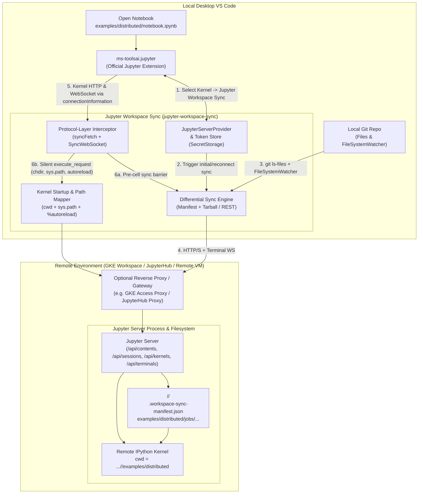
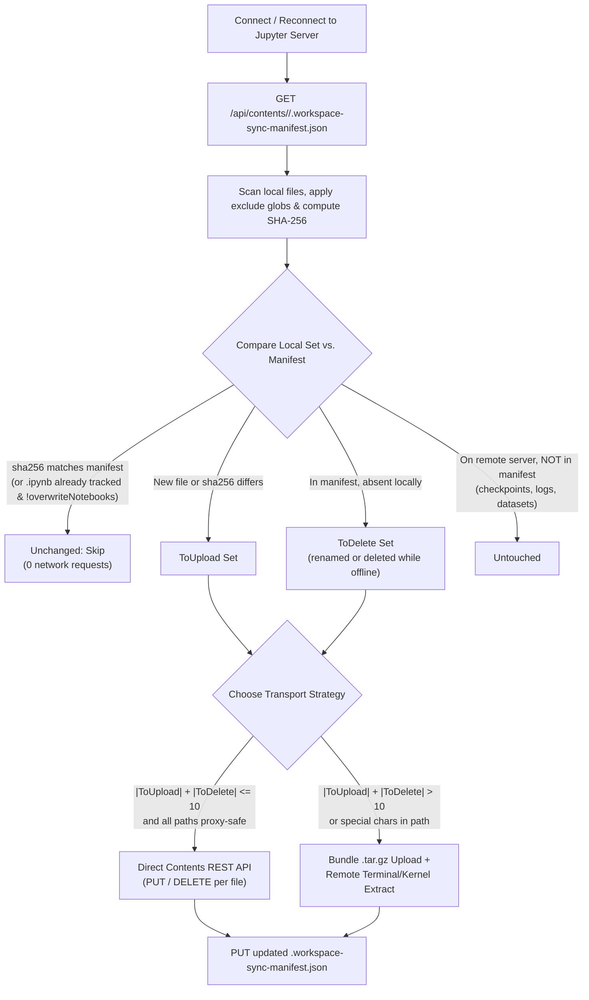
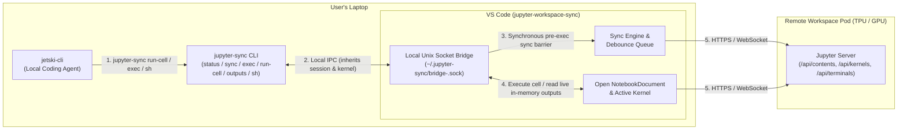

# Design: Jupyter Workspace Sync VS Code Extension (`jupyter-workspace-sync`)

Status: reviewed & implemented, 2026-10.

## 1. Context & Problem Statement

When developers use Desktop VS Code on their laptop and connect Microsoft's Jupyter extension (`ms-toolsai.jupyter`) to **any remote Jupyter Server**—whether a Kubeflow / GKE Workspace ([DESIGN.md](../providers/gke/DESIGN.md#how-the-desktop-vs-code-path-works)), JupyterHub, a remote GPU/TPU VM, or a port-forwarded container—four workflow gaps arise:

1. **Local library and config files are not on the remote machine**:
   `ms-toolsai.jupyter` only transmits notebook cell code (`execute_request`) over the kernel WebSocket (`/api/kernels/<id>/channels`). Local Python packages (e.g. `jobs/pipeline.py`), manifests (`inference-service.yaml`), and configuration files remain on the laptop, causing `ModuleNotFoundError` and `FileNotFoundError` on the remote kernel.
2. **Sidecar scripts require manual terminal management**:
   Running a script like [examples/upload_to_jupyter.py](../examples/upload_to_jupyter.py) `--watch` works around this, but requires users to paste the connection URL in two places (VS Code and a separate terminal), manually pass `--dir`, and keep a background process alive.
3. **Relative imports and relative file paths break when syncing a whole repo**:
   When `ms-toolsai.jupyter` starts a remote kernel for a local notebook (e.g. `<repo>/examples/distributed/distributed_tpu_example.ipynb`), `ms-toolsai.jupyter` strips the directory prefix when calling `POST /api/sessions` (`path: "distributed_tpu_example-jvsc-<uuid>.ipynb"`), so the remote kernel starts at the Jupyter Server's root directory (`JUPYTER_SERVER_ROOT`, e.g. `/home/jovyan`). Because the kernel's `os.getcwd()` and `sys.path[0]` point to the server root instead of `<server-root>/<repo>/examples/distributed`, relative imports (`from jobs import pipeline`) and relative file reads (`open("inference-service.yaml")`) fail unless every notebook includes custom directory-searching boilerplate.
4. **Reconnects and branch switches**:
   When a user reconnects (after laptop sleep, Wi-Fi changes, or replacing an expired token), wiping the remote directory would destroy remote-generated artifacts (checkpoints, downloaded datasets, logs) and disrupt running kernels, whereas naive overwrite-only uploads leave stale deleted/renamed `.py` modules behind and can trip proxy rate limits.

Because this extension relies exclusively on the **standard Jupyter Server REST and WebSocket APIs** (`/api/contents`, `/api/kernels`, `/api/sessions`, `/api/terminals`), it works universally across **any** remote Jupyter Server while including built-in support for Kubeflow / GKE Workspaces connection URLs and proxy policies.

---

## 2. Goals and Non-Goals

### Goals
- **Universal Remote Jupyter compatibility**: Work with any standard `jupyter_server` / JupyterLab / JupyterHub endpoint (`http(s)://<host>/<base-path>/?token=<token>`), as well as GKE / Kubeflow Workspaces desktop connections.
- **One-step connection & seamless window reload**: Integrate with the VS Code Jupyter kernel picker (`JupyterServerProvider`) using deterministic server handles so pasting a Jupyter Server URL once connects both the notebook kernel and the repository sync engine and survives `Developer: Reload Window`.
- **Automatic `.gitignore`-aware repo sync**: Automatically sync the local workspace repository to `<jupyter-root>/<repo-name>` on connect and keep it continuously updated on file save, create, rename, and delete.
- **Fast, safe reconnect (Manifest-based differential sync)**: Track synced files in `.workspace-sync-manifest.json` so reconnects only upload modified files and remove locally deleted tracked files, while leaving remote-generated artifacts and executed `.ipynb` outputs untouched.
- **Seamless relative imports & file paths**: Automatically configure the remote kernel's working directory (`os.chdir`) and `sys.path` to match the open notebook's subdirectory within the repo—without relying on restricted `ms-toolsai.jupyter` proposed APIs or triggering modal permission prompts.
- **Zero-restart module reloading**: Automatically enable IPython `%autoreload 2` on the remote kernel so saving a `.py` file locally in VS Code immediately updates the module on the next cell execution.
- **Zero backend/server changes required**: Operate entirely over standard Jupyter Server APIs, while respecting reverse-proxy constraints (such as the rate limits, `safePath`, and token validation in [connections_http.go](../providers/gke/internal/access/connections_http.go) and [proxy.go](../providers/gke/internal/access/proxy.go)).

### Non-Goals
- Replacing `ms-toolsai.jupyter`'s notebook editor or kernel execution UI.
- Two-way sync of large remote-generated binary artifacts (e.g. multi-GB model checkpoints) back to the laptop.
- Running the full VS Code Server inside the remote container (users who want a full remote IDE already have Remote-SSH or the `codeserver` WorkspaceKind).

---

## 3. Architecture Overview



---

## 4. Core Subsystems

### 4.1 Connection Management & `JupyterServerProvider`

The extension depends on `ms-toolsai.jupyter` and registers a `JupyterServerCollection` via `jupyterApi.createJupyterServerCollection`:

1. **Universal Jupyter URL Parsing**:
   When the user selects **Jupyter Workspace Sync** in the kernel picker (or runs `Jupyter Sync: Connect & Sync Workspace...`), they can paste any Jupyter URL:
   - Standard JupyterLab / Notebook URL: `http://localhost:8888/lab?token=<token>`
   - JupyterHub user server URL: `https://jupyter.example.com/user/alice/lab/tree/work?token=<token>`
   - GKE / Kubeflow Workspaces URL: `https://<desktop-host>/workspace/connect/<namespace>/<workspace>/jupyterlab/?token=<token>`

   Just like [parse_jupyter_url](../examples/upload_to_jupyter.py#L78-L98) in `upload_to_jupyter.py`, the parser strips UI suffixes (`/lab`, `/tree`, `/lab/tree/...`, `/notebooks/...`, `/workspaces/...`), extracts the clean `baseUrl` and `token`, and derives a human-readable display label (e.g. `<namespace>/<workspace>` for Kubeflow Workspaces, `jupyterhub:<user>` for JupyterHub, or `<host>` for generic servers).

2. **Deterministic Server Handles Across Window Reloads**:
   - `ms-toolsai.jupyter` caches `{ extensionId, id: collectionId, handle: server.id }` and queries `provideJupyterServers()` on startup to re-bind open notebooks to their remote kernels.
   - Each server's `id` is computed deterministically from `baseUrl` (`sha256(baseUrl).slice(0, 16)`), and non-sensitive server metadata (`id`, `baseUrl`, `label`, `remoteBaseDir`) is persisted in `context.globalState` / `context.workspaceState` so `provideJupyterServers()` immediately returns saved servers upon window reload.

3. **Credential Storage & Token Renewal**:
   - The `token` is stored in VS Code's encrypted `ExtensionContext.secrets` (`SecretStorage`), keyed by `server.id`. It is never written to `.vscode/settings.json` or plaintext logs.
   - If a token expires (such as the bounded 48-hour tokens in [providers/gke/DESIGN.md](../providers/gke/DESIGN.md#how-the-desktop-vs-code-path-works)) and a request returns `401 Unauthorized` or `403 Forbidden`, the status bar switches to `$(warning) Jupyter Sync: Token Expired` and prompts the user for a new URL/token.
   - Because `syncFetch` and `SyncWebSocket` dynamically read the latest token from `ConnectionManager` and rewrite both the `Authorization: token <token>` header and any `?token=` query parameter (which `@jupyterlab/services` appends when `appendToken: true`), updating the token in `SecretStorage` seamlessly resumes file syncing and kernel requests without triggering `desktopToken()` query-vs-header mismatch errors.

---

### 4.2 Differential Sync Engine & Reconnect Behavior

#### Remote Directory Layout
Instead of syncing files flat into the Jupyter Server root (which risks colliding with dotfiles or other projects), each local workspace folder is synced into a dedicated subdirectory named after the local workspace root (`<jupyter-root>/<repo-name>`):

```text
<jupyter-root>/                         # e.g. /home/jovyan, /workspace, or ~/
└── <repo-name>/                        # e.g. gke-workspaces/
    ├── .workspace-sync-manifest.json   # Managed by the extension
    ├── examples/
    │   └── distributed/
    │       ├── distributed_tpu_example.ipynb
    │       ├── inference-service.yaml
    │       └── jobs/
    │           ├── __init__.py
    │           └── pipeline.py
    └── ...
```

Because `/api/contents/<repo-name>/...` is always relative to the Jupyter Server's root directory, the sync engine does not need to hardcode `/home/jovyan`—it works identically regardless of the remote OS user or `--ServerApp.root_dir`.

#### File Discovery & Filtering
To determine which local files belong in the sync set:
1. **Git-tracked + untracked non-ignored files (Preferred)**:
   If the workspace is a Git repository, run:
   ```bash
   git ls-files --cached --others --exclude-standard -z
   ```
   This respects `.gitignore`, `.git/info/exclude`, and global gitignore rules in `< 50 ms`.
2. **Fallback directory walker (Non-Git folders)**:
   Walk the workspace excluding `.git`, `__pycache__`, `.ipynb_checkpoints`, `.pytest_cache`, `.mypy_cache`, `.venv`, `venv`, `node_modules`, and `.DS_Store`.
3. **User & Default Exclude Globs (`jupyterSync.exclude`)**:
   Applied to **both** Git-discovered files and non-Git files. By default excludes `[".git/**", "**/__pycache__/**", "**/.ipynb_checkpoints/**", "**/node_modules/**", "**/.venv/**", "**/dist/**", "**/out/**", "**/*.vsix", "**/*.mp4", "**/*.mov"]` so build outputs, packaged extensions, and large documentation screen recordings do not slow down workspace code sync.
4. **Max file size guard**:
   Skip individual local files larger than `jupyterSync.maxFileSizeMB` (default: `10 MB`) with a log entry so large local binary/media files do not stall sync or exceed proxy request body limits.
5. **Notebook (`.ipynb`) protection**:
   - On initial sync, `.ipynb` files are uploaded **only if they do not yet exist** on the remote server (seeded once).
   - Both the remote tarball extractor (`if member.endswith('.ipynb') and os.path.exists(dest): continue`) and the REST uploader check for existing remote `.ipynb` files when `jupyterSync.overwriteNotebooks = false`.
   - On reconnect and during continuous file watching, `.ipynb` files already present in `.workspace-sync-manifest.json` are skipped when `jupyterSync.overwriteNotebooks = false` so running remote notebooks never have their outputs or checkpoints overwritten.

#### Manifest-Based Reconnect (`.workspace-sync-manifest.json`)
On every initial connect or reconnect, the extension performs a **3-way differential sync** rather than wiping the remote directory:

```json
{
  "version": 1,
  "repoName": "gke-workspaces",
  "updatedAt": "2026-10-06T18:30:00Z",
  "files": {
    "examples/distributed/jobs/pipeline.py": {
      "sha256": "e3b0c44298fc1c149afbf4c8996fb92427ae41e4649b934ca495991b7852b855",
      "size": 14205
    }
  }
}
```



Why this matters on reconnect:
- **Zero-cost no-op reconnects**: If no local files changed while disconnected, reconnect makes **1 `GET` request** and transfers 0 files.
- **No ghost modules**: If a user renamed `jobs/old.py` → `jobs/new.py` while offline, `jobs/old.py` is present in the previous manifest but absent locally, so it is deleted from the remote server.
- **Remote artifacts are safe**: Any file created by the remote kernel (`model.npz`, logs, downloaded datasets) is not in `.workspace-sync-manifest.json` and is never deleted.

#### Hybrid Transport Strategy (Proxy-Friendly Bulk + Delta Sync)
Many production Jupyter proxies enforce request rate limits and strict URL path validation. For example, GKE Workspaces' [connections_http.go](../providers/gke/internal/access/connections_http.go) enforces `rate.NewLimiter(50, 100)` (50 req/s, burst 100), and [proxy.go](../providers/gke/internal/access/proxy.go#L184-L195) (`safePath`) rejects any URL path containing `%`, `\`, `//`, `.` or `..`. Even without a proxy, uploading 200 files one-by-one over HTTP takes hundreds of sequential round-trips.

Therefore, the Sync Engine uses a **Hybrid Transport**:

- **Bulk / Chunked Tarball Path** (used when syncing `> 10` files, on first sync, on branch switch, or when any file path contains spaces/special characters):
  1. Partitions `ToUpload` files into **batches of at most `5 MB` uncompressed (or `100` files)** per batch. Splitting large repositories into ~5 MB batches avoids reverse-proxy/Tornado request body limits (`max_body_size`), enables smooth percentage progress updates, and allows mid-sync cancellation without losing completed batches.
  2. For each batch `k / N`:
     - Packs the batch into an in-memory gzipped tarball (`_jupyter_sync_batch.tar.gz`) in Node.js.
     - Uploads `_jupyter_sync_batch.tar.gz` via `PUT /api/contents/<repo>/_jupyter_sync_batch.tar.gz` (format: `base64`).
     - Extracts the batch (skipping existing `.ipynb` files when `overwriteNotebooks = false`), applies `ToDelete` removals on the final batch, removes `_jupyter_sync_batch.tar.gz`, and writes the updated `.workspace-sync-manifest.json` using a **3-tier remote execution strategy**:
       1. **Primary — Transient Jupyter Terminal WebSocket (`/api/terminals`)**: Opens a temporary terminal (`POST /api/terminals`), runs a compact Python extraction one-liner framed by deterministic start/exit sentinels (`__JSYNC_START_<id>__` / `__JSYNC_EXIT_<id>__:<code>__`) over `/terminals/websocket/<name>`, and deletes the terminal (`DELETE /api/terminals/<name>`). Because terminals run as an independent OS process, extraction works before any notebook kernel is started and never blocks if a TPU/GPU kernel is busy training.
       2. **Secondary — Idle Remote Kernel (`/api/kernels/<id>/channels`)**: If `/api/terminals` is disabled on the server, executes the Python extraction snippet silently (`silent: true, store_history: false`) on an idle running kernel (or temporary kernel).
       3. **Tertiary — Direct REST Fallback (`/api/contents`)**: If neither terminals nor kernels can be used for extraction, automatically falls back to rate-limited `PUT /api/contents` requests with per-file progress updates.
  3. Because `.workspace-sync-manifest.json` is updated incrementally after each batch, cancelling or losing network mid-way through a large initial sync preserves all completed batches—reconnecting resumes from the remaining files.

- **Single-File REST Path** (used during live editing when `≤ 10` proxy-safe ASCII files change):
  - Issues `PUT /api/contents/<repo>/<rel_path>` (and `PUT` for any uncreated parent directory cached in memory) or `DELETE /api/contents/<repo>/<rel_path>`.
  - Requests pass through a client-side token-bucket limiter (max concurrency `4`, max `20 req/s`) with exponential backoff on `429`.

---

### 4.3 Real-Time File Watcher, Debouncing & Pre-Cell-Execution Barrier

During active development, the extension registers a `vscode.FileSystemWatcher` on the workspace folder:

- **Events handled**:
  - `vscode.workspace.onDidSaveTextDocument` (immediate priority push for saved `.py` / `.yaml` files)
  - `watcher.onDidCreate`, `watcher.onDidChange`, `watcher.onDidDelete`
  - `vscode.workspace.onDidRenameFiles`
- **Coalescing & Debounce Window (`150 ms`)**:
  File events are queued in a `150 ms` sliding window:
  - Saving a single file triggers a single REST `PUT` after 150 ms.
  - Running `git checkout`, `git pull`, or `git rebase` (which fires dozens of file events simultaneously) automatically crosses the `> 10` file threshold in the debounce queue and switches to a **Chunked Tarball Sync** automatically.
- **Deterministic Pre-Cell-Execution Barrier (via `SyncWebSocket`)**:
  Because `JupyterServer.connectionInformation.WebSocket` routes all kernel WebSocket messages through our `SyncWebSocket` subclass, whenever `ms-toolsai.jupyter` sends an outbound `execute_request` (`silent: false`), `SyncWebSocket` **flushes any pending debounced file events and awaits any active sync promise before writing the `execute_request` frame to the socket**. Even if a user saves a `.py` file and presses `Shift+Enter` 1 ms later, the updated file is guaranteed to be on the remote server before the cell executes.

---

### 4.4 Working Directory (`cwd`), Relative Imports (`sys.path`), and `%autoreload`

#### Why Not `jupyterApi.kernels.onDidStart`?
In `ms-toolsai.jupyter` (`@vscode/jupyter-extension`), `jupyterApi.kernels.onDidStart` is a restricted Proposed API that throws `Error: Proposed API is not supported for extension <id>` for any extension outside Microsoft's hardcoded publisher allowlist (`ms-toolsai.jupyter`, `ms-toolsai.datawrangler`, `donjayamanne`). Furthermore, `jupyterApi.kernels.getKernel(uri)` returns `undefined` until *after* the user has already started a cell and triggers a modal permission dialog (`"Do you want to grant Kernel access to the extension...?"`).

#### Protocol-Layer Kernel Initialization (`syncFetch` + `SyncWebSocket`)
Instead of relying on restricted proposed APIs, `jupyter-workspace-sync` operates transparently at the `JupyterServer.connectionInformation` transport layer (`syncFetch` and `SyncWebSocket`):

1. **Session Path Mapping & Restart Tracking (`syncFetch`)**:
   - Note that `@jupyterlab/services` invokes `connectionInformation.fetch(request)` with a `node-fetch` `Request` object (`request.url`, `request.method`, `request.headers`, `request.text()`). `syncFetch` normalizes this request, sets `Authorization: token <token>` and `Origin`, and normalizes paths so `//` never appears.
   - When `ms-toolsai.jupyter` creates or updates a notebook session via `POST /api/sessions` or `PATCH /api/sessions/<id>`, `syncFetch` matches the notebook name against open workspace notebooks (`vscode.workspace.notebookDocuments`), rewrites the session `path` to `<repo-name>/<rel-notebook-dir>/<session-name>`, and records the mapping `kernelId -> notebookUri`.
   - When `ms-toolsai.jupyter` calls `POST /api/kernels/<id>/restart`, `syncFetch` clears the initialization state for `<id>` so the kernel is automatically re-initialized before the next cell runs.

2. **Silent Pre-Execution Setup on the Kernel Socket (`SyncWebSocket`)**:
   - Notice that `ms-toolsai.jupyter`'s `wrapWebSocketCtor` subclasses `connectionInformation.WebSocket` without passing the 3rd `options` argument when `@jupyterlab/services` calls `new WebSocket(url, protocols)`. `SyncWebSocket` therefore injects `{ headers: { Authorization: "token <token>", Origin: "<origin>" } }` directly in its constructor and updates any `?token=` query parameter on the WebSocket URL.
   - `SyncWebSocket` decodes outbound frames in both the `v1.kernel.websocket.jupyter.org` binary wire protocol and the default JSON wire protocol.
   - When `ms-toolsai.jupyter` sends a user cell `execute_request` (`channel === "shell"`, `header.msg_type === "execute_request"`, `content.silent === false`) on `/api/kernels/<kernelId>/channels`:
     1. `SyncWebSocket` awaits `syncEngine.flushAndWait()` (the Pre-Cell-Execution Sync Barrier).
     2. `SyncWebSocket` resolves the target notebook's `relRepoRoot` (e.g. `"gke-workspaces"`) and `relNotebookDir` (e.g. `"gke-workspaces/examples/distributed"`).
     3. If `<kernelId>` has not yet been initialized for `relNotebookDir` (or was restarted), `SyncWebSocket` injects a silent `execute_request` (`msg_id: "sync-init-<uuid>"`, `silent: true`, `store_history: false`, `allow_stdin: false`) over the socket using the active wire protocol (`this.protocol`), filters out all incoming messages whose `parent_header.msg_id === "sync-init-<uuid>"` in `emit("message")` (so `@jupyterlab/services` never sees unexpected replies), awaits the `execute_reply` for `"sync-init-<uuid>"`, and then forwards the user's cell `execute_request`.

#### Idempotent Python Kernel Initialization Snippet
The silent setup snippet resolves `<jupyter-root>` reliably (even if `JUPYTER_SERVER_ROOT` is unset or `os.getcwd()` was already changed by session startup), cleans up any previous notebook directory on `sys.path` if the kernel switched notebooks, configures `os.chdir` and `sys.path`, and enables `%autoreload 2`:

```python
import os, sys

# 1. Reliably discover the Jupyter Server root directory once per kernel process
if not hasattr(sys, "_jupyter_sync_server_root"):
    _rel_repo = "gke-workspaces"
    _rel_nb = "gke-workspaces/examples/distributed"
    _cwd = os.getcwd().replace("\\", "/")
    _candidates = []
    if os.environ.get("JUPYTER_SERVER_ROOT"):
        _candidates.append(os.environ["JUPYTER_SERVER_ROOT"])
    for _suffix in ("/" + _rel_nb, "/" + _rel_repo):
        if _cwd.endswith(_suffix):
            _candidates.append(_cwd[: -len(_suffix)] or "/")
    _candidates.extend([os.getcwd(), os.path.expanduser("~")])
    sys._jupyter_sync_server_root = _candidates[0]
    for _c in _candidates:
        if _c and os.path.exists(os.path.join(_c, _rel_repo, ".workspace-sync-manifest.json")):
            sys._jupyter_sync_server_root = os.path.abspath(_c)
            break
    for _c in _candidates:
        if _c and os.path.isdir(os.path.join(_c, _rel_repo)):
            sys._jupyter_sync_server_root = os.path.abspath(_c)
            break

_sync_repo_root = os.path.abspath(
    os.path.join(sys._jupyter_sync_server_root, "gke-workspaces")
)
_sync_notebook_dir = os.path.abspath(
    os.path.join(sys._jupyter_sync_server_root, "gke-workspaces/examples/distributed")
)

# 2. Ensure target directory exists and chdir into the notebook's folder
os.makedirs(_sync_notebook_dir, exist_ok=True)
if os.getcwd() != _sync_notebook_dir:
    os.chdir(_sync_notebook_dir)

# 3. Remove previous synced notebook dir if kernel switched notebooks, then set sys.path[0]
_prev_nb_dir = getattr(sys, "_jupyter_sync_prev_notebook_dir", None)
if _prev_nb_dir and _prev_nb_dir != _sync_notebook_dir and _prev_nb_dir in sys.path:
    sys.path.remove(_prev_nb_dir)
sys._jupyter_sync_prev_notebook_dir = _sync_notebook_dir

if _sync_notebook_dir in sys.path:
    sys.path.remove(_sync_notebook_dir)
sys.path.insert(0, _sync_notebook_dir)

# 4. Put repo root at sys.path[1] (for repo-wide imports like `from examples.distributed.jobs import pipeline`)
if _sync_repo_root != _sync_notebook_dir:
    if _sync_repo_root in sys.path:
        sys.path.remove(_sync_repo_root)
    sys.path.insert(1, _sync_repo_root)

# 5. Enable IPython %autoreload 2 so local edits to .py files reload automatically on save
try:
    _ip = get_ipython()
    if _ip is not None:
        _ip.run_line_magic("load_ext", "autoreload")
        _ip.run_line_magic("autoreload", "2")
except Exception:
    pass
```

#### How Common Notebook Patterns Resolve

| Notebook Code | Resolution Mechanism |
| :--- | :--- |
| `from jobs import pipeline` | Resolved via `sys.path[0]` (`<jupyter-root>/gke-workspaces/examples/distributed/jobs/pipeline.py`). |
| `open("inference-service.yaml")` | Resolved via `os.getcwd()` (`<jupyter-root>/gke-workspaces/examples/distributed/inference-service.yaml`). |
| `!kubectl apply -f inference-service.yaml` | Shell subprocess inherits the kernel's `cwd`. |
| `from shared.utils import helper` | Resolved via `sys.path[1]` (`<jupyter-root>/gke-workspaces/shared/utils.py`). |
| Editing `jobs/pipeline.py` locally & re-running cell | File watcher (or pre-cell barrier) pushes `jobs/pipeline.py`, updating remote `mtime`; `%autoreload 2` reloads `jobs.pipeline` automatically before the cell runs. |

---

### 4.5 Local Coding Agent (`jetski-cli`) Integration & CLI Bridge

When a local CLI coding agent (such as `jetski-cli`, Gemini CLI, or Claude Code) operates alongside VS Code, file edits made on disk by the agent are automatically picked up by `vscode.workspace.createFileSystemWatcher`. However, an autonomous edit-run-debug loop against a remote Jupyter/TPU kernel faces **five gaps** if the extension only exposes a GUI:

| # | Agent Workflow Gap | Root Cause |
| :--- | :--- | :--- |
| **1. Remote kernel execution** | `jetski-cli` can edit `.py` and `.ipynb` files locally, but its bash tool runs on the **laptop CPU** (no TPU/GPU, no cluster ServiceAccount, no `$GCS_BUCKET`). It cannot natively trigger a cell run on the remote kernel. | `ms-toolsai.jupyter` only exposes kernel execution inside VS Code's internal extension host. |
| **2. Sync-before-execute race condition** | An agent edits `tpu_trainer.py` and invokes a test command **within 5 ms**—before the `150 ms` file-watcher debounce window has finished uploading the change to the remote pod. | Background file-watching is asynchronous and decoupled from CLI command invocation. |
| **3. Reading live notebook outputs & tracebacks** | When a cell executes in VS Code, its outputs and tracebacks stay in VS Code's **in-memory `NotebookDocument`** until the user presses `Cmd+S`. Reading the `.ipynb` file from disk shows stale or empty outputs. | VS Code buffers notebook execution state in memory. |
| **4. Remote shell execution without `kubectl`** | The agent needs to run remote commands (`python3 tpu_lock.py --status`, `pip install --user <pkg>`, `torchrun --nproc_per_node=4 ...`), but the laptop may only have the Jupyter connection URL, not `kubectl exec`. | The connection URL only speaks Jupyter HTTP/WebSocket APIs. |
| **5. Credential & session discovery** | The connection URL and token live in VS Code's encrypted `SecretStorage`, so a CLI agent in an external terminal does not know the active `baseUrl`, `token`, or attached `kernel_id`. | `SecretStorage` and kernel handles live inside the VS Code process. |

#### Architecture: Shared Core + Local IPC Bridge + `jupyter-sync` CLI

To close all five gaps, the extension separates its VS-Code-agnostic logic into `src/core/` and exposes a **Local Unix Domain Socket Bridge** (`~/.jupyter-sync/bridge-<workspace-hash>.sock`, `chmod 0600`) paired with a companion CLI (`jupyter-sync`) that is automatically linked into `~/.local/bin/jupyter-sync` on extension activation:



#### Companion CLI Subcommands (`jupyter-sync`)

1. **Zero-Config Session Discovery (`~/.jupyter-sync/bridge-<hash>.sock`) — Closes Gap 5**:
   - When `jetski-cli` runs `jupyter-sync` inside the workspace directory (or **any nested subdirectory** such as `examples/torch_tpu/`), the CLI walks up parent directories from `process.cwd()` (and checks `~/.jupyter-sync/sessions.json`) to locate the active workspace root's `0600` Unix socket, reusing its authenticated session and active kernel mappings without exposing tokens in plaintext config files or prompting the user a second time.
   - **Auto-PATH Setup**: On activation, the extension writes an executable wrapper to `~/.local/bin/jupyter-sync` (`chmod 0755`) and prepends `~/.local/bin` to VS Code's terminal `PATH` via `context.environmentVariableCollection`.
   - **Headless fallback**: If VS Code is not running, `jupyter-sync` reads `JUPYTER_URL` (or `--url`) and executes standalone using `src/core/`.

2. **Synchronous Pre-Execution Sync Barrier — Closes Gap 2**:
   - Every `jupyter-sync` execution command (`exec`, `run-cell`, `sh`, `sync`) **first flushes any pending file events in the Sync Engine and awaits completion** before dispatching code to the remote kernel.
   - If `jetski-cli` edits `jobs/train.py` and runs `jupyter-sync exec ...` 1 ms later, the modified file is guaranteed to be on the remote pod and reloaded via `%autoreload 2` before execution begins.

3. **`jupyter-sync exec "<python>" [--notebook <path>] [--cwd <rel-dir>]` — Closes Gap 1**:
   - Runs a Python snippet on the remote kernel attached to `<notebook>` (or an active/background kernel pre-initialized with the target `cwd` and `sys.path`), streams `stdout`, `stderr`, display data, and rich tracebacks back to `jetski-cli`, and exits with code `1` on uncaught Python exceptions.

4. **`jupyter-sync run-cell <notebook.ipynb> <cell-index>` — Closes Gap 1 & Gap 3**:
   - Flushes pending file syncs, executes the target cell on the remote kernel (via VS Code's `NotebookDocument` when attached to a controller in VS Code so the user sees the cell run live and the status bar shows `$(hubot) Jupyter Sync: Agent running cell <n>...`, or directly against the remote kernel when headless/unattached), streams the cell output/traceback to `jetski-cli`'s stdout, and optionally persists updated outputs to the local `.ipynb` file.

5. **`jupyter-sync outputs <notebook.ipynb> [--cell <index>]` — Closes Gap 3**:
   - Queries VS Code's live in-memory `NotebookDocument` over the IPC bridge (falling back to parsing the `.ipynb` file on disk in headless mode), returning the latest `stdout`, `stderr`, results, and error tracebacks from cells—even if the user hasn't pressed `Cmd+S`.

6. **`jupyter-sync sh "<shell-command>" [--cwd <rel-dir>]` — Closes Gap 4**:
   - Flushes pending file syncs and runs `<shell-command>` on the remote pod inside `<jupyter-root>/<repo>/<rel-dir>` (e.g. `jupyter-sync sh "python3 tpu_lock.py --status"`, `jupyter-sync sh "pip install --user einops"`, or `jupyter-sync sh "torchrun --nproc_per_node=4 tpu_trainer.py"`) via the transient Jupyter Terminal WebSocket (with kernel `subprocess` fallback), streaming output and returning the exact remote exit code without needing `kubectl`.

---

## 5. Proxy & Security Considerations

| Area | Design Choice |
| :--- | :--- |
| **Authentication header & query synchronization** | All HTTP and WebSocket requests send `Authorization: token <token>` (using `.set` so duplicate `Authorization` headers are never added) and synchronize any `?token=` query parameter with the latest token so `desktopToken()` in [connections_http.go](../providers/gke/internal/access/connections_http.go#L125-L146) never sees a header-vs-query mismatch after token renewal. |
| **Origin header** | Reverse proxies (including GKE's `desktopHandler` and `Proxy.ServeHTTP`) reject requests where `Origin` is non-empty and does not match the server origin. Requests from `JupyterClient`, `syncFetch`, and `SyncWebSocket` set `Origin` to match `<scheme>://<host>` of the target `baseUrl`. |
| **Path normalization (`safePath`)** | GKE's `safePath()` in [proxy.go](../providers/gke/internal/access/proxy.go#L184-L195) rejects any path containing `//`, `\`, `%`, `.` or `..`. `JupyterClient` normalizes all `/api/contents/...` paths to eliminate duplicate slashes and automatically routes any file path containing spaces or special characters through the Tarball transport. |
| **XSRF tokens** | Upon initializing a session (`GET /api/contents`), if the server returns an `_xsrf` cookie (standard when connecting directly to `jupyter_server`), the client echoes `Cookie: _xsrf=...` and `X-XSRFToken: ...` on subsequent `PUT`/`DELETE`/`POST`/`PATCH` requests. |
| **Credential storage** | Connection tokens are stored exclusively in VS Code's OS-keychain-backed `SecretStorage` (`context.secrets`), never in workspace settings or logs. |
| **Local IPC socket permissions** | The local agent bridge socket (`~/.jupyter-sync/bridge-<hash>.sock`) and session registry (`~/.jupyter-sync/sessions.json`) are created inside a `0700` directory with `0600` permissions (owner-only) and never expose raw connection tokens over IPC responses. |
| **Tarball extraction safety** | Remote extraction validates every member path with `os.path.abspath` containment inside `<jupyter-root>/<repo-name>` (and uses `filter="data"` on Python 3.12+) to block `..` traversal and unsafe symlink extraction. |

---

## 6. User Experience (UX), Progress Reporting, Commands & Settings

### 6.1 Progress Visibility During Initial & Bulk Syncs

Because an initial sync (or a major branch checkout) may transfer hundreds of files or several megabytes over the network, the extension surfaces progress across **four coordinated VS Code UI elements**:

#### 1. Cancellable Notification Toast (`vscode.ProgressLocation.Notification`)
During initial sync, reconnect sync (when `> 5` files changed), or manual `Sync Repository Now`, the extension displays a bottom-right **Progress Notification** with a determinate percentage bar (`0% → 100%`) and a **Cancel** button:
- **Phase 1 (Scan)**: `Scanning local repository... (342 files, 7.4 MB)`
- **Phase 2 (Diff)**: `Checking remote manifest on jupyter-tpu-v4fi...`
- **Phase 3 (Transfer & Extract)**: `Batch 2/2 — 65% (220/342 files, 4.8 / 7.4 MB) — examples/torch_tpu/...`
- **Completion Summary**: `✓ Synced 342 files (7.4 MB) to jupyter-tpu-v4fi in 1.8s` with a `Show Logs` action button.
- **Cancellation & Resumability**: Clicking **Cancel** aborts the active transfer immediately; because the remote `.workspace-sync-manifest.json` is updated after each `5 MB` batch, running `Sync Repository Now` later resumes from the remaining unsynced batches.

#### 2. Persistent Status Bar Indicator (`vscode.StatusBarItem`)
Even if the user dismisses the toast notification (or during single-file saves where pop-up toasts are suppressed to avoid noise), the right-hand status bar item always reflects live progress:
- `$(cloud) Jupyter Sync: Off` — Click to connect to a remote Jupyter Server.
- `$(sync~spin) Jupyter Sync: 65% (220/342)` — Live percentage and file counter during bulk sync; clicking opens the streaming Output channel.
- `$(sync~spin) Jupyter Sync: pipeline.py` — Brief indicator during single-file save sync.
- `$(hubot) Jupyter Sync: Agent running...` — Shown when a local coding agent (`jetski-cli`) executes code or a cell via the local IPC bridge.
- `$(check) Jupyter Sync: <workspace>` — Idle/synced state. Hovering shows a rich Markdown tooltip with:
  - Server URL and remote folder (`<jupyter-root>/gke-workspaces`)
  - Last sync summary (`342 files synced at 4.1 MB/s`)
  - Clickable quick actions: `[Sync Now](command:jupyterSync.syncNow)` · `[Show Logs](command:jupyterSync.showLogs)` · `[Update Token](command:jupyterSync.updateToken)` · `[Disconnect](command:jupyterSync.disconnect)`
- `$(warning) Jupyter Sync: Token Expired` — Click to paste a replacement connection URL/token and resume.

#### 3. Real-Time Streaming Output Channel (`vscode.OutputChannel`)
Clicking the status bar during sync (or running `Jupyter Sync: Show Sync Output Logs`) opens the **`Jupyter Workspace Sync`** Output panel, streaming timestamped progress per batch/file:
```text
[13:48:01] Connecting to https://connect.35.201.99.43.sslip.io/workspace/connect/kubeflow-user/jupyter-tpu-v4fi/jupyterlab
[13:48:01] Scanned 342 local files (7.4 MB) in 'gke-workspaces'
[13:48:02] Remote manifest not found — starting initial sync (342 files across 2 batches)
[13:48:03] ✓ Batch 1/2 uploaded & extracted (100 files, 3.8 MB) [0.9s]
[13:48:04] ✓ Batch 2/2 uploaded & extracted (242 files, 3.6 MB) [0.9s]
[13:48:04] ✓ Initial sync complete: 342 files (7.4 MB) in 1.8s
[13:48:06] ✓ Kernel f1d7fbe3 initialized: cwd=/home/jovyan/gke-workspaces/examples/torch_tpu (%autoreload 2 enabled)
```

#### 4. Pre-Cell-Execution Wait Banner
If the user opens a notebook and immediately executes a cell (`Shift+Enter`) while the initial sync is still in flight, `SyncWebSocket` awaits the sync promise and updates the status bar (`$(sync~spin) Jupyter Sync: Waiting for sync before cell execution...`) so the first cell never fails with a premature `ModuleNotFoundError`.

---

### 6.2 Command Palette Commands (`package.json`)
| Command ID | Title | Description |
| :--- | :--- | :--- |
| `jupyterSync.connect` | `Jupyter Sync: Connect & Sync Workspace...` | Prompts for a remote Jupyter URL (with token), stores credentials, runs differential repo sync, and registers the server in the Jupyter kernel picker. |
| `jupyterSync.syncNow` | `Jupyter Sync: Sync Repository Now` | Forces an immediate differential sync of the workspace with progress notification. |
| `jupyterSync.cancelSync` | `Jupyter Sync: Cancel Active Sync` | Cancels an in-progress initial or bulk sync after the current batch. |
| `jupyterSync.fullResync` | `Jupyter Sync: Clean & Full Re-sync Remote Repository` | Removes all previously manifest-tracked files on the remote server and re-uploads the full repo from scratch. |
| `jupyterSync.updateToken` | `Jupyter Sync: Update Connection Token...` | Replaces an expired connection token without resetting the workspace binding. |
| `jupyterSync.disconnect` | `Jupyter Sync: Disconnect Remote Server` | Stops file watching and clears the active session. |
| `jupyterSync.showLogs` | `Jupyter Sync: Show Sync Output Logs` | Opens the dedicated `Jupyter Workspace Sync` Output channel in VS Code. |
| `jupyterSync.installCli` | `Jupyter Sync: Install 'jupyter-sync' CLI to PATH` | Installs/updates the `jupyter-sync` companion CLI symlink in `~/.local/bin/jupyter-sync`. |

### 6.3 Extension Settings
| Setting | Type | Default | Description |
| :--- | :--- | :--- | :--- |
| `jupyterSync.autoSyncOnSave` | `boolean` | `true` | Automatically sync modified/created/deleted files to the remote Jupyter server. |
| `jupyterSync.enableAutoreload` | `boolean` | `true` | Automatically configure `%autoreload 2` on remote Jupyter kernels. |
| `jupyterSync.setKernelWorkingDirectory` | `boolean` | `true` | Automatically set the remote kernel's `cwd` and `sys.path` to match the open notebook's directory. |
| `jupyterSync.enableAgentBridge` | `boolean` | `true` | Enable the local Unix socket IPC bridge (`~/.jupyter-sync/`) so CLI coding agents (`jetski-cli`) can flush syncs, inspect live cell outputs, and execute code on the remote kernel. |
| `jupyterSync.autoSaveOutputs` | `boolean` | `true` | Automatically persist updated cell outputs to the local `.ipynb` file after remote cell execution so local CLI tools and agents see fresh outputs and tracebacks. |
| `jupyterSync.overwriteNotebooks` | `boolean` | `false` | When `false`, `.ipynb` files are seeded only if missing on the remote server and ignored during continuous watch. |
| `jupyterSync.remoteBaseDir` | `string` | `"${workspaceFolderBasename}"` | Target subdirectory under the Jupyter Server root (set to `""` to sync directly into the server root). |
| `jupyterSync.exclude` | `string[]` | `[".git/**", "**/__pycache__/**", "**/.ipynb_checkpoints/**", "**/node_modules/**", "**/.venv/**", "**/dist/**", "**/out/**", "**/*.vsix", "**/*.mp4", "**/*.mov"]` | Glob patterns to exclude from synchronization (applied to both Git and non-Git workspaces). |
| `jupyterSync.maxFileSizeMB` | `number` | `10` | Maximum individual file size (in MB) to include in automatic sync. |

---

## 7. Directory Structure (`vscode-extension/`)

```text
vscode-extension/
├── DESIGN.md                     # This design document
├── README.md                     # User guide: installation, usage & CLI reference
├── package.json                  # Extension manifest, commands, settings, bin ("jupyter-sync")
├── tsconfig.json                 # TypeScript configuration
└── src/
    ├── extension.ts              # VS Code activate() / deactivate(), commands, status bar
    ├── connection.ts             # SecretStorage token manager, JupyterServerProvider, syncFetch & SyncWebSocket
    ├── fileWatcher.ts            # Debounced VS Code FileSystemWatcher & save hooks
    ├── kernelInitializer.ts      # Kernel setup snippet builder & protocol-layer WebSocket initializer
    ├── agentBridge.ts            # Local Unix socket IPC server for jetski-cli / CLI agents
    ├── cli.ts                    # Companion `jupyter-sync` CLI entrypoint (IPC client + headless mode)
    ├── core/                     # VS-Code-agnostic core library (shared by Extension, CLI & Tests)
    │   ├── urlParser.ts          # Universal Jupyter / JupyterHub / GKE Workspaces URL parser
    │   ├── jupyterClient.ts      # Jupyter Contents REST, Kernel WebSocket & Terminal WebSocket client
    │   └── syncEngine.ts         # Git file scanner, glob matcher, SHA-256 manifest diff, Tarball/REST sync
    └── test/
        ├── unit/                 # Offline unit tests (URL parser, manifest diff, batching, kernel init)
        └── liveTpuIntegration.ts # Automated end-to-end test suite against JUPYTER_TEST_URL
```

---

## 8. Testing Plan (With Live Remote TPU Workspace)

The extension is validated across three tiers so that core sync, path-mapping, kernel-initialization, and agent CLI bridge logic can be verified both **automatically from the CLI** (using a supplied `JUPYTER_TEST_URL` pointing to a remote TPU workspace) and **interactively inside VS Code**.

### 8.1 Tier 1: Fast Offline Unit Tests (`npm test`)
Runs in `< 2s` with no network required:
- **URL Parsing (`urlParser.test.ts`)**: Verifies extraction of `baseUrl`, `token`, deterministic `id`, and display labels from GKE Workspaces URLs (`/workspace/connect/<ns>/<ws>/jupyterlab/?token=...`), JupyterHub URLs (`/user/<name>/lab/tree/...`), and localhost URLs.
- **3-Way Manifest Diff (`syncEngine.test.ts`)**: Verifies `ToUpload`, `ToDelete`, and `Unchanged` sets given mock local file trees and remote `.workspace-sync-manifest.json` snapshots, ensuring untracked remote files are never added to `ToDelete` and tracked `.ipynb` files are protected when `overwriteNotebooks = false`.
- **Chunked Batch Partitioning (`syncEngine.test.ts`)**: Verifies splitting large file sets into `≤ 5 MB` / `≤ 100`-file tarball batches and applying `exclude` globs.
- **Kernel Setup Snippet & Wire Protocol Framing (`kernelInitializer.test.ts`)**: Verifies `relRepoRoot` and `relNotebookDir` path resolution across nested directories (`examples/torch_tpu/torch_tpu_training.ipynb` and `examples/distributed/distributed_tpu_example.ipynb`) as well as `v1.kernel.websocket.jupyter.org` binary and JSON message decoding/encoding.

---

### 8.2 Tier 2: Automated Live Integration Suite Against Remote TPU Workspace (`npm run test:live`)

When supplied with a live TPU workspace connection URL:
```bash
export JUPYTER_TEST_URL="https://<desktop-host>/workspace/connect/<namespace>/<tpu-workspace>/jupyterlab/?token=<token>"
npm run test:live
```
`src/test/liveTpuIntegration.ts` executes an end-to-end automated test suite directly against the remote TPU workspace without needing manual clicks:

| Test Case | What It Executes Against the Remote TPU Workspace | Pass Criteria |
| :--- | :--- | :--- |
| **TC-1: Proxy Auth, XSRF & Rate-Limit Handshake** | Connects to `JUPYTER_TEST_URL` using `Authorization: token <token>`, queries `GET /api/contents` and `GET /api/kernelspecs`. | Returns `200 OK`; verifies compatibility with GKE `desktopHandler` ([connections_http.go](../providers/gke/internal/access/connections_http.go)) and captures any `_xsrf` cookie. |
| **TC-2: Initial Whole-Repo Chunked Sync & Progress** | Runs initial sync of the local `gke-workspaces` repository to `<jupyter-root>/gke-workspaces-test`. Records all progress events (`phase`, `percent`, `batch`, `filesCompleted`). | Progress callbacks fire monotonically from `0% → 100%`; remote `.workspace-sync-manifest.json` exists; `examples/torch_tpu/tpu_lock.py`, `examples/torch_tpu/tpu_trainer.py`, `examples/torch_tpu/src/`, and `examples/distributed/jobs/pipeline.py` are verified on the remote pod; `.git/` and excluded media files are omitted. |
| **TC-3: Reconnect Differential Sync & Remote Artifact Preservation** | 1. Creates an untracked file on the remote TPU pod (`examples/torch_tpu/_mock_tpu_checkpoint.pt`) simulating a saved model checkpoint.<br/>2. Runs reconnect sync with no local changes.<br/>3. Modifies a local `.py` file, adds `temp_helper.py`, syncs, then deletes `temp_helper.py` locally and syncs again. | 1. Reconnect with no local changes uploads `0` files.<br/>2. Modified file updates on remote; deleted `temp_helper.py` is removed from remote.<br/>3. Untracked `_mock_tpu_checkpoint.pt` remains **untouched** throughout all reconnects. |
| **TC-4: Cancelled Sync & Resumability** | Starts a multi-batch full sync and triggers `AbortController.abort()` immediately after Batch 1 completes, then runs a normal reconnect sync. | Batch 1 files are already recorded in `.workspace-sync-manifest.json`; the follow-up reconnect sync skips Batch 1 files and only uploads remaining batches (`2..N`). |
| **TC-5: Nested Notebook `cwd`, `sys.path` & Relative Imports on TPU Kernel** | Spawns/attaches to a remote `python3` kernel over `/api/kernels/<id>/channels`, runs `KernelInitializer` for `examples/torch_tpu/torch_tpu_training.ipynb`, and executes a test cell on the remote kernel. | Kernel confirms:<br/>- `os.getcwd()` ends with `/gke-workspaces-test/examples/torch_tpu`<br/>- Sibling imports (`import tpu_lock`, `import tpu_trainer`, `from src import ...`) succeed<br/>- Relative file reads (`open("../distributed/inference-service.yaml")`) succeed<br/>- Repo-root imports (`from examples.distributed.jobs import pipeline`) succeed via `sys.path[1]`. |
| **TC-6: Live `.py` Edit + `%autoreload 2` Without Releasing TPU Lock** | 1. On the running TPU kernel, verifies TPU device availability (`tpu_lock.preflight_check()`) and imports a local test module returning `"v1"`.<br/>2. Modifies the module locally to return `"v2"` and pushes via single-file sync.<br/>3. Re-evaluates the function in the **same kernel session** without restarting the kernel. | Function immediately returns `"v2"` via `%autoreload 2` while the kernel PID remains uninterrupted (avoiding expensive TPU runtime re-initialization). |
| **TC-7: Notebook (`.ipynb`) Output Protection** | Modifies a remote `.ipynb` file on the server (simulating executed cell outputs), then runs a sync and file-watcher trigger with `overwriteNotebooks = false`. | The remote `.ipynb` file with outputs is **not** overwritten by the local unexecuted `.ipynb`. |
| **TC-8: Local Coding Agent CLI Bridge (`jupyter-sync`)** | Modifies a local `.py` file and immediately (< 5 ms) invokes `jupyter-sync exec`, `jupyter-sync run-cell`, `jupyter-sync outputs`, and `jupyter-sync sh "python3 tpu_lock.py --status"`. | Synchronous pre-execution barrier flushes the pending edit before execution; remote TPU kernel output and tracebacks stream cleanly to CLI stdout. |
| **TC-9: Teardown & Cleanup** | Deletes `<jupyter-root>/gke-workspaces-test` and shuts down the temporary test kernel. | Remote workspace is left clean. |

---

### 8.3 Tier 3: Interactive VS Code Extension Host (`F5` / Installed `.vsix`) Verification Checklist

To validate the UI/UX in a real VS Code window against the remote TPU workspace:

1. **Install or Launch Extension**:
   - Install `jupyter-workspace-sync-0.1.0.vsix` in local VS Code (`code --install-extension ...`) or press `F5` in `vscode-extension/` to launch the Extension Development Host window with the `gke-workspaces` repo open.
2. **Connect & Observe Initial Sync Progress**:
   - Open [`examples/torch_tpu/torch_tpu_training.ipynb`](../examples/torch_tpu/torch_tpu_training.ipynb) (or [`examples/distributed/distributed_tpu_example.ipynb`](../examples/distributed/distributed_tpu_example.ipynb)).
   - Click **Select Kernel → Jupyter Workspace Sync** (or status bar `$(cloud) Jupyter Sync: Off`) and paste the TPU workspace connection URL.
   - Verify the bottom-right **Progress Notification** displays batch percentage (`0% → 100%`), file counts, and MB transferred, while the status bar spins with `$(sync~spin) Jupyter Sync: XX%` and the `Jupyter Workspace Sync` Output channel streams batch logs.
3. **Run TPU Notebook Cells Using Local Modules**:
   - Run the cells in `torch_tpu_training.ipynb` (which imports local [`tpu_lock.py`](../examples/torch_tpu/tpu_lock.py)) or `torch_tpu_distributed.ipynb` (which imports [`tpu_trainer.py`](../examples/torch_tpu/tpu_trainer.py) and `src/`).
   - Verify `import tpu_lock` and `tpu_lock.preflight_check()` execute cleanly on the remote TPU without ever running `upload_to_jupyter.py`.
4. **Live Edit & Hot-Reload Test**:
   - Open [`examples/torch_tpu/tpu_lock.py`](../examples/torch_tpu/tpu_lock.py) in VS Code, add a small print statement or helper constant, and press `Cmd+S`.
   - Observe the brief status bar flash (`$(sync~spin) Jupyter Sync: tpu_lock.py` → `$(check) Jupyter Sync: <workspace>`).
   - Run a cell calling that helper in the notebook without restarting the kernel; confirm the change is reflected immediately.
5. **Reload Window (Reconnect Test)**:
   - Run `Developer: Reload Window` in VS Code.
   - Verify the extension reconnects, checks `.workspace-sync-manifest.json`, performs a sub-second `0`-file no-op diff, and re-attaches to the running TPU kernel.
